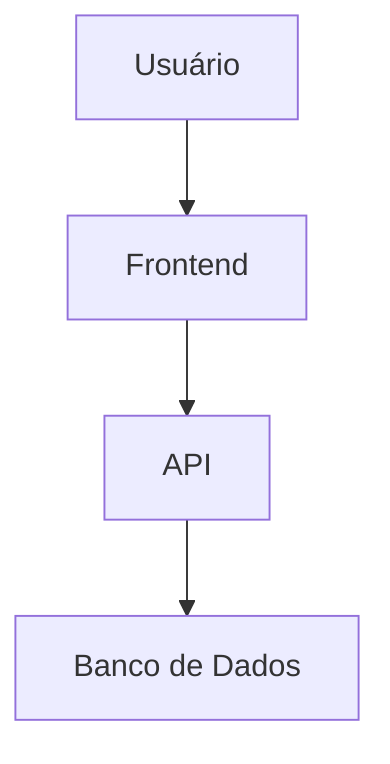
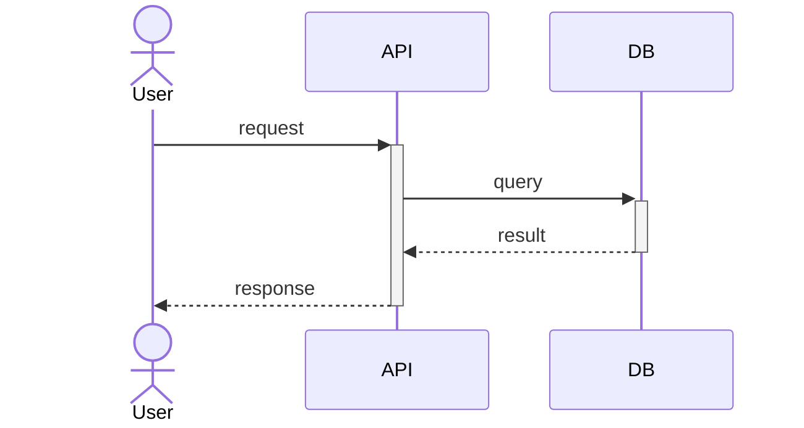

# Feature Documentation Generator

Gera um **índice de features** e, para cada feature, um conjunto completo de artefatos de especificação em `specs/<feature-slug>/`, baseando-se somente em evidências (documentação existente + implementação real).

## Quando ativar

- O usuário pede "documente as features", "gere specs", "construa o índice de features", "escreve a documentação de X".
- O usuário quer fazer engenharia reversa de specs a partir de um codebase existente.
- **Não ativar** para: revisão de código (use `backend-improvements`/`frontend-improvements`), config do opencode, ou escrita de um único README pontual sem estrutura de specs.

## Escopo de saída

Para cada feature identificada, criar `specs/<feature-slug>/` com 7 arquivos + `specs/INDEX.md` na raiz:

| Arquivo | Conteúdo |
|---|---|
| `requirements.md` | Requisitos funcionais e não funcionais |
| `specifications.md` | Especificações técnicas detalhadas |
| `user-stories.md` | Histórias de usuário (formato padrão) |
| `acceptance-criteria.md` | Critérios de aceitação (Given/When/Then) |
| `test-cases.md` | Casos de teste (unitários, integração, E2E) |
| `architecture.md` | Design de arquitetura e diagramas em Mermaid |
| `trade-offs.md` | Trade-offs, decisões de design e alternativas |
| `specs/INDEX.md` | Índice geral de todas as features com links |

## Protocolo de Execução

### Fase 1 — Descoberta de documentação

Varrer o projeto em busca de fontes de conhecimento nesta ordem de prioridade:

1. **Arquivos de release/changelog** — `CHANGELOG.md`/`.rst`/`.txt`, `RELEASES.md`, `RELEASE_NOTES.md`, `HISTORY.md`, `NEWS.md`; tags e releases do Git (`git tag -l`, `git log --oneline --decorate`).
2. **Documentação geral** — `README.md` (e variantes), `docs/` recursivamente (`.md`, `.rst`, `.txt`, `.html`), `wiki/`, `ADR/` se existir.
3. **Comentários e anotações no código** — docstrings em funções/classes públicas; `TODO`/`FIXME`/`NOTE`/`FEATURE`; JSDoc/TSDoc/Swagger/OpenAPI.
4. **Configurações e manifests** — `package.json` (`description`, `scripts`, deps), `pyproject.toml`, `setup.py`, `Cargo.toml`, `go.mod`, `openapi.yaml`, `swagger.json`, `.env.example`.

### Fase 2 — Descoberta de implementações

Mapear o código-fonte para identificar módulos, serviços e funcionalidades reais:

1. Listar a estrutura de diretórios de nível superior (`src/`, `lib/`, `app/`, `packages/`, `services/`, `modules/`, `features/`).
2. Identificar rotas de API (Express, FastAPI, Rails, etc.).
3. Identificar componentes de UI principais (React, Vue, Angular, etc.).
4. Identificar entidades/modelos de dados (schemas, migrations, ORM models).
5. Identificar workers, jobs, cron tasks.
6. Identificar integrações externas (SDKs, webhooks, third-party APIs).

### Fase 3 — Construção do Índice de Features

Cruzar documentação × implementação para:

1. **Nomear** cada feature no vocabulário do domínio.
2. **Classificar** por categoria (ex: Auth, Billing, Notifications, Core, Integrations, Admin).
3. **Determinar status**:
   - `stable` — documentada e implementada
   - `partial` — implementada mas sem documentação completa
   - `documented-only` — documentada mas sem implementação clara
   - `deprecated` — marcada como descontinuada
4. **Priorizar** (começar pelas `stable` e `partial`).

Gerar `specs/INDEX.md` **antes** dos artefatos individuais.

### Fase 4 — Geração dos Artefatos por Feature

Para cada feature do índice, criar `specs/<feature-slug>/` e os 7 arquivos abaixo.

---

#### `requirements.md`

```markdown
# Requisitos — <Nome da Feature>

## Visão Geral
<Descrição concisa da feature em 2–3 frases>

## Requisitos Funcionais
| ID | Requisito | Prioridade |
|---|---|---|
| RF-001 | ... | Must Have |
| RF-002 | ... | Should Have |
| RF-003 | ... | Could Have |

## Requisitos Não Funcionais
| ID | Requisito | Categoria |
|---|---|---|
| RNF-001 | ... | Performance |
| RNF-002 | ... | Segurança |
| RNF-003 | ... | Escalabilidade |

## Restrições e Premissas
- ...

## Dependências
- Depende de: <outras features ou sistemas>
- Requerido por: <features que dependem desta>
```

---

#### `specifications.md`

```markdown
# Especificações Técnicas — <Nome da Feature>

## Escopo Técnico
<Descrição dos limites técnicos da feature>

## Endpoints / Interface
<Documentar cada endpoint, método, parâmetros, request/response — usar blocos de código>

## Modelo de Dados
<Esquema das entidades envolvidas — tabelas, campos, tipos, relações>

## Fluxo de Dados
<Descrever como os dados fluem entre componentes>

## Regras de Negócio
1. ...
2. ...

## Configurações e Variáveis de Ambiente
| Variável | Descrição | Padrão | Obrigatória |
|---|---|---|---|
| ... | ... | ... | Sim/Não |

## Referências de Implementação
- Arquivos principais: `src/...`
- Módulos relacionados: `...`
```

---

#### `user-stories.md`

```markdown
# Histórias de Usuário — <Nome da Feature>

## Personas
- **<Persona 1>**: <descrição breve do perfil>
- **<Persona 2>**: <descrição breve do perfil>

---

### US-001 — <Título da História>
**Como** <persona>,
**Quero** <ação ou capacidade>,
**Para que** <benefício ou objetivo>.

**Critérios de Aceitação resumidos:**
- [ ] ...

**Notas:**
- ...
```

---

#### `acceptance-criteria.md`

```markdown
# Critérios de Aceitação — <Nome da Feature>

## AC-001 — <Título do Critério>
**Dado que** <contexto/pré-condição>,
**Quando** <ação executada>,
**Então** <resultado esperado>.

**Notas de validação:**
- ...

---

## Cenários de Borda
| Cenário | Comportamento Esperado |
|---|---|
| ... | ... |

## Critérios de Não-Funcionalidade
| Critério | Threshold |
|---|---|
| Tempo de resposta | < 200ms |
| ... | ... |
```

---

#### `test-cases.md`

```markdown
# Casos de Teste — <Nome da Feature>

## Cobertura Alvo
- Unitários: <módulos/funções críticas>
- Integração: <fluxos entre serviços>
- E2E: <jornadas de usuário>

---

## Testes Unitários

### TC-U-001 — <Descrição>
- **Módulo**: `src/...`
- **Função/Método**: `...`
- **Entrada**: `...`
- **Saída esperada**: `...`
- **Tipo**: Happy path / Edge case / Error case

---

## Testes de Integração

### TC-I-001 — <Descrição>
- **Fluxo**: <serviço A> → <serviço B>
- **Pré-condições**: ...
- **Passos**: ...
- **Resultado esperado**: ...

---

## Testes E2E

### TC-E-001 — <Descrição>
- **Persona**: <persona que executa>
- **Jornada**: ...
- **Passos**: ...
- **Resultado esperado**: ...

---

## Testes de Regressão
<Listar casos críticos que devem ser mantidos a cada release>
```

---

#### `architecture.md`

```markdown
# Arquitetura — <Nome da Feature>

## Visão Geral
<Descrição de alto nível da solução arquitetural>

## Componentes Envolvidos
| Componente | Responsabilidade | Tecnologia |
|---|---|---|
| ... | ... | ... |

## Diagrama de Contexto


## Diagrama de Sequência


## Decisões de Design
1. **<Decisão>**: <Justificativa>

## Padrões Utilizados
- Design Pattern: ...
- Convenções: ...

## Segurança e Autenticação
<Descrever mecanismos de segurança aplicados à feature>

## Observabilidade
- Logs: ...
- Métricas: ...
- Traces: ...
```

---

#### `trade-offs.md`

```markdown
# Trade-offs — <Nome da Feature>

## Decisão 1 — <Título>

### Contexto
<Qual problema estava sendo resolvido e por quê uma decisão era necessária>

### Opções Consideradas
| Opção | Prós | Contras |
|---|---|---|
| Opção A (escolhida) | ... | ... |
| Opção B | ... | ... |
| Opção C | ... | ... |

### Decisão Tomada
**Opção A** — <Justificativa da escolha>

### Consequências
- Positivas: ...
- Negativas / dívida técnica: ...

---

## Dívida Técnica Conhecida
| Item | Impacto | Prioridade |
|---|---|---|
| ... | ... | Alta/Média/Baixa |

## Riscos Identificados
| Risco | Probabilidade | Impacto | Mitigação |
|---|---|---|---|
| ... | Alta/Média/Baixa | Alto/Médio/Baixo | ... |
```

---

### Fase 5 — Geração do INDEX.md

```markdown
# Índice de Features — <Nome do Projeto>

> Gerado em: <data>
> Total de features: <N>

## Categorias

### <Categoria 1>
| Feature | Status | Pasta |
|---|---|---|
| [<Nome>](./<slug>/requirements.md) | stable | `specs/<slug>/` |

## Features por Status

### ✅ Stable
- [<Nome>](./<slug>/requirements.md)

### 🔶 Partial (implementadas, documentação incompleta)
- ...

### 📄 Documented Only (sem implementação clara)
- ...

### ❌ Deprecated
- ...
```

---

## Regras e Boas Práticas

### Sobre o conteúdo

- **Baseie-se somente em evidências**: nunca invente comportamentos. Se a documentação for incompleta, marque com `<!-- TODO: verificar implementação em src/... -->`.
- **Prefira vocabulário do domínio**: use os termos que aparecem no código e na documentação, não traduções livres.
- **Mantenha rastreabilidade**: sempre referencie o arquivo de origem (`docs/release-v1.2.md`, `src/auth/login.ts`) nos artefatos.
- **Evite duplicação**: se duas features compartilham lógica, documente na mais abrangente e faça referência cruzada.

### Sobre os slugs de pasta

- `kebab-case` minúsculo: `user-authentication`, `billing-subscriptions`, `email-notifications`.
- Sem espaços, acentos ou caracteres especiais. Máximo 40 caracteres.

### Sobre Mermaid

- Blocos de código com linguagem `mermaid`.
- Prefira `graph TD` para fluxos e `sequenceDiagram` para interações.
- Máximo 10–12 nós por diagrama.

### Sobre completude

- Implementação existe mas documentação é ausente → inferir do código e marcar `[Inferido do código]`.
- Documentação existe mas implementação não foi localizada → marcar `[Implementação não localizada]`.
- Nunca deixar seção vazia — ao menos escreva `> Não documentado. Investigação necessária.`

---

## Fluxo de execução recomendado

1. Confirme com o usuário o **escopo** (repo inteiro? um app específico? um subconjunto de features?) antes de varrer.
2. Rode Fase 1 + 2 em paralelo (use busca em `docs/`, `CHANGELOG.md`, rotas, models, manifests).
3. Apresente o **rascunho do índice** (Fase 3) e peça confirmação do usuário antes de gerar os 7×N artefatos — evita retrabalho.
4. Gere `INDEX.md` primeiro, depois os artefatos feature a feature.
5. Ao final, liste os arquivos criados e os TODOs pendentes (`<!-- TODO: ... -->` e `[Inferido do código]`).

## Restrições específicas deste repo (my-registers-docs)

Se executada neste projeto, respeitar:

- **Não sobrescrever** `specs/001-mvp-registro-diario/` (spec SDD canônica já existente — fonte de verdade). Se a feature coincide com o MVP, referencie cruzada e marque status `stable`.
- Docs SDD em **pt-BR**; código/identificadores em **inglês** (regra do repo). Manter os artefatos gerados em pt-BR.
- Constituição em `.specify/memory/constitution.md` é inegociável — não propor specs que violem Art. I-X ou INV-N.
- ADRs em `specs/001-mvp-registro-diario/research.md` são append-only; nunca reescrever ADR aceito.
