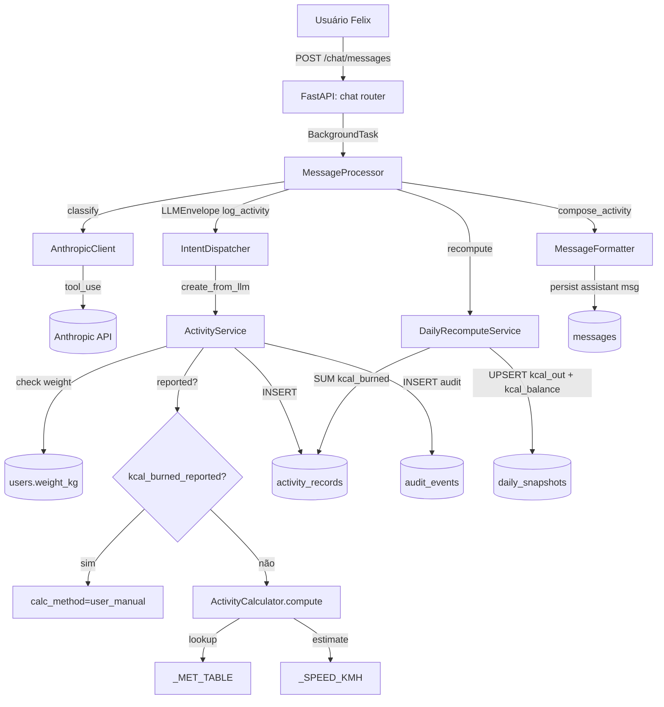
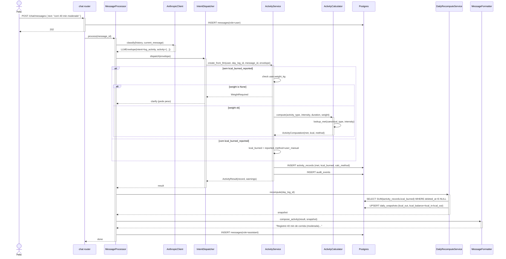

# Arquitetura — Registro de atividade física (cardio)

## Visão geral

Feature com cálculo determinístico de `kcal_burned` via fórmula MET, com dois caminhos: (1) `ActivityCalculator.compute` a partir de `activity_type` + `intensity` + `duration` + `weight_kg`, ou (2) `kcal_burned_reported` extraído de print de smartwatch (autoritativo, `calc_method='user_manual'`). A LLM apenas extrai campos estruturados; o backend calcula. `met_value` e `calc_method` são materializados para auditoria e recomputo futuro (Const. Art. III §10). Sem endpoint próprio — tudo via `POST /chat/messages`.

## Componentes envolvidos

| Componente | Responsabilidade | Tecnologia |
|---|---|---|
| `chat.router` | Recebe `POST /chat/messages`, agenda `BackgroundTask` | FastAPI |
| `MessageProcessor` | Orquestra: LLM → dispatch → recompute → formatter → persist | Python service |
| `AnthropicClient` | Classifica intent via `tool_use` | `anthropic` SDK |
| `LLMEnvelope.activity` (`ActivityIn`) | Sub-schema Pydantic v2 `extra="ignore"` com validators pt-BR | Pydantic v2 |
| `IntentDispatcher._handle_log_activity` | Roteia `intent=log_activity` para `ActivityService` | Python service |
| `ActivityService` | Decide cálculo vs. reported, cria `activity_records`, warnings, audit | Python service |
| `ActivityCalculator` | `compute(type, intensity, duration, weight)` → `ActivityComputation`; `lookup_met`; `estimate_duration_from_distance` | static method |
| `_MET_TABLE` / `_SPEED_KMH` / `_ACTIVITY_TYPE_ALIASES` | Tabelas em memória | dicts Python |
| `ActivityRecordRepository` | INSERT em `activity_records` | SQLAlchemy 2 async |
| `AuditEventRepository` | INSERT em `audit_events` | SQLAlchemy 2 async |
| `DailyRecomputeService._aggregate_activity` | `SELECT SUM(kcal_burned)` → UPSERT `kcal_out` | SQLAlchemy 2 + Postgres |
| `MessageFormatter.compose_activity` | Monta assistant message (SP-118) | Python util |

## Diagrama de contexto

## Diagrama de sequência

## Decisões de design

1. **`ActivityCalculator` como pure function (staticmethod)**.
   - **Justificativa**: determinismo absoluto — dados os mesmos inputs, mesmo `kcal_burned`. Trivial de testar. Tabela `_MET_TABLE` em memória, sem I/O.
   - **Alternativa considerada**: tabela `met_values` no Postgres. Rejeitada — lookup em memória é mais rápido e a tabela raramente muda.

2. **`kcal_burned_reported` autoritativo** (Const. Art. III §10).
   - **Justificativa**: se Felix envia print do smartwatch com kcal=500, o valor do dispositivo é mais preciso que a estimativa MET. `calc_method='user_manual'` marca que não recalculamos. `met_value` ainda é gravado para contexto de auditoria.
   - **Alternativa considerada**: ignorar reported e sempre calcular MET. Rejeitada — perde precisão do dispositivo.

3. **`_ACTIVITY_TYPE_ALIASES` em código** vs. esperar LLM sempre canonicalizar.
   - **Justificativa**: LLM escorrega em pt-BR ("corrida", "musculação") mesmo com prompt em inglês. Canonicalizar no backend é robusto e barato.
   - **Alternativa considerada**: só prompt. Rejeitada — LLM é não-determinística.

4. **`_normalize_intensity` validator antes do Literal**.
   - **Justificativa**: LLM às vezes emite "moderada" (pt-BR) e o Literal rejeitaria, esgotando retry semântico. Normalizar antes evita "Não consegui interpretar".
   - **Alternativa considerada**: aceitar só inglês. Rejeitada — quebra UX.

5. **SP-62 — `strength` + `unknown` → `moderate` no cálculo, `unknown` no registro**.
   - **Justificativa**: musculação sem intensidade é comum; default `moderate` (met=5.0) é razoável. Preservar `unknown` no registro mantém auditoria honesta.
   - **Alternativa considerada**: bloquear até informar intensidade. Rejeitada — fricção desnecessária.

6. **SP-63 — estimar duração por velocidade média**.
   - **Justificativa**: "caminhei 4 km" sem cronômetro é comum. `_SPEED_KMH` por tipo dá estimativa razoável.
   - **Alternativa considerada**: pedir duração sempre. Rejeitada — fricção.

7. **`WeightRequired` como exceção própria** (não `ValidationAppError`).
   - **Justificativa**: é uma condição de negócio (perfil incompleto), não erro de validação de envelope. `MessageProcessor` trata diferentemente — pede peso via clarify.
   - **Alternativa considerada**: `ValidationAppError(code="weight_required")`. Rejeitada — mistura categorias.

8. **Sem `needs_confirmation` para activity no MVP**.
   - **Justificativa**: activity não tem macros para confirmar (só kcal). `low_confidence_item` warning basta. `confirmation.py` linha 236 explicita.

## Padrões utilizados

- **Layered architecture**: routes → services → repositories → models.
- **Pure function**: `ActivityCalculator.compute` — `staticmethod`, sem estado, sem I/O.
- **Result object**: `ActivityResult(record, warnings)` — dataclass com `slots=True`.
- **Value object**: `ActivityComputation(met_value, kcal_burned, calc_method, reasons)` — dataclass com `slots=True`.
- **Repository pattern**: `ActivityRecordRepository.create` com `user_id` explícito (Const. §21).
- **Canonicalização em camada de service**: `_canonicalize_activity_type` no `ActivityCalculator`, não no schema.

## Segurança e autenticação

- **Rota de entrada** (`POST /chat/messages`) exige JWT (cookie `access_token`).
- **`user_id`** propagado em toda query (Const. §21).
- **`weight_kg`** é lido do perfil do usuário autenticado — nunca do envelope (LLM não pode injetar peso).
- **`kcal_burned_reported` limitado a `le=10000`** no schema — previne valores absurdos.

## Observabilidade

- **Logs estruturados** com `request_id`, `user_id`, `intent`.
- **Métricas** (futuro): taxa de `unknown_activity_or_intensity` — sinal de `_MET_TABLE` faltando tipos comuns; taxa de `user_manual` vs. `mets_body_weight`.
- **Audit trail**: `audit_events` com `calc_method` permite reconstruir como kcal foi calculado.

## Ganchos com outras features

- **`chat-messaging`**: dono do `POST /chat/messages`. `ActivityService` é um handler.
- **`anthropic-integration`**: dono do `LLMEnvelope` + `ActivityIn`.
- **`authentication-session`**: fornece `users.weight_kg` — se perfil incompleto, SP-61 dispara.
- **`daily-snapshot`**: dono do `DailyRecomputeService._aggregate_activity`.
- **`record-correction`**: `_apply_activity_changes` recalcula kcal via `ActivityCalculator` se duration/intensity mudar.
- **`record-deletion`**: soft delete em `activity_records` (TargetKind.ACTIVITY).
- **`day-close`**: usa `kcal_out` do snapshot.
- **`weekly-report`**: soma `kcal_out` entre dias fechados.
- **`workout-session-tracking`** (documented-only): Bloco 3 quer treino estruturado (sessão → exercícios → séries) — evoluirá este registro para suportar séries, mas SP-60..64 continuam válidos para cardio isolado.
