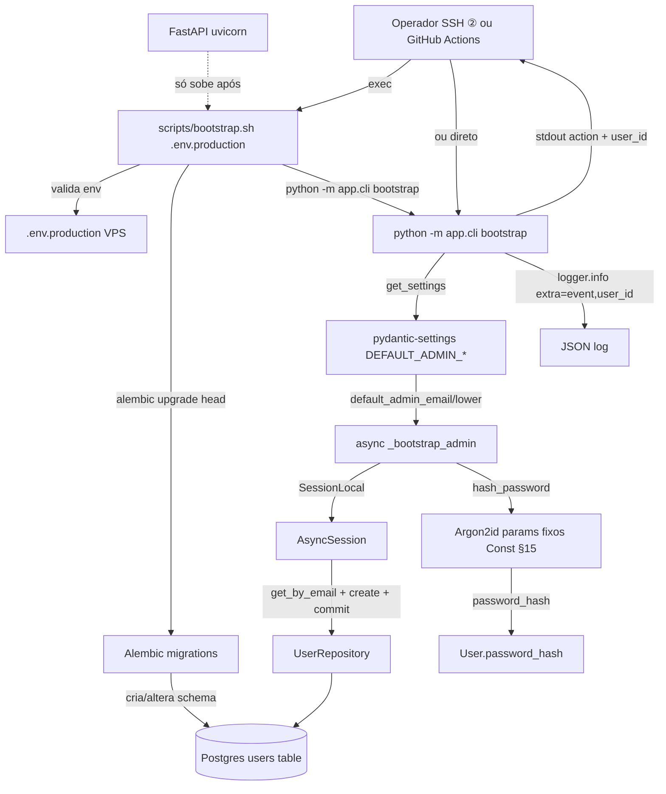
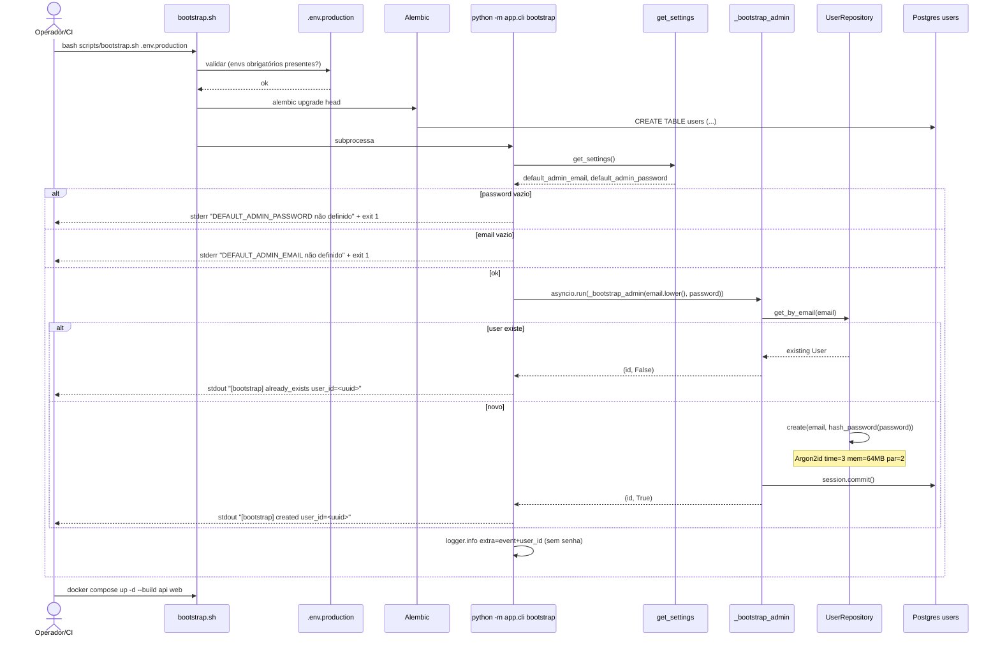

# Arquitetura — Bootstrap de admin via CLI

> **Rastreabilidade**: Const. §18/§24, ADR-001 · Implementação: `apps/api/app/cli/main.py`, `apps/api/app/core/{config,security}.py`, `apps/api/app/repositories/user.py`, `apps/api/app/models/user.py`, `scripts/bootstrap.sh`.

## Visão geral

CLI Typer standalone (`python -m app.cli`) que executa fora do servidor HTTP. Bootstrap cria o admin default a partir de envs (idempotente via lookup por email), aplica hash Argon2id fixo pela Constituição (params `time=3, mem=64MB, par=2`), commit. Complementarmente, `seed-nutrition` popula catálogo TBCA idempotente e `version` reporta build. Sem servidor HTTP; não acopla FastAPI runtime. Operador (humano com SSH) roda diretamente na VPS, ou é invocado por `scripts/bootstrap.sh` (compartilhado entre deploy Actions e manual — ADR-012) que antes chama `alembic upgrade head`.

## Componentes envolvidos

| Componente | Responsabilidade | Tecnologia |
|---|---|---|
| `app/cli/main.py` | Typer app + commands `bootstrap`, `seed-nutrition`, `version` | Python + typer |
| `app/cli/__main__.py`, `__init__.py` | Entry point `python -m app.cli` | Python package |
| `_bootstrap_admin(email, password)` | Async core: lookup + create idempotente | asyncio + SQLAlchemy |
| `UserRepository.get_by_email`/`.create` | DB queries | SQLAlchemy 2 async |
| `SessionLocal` | DB session async | SQLAlchemy + asyncpg |
| `app/core/security.py::hash_password` | Argon2id hashing | argon2-cffi |
| `app/core/config.py::Settings` | Lê `DEFAULT_ADMIN_*` envs | pydantic-settings |
| `app/core/logging.py::configure_logging` | Log estruturado (usado pelo CLI) | Python logging (JSON fmt) |
| `User` model | Tabela `users` (CITEXT email, Argon2 hash) | SQLAlchemy ORM |
| `app/integrations/nutrition/seed.py::seed_from_csv` | Upsert catálogo TBCA | Python + csv |
| `scripts/bootstrap.sh` | Orquestra `alembic upgrade head` + CLI bootstrap | Bash |
| `alembic upgrade head` | Aplica migrations ANTES do runtime | Alembic |
| `docker compose up -d --build api web` | Sobe API somente após bootstrap | Docker Compose |
| VS envs (`.env.production`) | Segredos `DEFAULT_ADMIN_PASSWORD`, `ANTHROPIC_API_KEY` etc. | dotenv/shell |

## Diagrama de contexto

## Diagrama de sequência — bootstrap (happy path)

## Decisões de design

1. **CLI standalone em vez de endpoint HTTP** (Const. §18 & V §20): sem `/register`/`/reset-password`. Justificativa: cadastro/reset via HTTP expõe ataque de enumeracão/de brute-force; single-user MVP dispensa a superfície. Operador com SSH é único canal.

2. **Typer em vez de argparse/click puro**: Typer oferece type-hints + auto-help + commands declarativos; mantém coerência com codebase pydantic-ish. Implementação: `apps/api/app/cli/main.py`.

3. **Idempotência via lookup (não upsert com flag)**: `bootstrap` faz `get_by_email(email)` → se existe, retorna id sem write; se None, cria + commit. Justificativa: sem flag `--force` no MVP, sem risco de sobrescrever senha; `_bootstrap_admin` descarta password após hash sem nunca devolvê-lo ao caller.

4. **`lower()` no caller** apesar de `CITEXT` unique: garantir que env maiúsculo não quebre idempotência. Byte extra `lower()` e defensivo; CI simula env lowercase.

5. **Hash params fixos na Constituição (§15)**: `_hasher = PasswordHasher(time_cost=3, memory_cost=64*1024, parallelism=2)` hardcoded em `app/core/security.py`. Justificativa: ajuste runtime poderia degradar segurança; upgrade requer code change + `needs_rehash()` opportunistic.

6. **`logs.info` sem `password`/`password_hash` em `extra`**: Const. §19 prohibit logging secrets. Justificativa: log auditável em `event`+`user_id`; hash nunca é informação secretaria, mas senha plaintext sim (descartada após `hash_password`).

7. **`scripts/bootstrap.sh` é o mesmo rodado por Actions/SSH/manual** (ADR-012): compartilhar código (single source of truth) garante fallback em GitHub outage. Justificativa: prod runbook §14.5 cobre cenário.

8. **`alembic upgrade head` antes de `bootstrap`**: necessário para tabela `users` existir. Justificativa: runtime da API nunca roda migrations (Const. §24); bootstrap.sh combina os dois passos no deploy-time.

9. **Senhas nunca em migration/code**: ADR-001 explícito. Justificativa: migrations entram no git history; senha hardcoded exporia. Bootstrap lê env no deploy.

10. **`reset-password`/`create-admin` postponed** (não implementados): MVP single-user; spec menciona como referência. Justificativa: gap operacional aceitável; reset atual via SSH/Python ad-hoc; criar 2nd user ainda sem demanda.

11. **Settings com `default_admin_password=""` default** força operador setar explicitamente: se env missing, `not default_admin_password` check captura. Justificativa: defesa em profundidade.

12. **`CITEXT` column type no Postgres** para email: case-insensitive unique constraint gratuito. Justificativa: garante match de env com variação case, mantém DNS-style email semantics.

## Padrões utilizados

- **CLI**: Typer `@app.command()` decorators; `add_completion=False`; `no_args_is_help=True`.
- **Async bridge**: `asyncio.run(_bootstrap_admin(...))` sync entrypoint → async coroutine.
- **Settings Singleton**: `get_settings()` (pydantic-settings cache interno).
- **Repository pattern**: `UserRepository` expõe `get_by_email`/`create`; CLI não escreve SQL direto.
- **Structlog pattern**: `logger.info(msg, extra={...})` para JSON log (compartilhado com API).
- **Idempotency by lookup**: detecção via SELECT antes do INSERT; sem `ON CONFLICT` (simples).
- **Env-based config**: `DEFAULT_ADMIN_*` no Settings; `.env.example` doc; `.env.production` real na VPS.

## Segurança e autenticação

- **Argon2id (Const. §15)**: OT recommended; GPU-resistant (time=3/memory=64MB/parallelism=2).
- **Senha nunca persistida plaintext**: só `password_hash` é column; `password` descartado após hashing.
- **Senha nunca em logs/stdout** (Const. §19): CLI só `typer.echo` action + user_id; log info extra `{event, user_id}`.
- **No HTTP register/reset** (Const. §18, SP-05): FastAPI router `auth.py` não expõe `/register`/`/forgot`/`/reset`; respondem 404 sem hint.
- **Operador SSH-only**: invocado por humano com SSH na VPS (ouerte GitHub Actions via `command="..."` restrito — ver `deploy-pipeline-ci-cd`).
- **Ambiente like-prod guarda secrets**: `.env.production` na VPS (not GitHub); `bootstrap.sh` valida antes de rodar (T-905).
- **Audit gap**: bootstrapped user creation não grava `audit_events` (não é mutação de registro de negócio; INV-10 não é aplicável); logs estruturados é o trilha.
- **Race condition**: 2 bootstrap paralelos → 1º vence INSERT; 2º falha unique constraint (CITEXT unique). Não é problema (deploy serial via deploy.yml concurrency).

## Observabilidade

- **Logs estruturados**: `cli_bootstrap` event + `user_id`; `seed_nutrition_done` + `inserted`/`updated`; `version` não loga.
- **Saída human-legível stdout**: `[bootstrap] created user_id=...` / `already_exists`; `[seed-nutrition] inserted=N updated=M`; `my-registers-api 0.0.0`.
- **Métricas**: nenhuma client-side/domain — CLI é one-shot; logs persistem em `stdout` capturados pelo `docker compose logs`/VPS `journald`.
- **Traces**: nenhum; CLI não integra com FastAPI middleware de `X-Request-Id`.
- **Erros**: stderr + exit code 1 em env missing; exceptions propagadas produzem stacktrace (não-capturado — future: wrap em `typer.BadParameter`).
<!-- TODO: adicionar teste automatizado para CLI; capturar exit codes em caso de DB error explicitamente -->