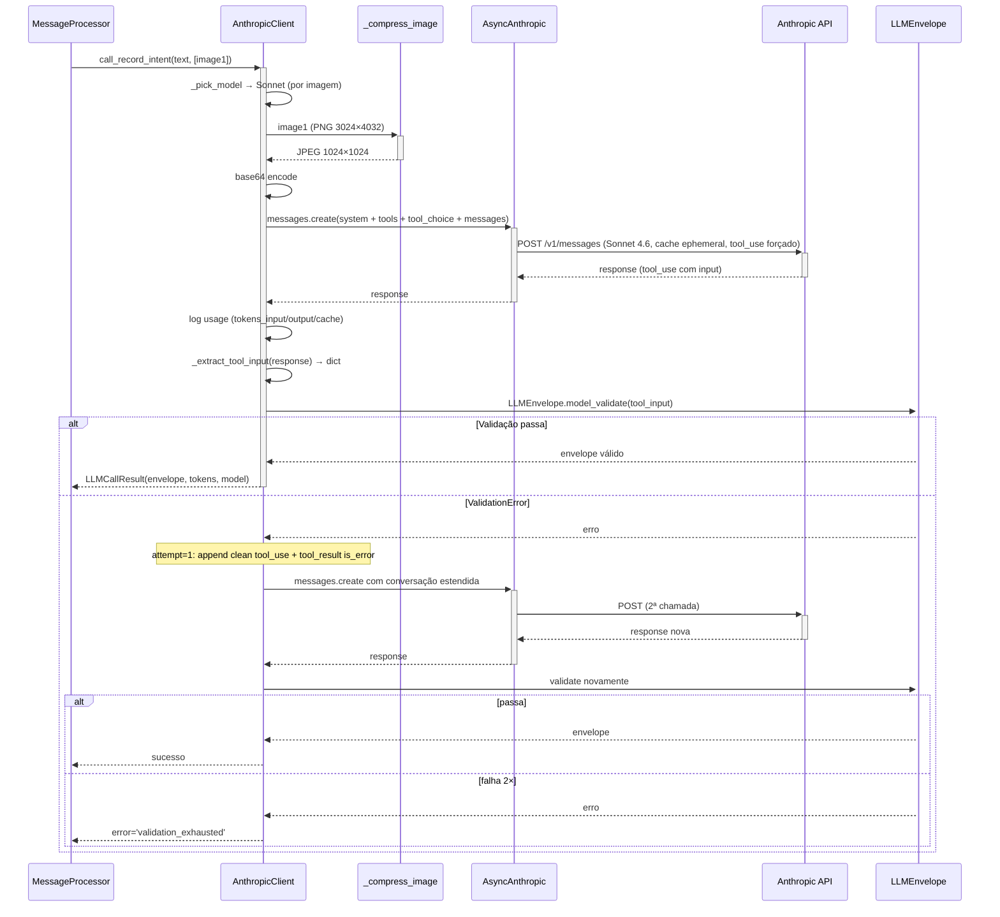

# Arquitetura — Integração Anthropic

## Visão geral

Camada de integração encapsula 100% das chamadas à Anthropic. Três operações: **classificação de intent** (com tool_use forçado), **narrativa de dia** (SP-103) e **narrativa semanal** (SP-111). Design consciente para: (1) **determinismo estrutural** (LLM nunca calcula, INV-1), (2) **custo baixo** (roteamento Sonnet/Haiku, cache ephemeral, compressão de imagem), (3) **testabilidade** (fake substitui via DI, fixtures em JSON) e (4) **degradação graciosa** (todo erro traz `error` code + `text=None` sem levantar exception para o caller).

## Componentes envolvidos

| Componente | Papel |
|---|---|
| `AnthropicClient` | Wrapper singleton (`@lru_cache get_anthropic_client()`) sobre `AsyncAnthropic` |
| `LLMCallResult`, `NarrativeResult` | Dataclasses de resultado |
| `RECORD_INTENT_TOOL` (tool_schema.py) | JSON schema declarativo da tool |
| `system_v2.md`, `narrative_v1.md`, `weekly_narrative_v1.md` | Prompts versionados em disco (`@lru_cache` carrega) |
| `LLMEnvelope` (schemas/llm.py) | Modelo Pydantic v2 estrito no raiz, tolerante em sub-payloads |
| `_pick_model` | Roteamento Sonnet vs Haiku |
| `_compress_image` | Pillow: longest-side 1024px + JPEG q=75 |
| `_extract_tool_input`, `_find_tool_use_id`, `_clean_content_for_retry` | Utilitários para navegar resposta e preparar retry |
| `get_anthropic_client_dep` | FastAPI Depends → injeta em rotas |

## Diagrama de contexto

```mermaid
graph TD
    subgraph "Chat pipeline"
      MP[MessageProcessor] -->|classify| AC[AnthropicClient.call_record_intent]
    end
    subgraph "Day close"
      DC[DayCloseService] -->|narrativa| ACN[AnthropicClient.call_narrative]
    end
    subgraph "Weekly"
      WR[WeeklyReportService] -->|narrativa semanal| ACW[AnthropicClient.call_weekly_narrative]
    end

    AC -->|Pillow| IMG[Compressão de imagem]
    AC -->|Pydantic| ENV[LLMEnvelope validate]
    AC -->|SDK| SDK[AsyncAnthropic messages.create]
    ACN -->|SDK| SDK
    ACW -->|SDK| SDK
    SDK -->|HTTP + backoff 5xx/429| A[(Anthropic API)]

    AC -->|logger.info<br/>event=anthropic_usage| LOG[Structured logs]

    subgraph "Prompts (arquivos versionados)"
      P1[system_v2.md]
      P2[narrative_v1.md]
      P3[weekly_narrative_v1.md]
    end
    AC -->|@lru_cache| P1
    ACN -->|@lru_cache| P2
    ACW -->|@lru_cache| P3
```

## Diagrama de sequência — `call_record_intent` com retry semântico



## Decisões de design

1. **Wrapper fino ao invés de reescrever SDK.**
   - **Justificativa**: `anthropic` SDK oficial já faz retry HTTP (backoff 5xx/429), timeout, streaming, base64. Só adicionamos: validação Pydantic, retry semântico, compressão, roteamento, cache config, logging.
   - **Alternativa**: cliente HTTP puro. Rejeitada — reinventaria SDK.

2. **Retry semântico limitado a 1×.**
   - **Justificativa**: Fase 5 mostrou que 2º retry raramente resolve; prompt é estrito o suficiente.
   - **Consequência**: quando falha, falha rápido; UX de "reformule" fica <30s típico.

3. **`_clean_content_for_retry` remove metadata do SDK.**
   - **Justificativa**: bug histórico (`c4fa31e` em `CHANGELOG.md`) — SDK adiciona campos internos (`caller`) que Haiku 4.5 rejeita com HTTP 400. Se remover essa função, feature quebra silenciosamente até retry.
   - **Consequência**: teste explícito de regressão obrigatório.

4. **Roteamento Sonnet vs Haiku por heurística simples.**
   - **Justificativa**: fotos precisam qualidade multimodal; texto curto puro é trivial. Haiku ~4× mais barato.
   - **Limitação**: 500 chars é threshold arbitrário; se mensagens típicas subirem, revisitar.

5. **Cache ephemeral em system + tools.**
   - **Justificativa**: TTL ~5 min do cache ephemeral do Anthropic; usuário typicamente manda várias mensagens seguidas. Hit rate potencial alto.
   - **Log** de `cache_creation_input_tokens` e `cache_read_input_tokens` mede eficácia.

6. **Compressão de imagem best-effort.**
   - **Justificativa**: reduz 5-11K tokens → 500-1500. OCR de rótulo continua legível em 1024px q=75.
   - **Fallback**: se Pillow falhar (imagem exótica), envia bytes originais em vez de travar.

7. **`extra="forbid"` no raiz, `extra="ignore"` em payloads.**
   - **Justificativa**: raiz precisa ser fechado (sinal de "veio do modelo certo"); payloads precisam ser abertos (LLM inventa campos comuns como `pace`, `sugars_g`).
   - **Consequência**: adicionar novo intent no raiz exige revisão; adicionar campo em payload é resistente à evolução.

8. **Prompts como arquivos em disco.**
   - **Justificativa**: versionamento no git; diff é claro; testes podem reusar mesma cópia; sem hardcode em Python.
   - **`PROMPT_VERSION`** exposto no resultado — audit "qual prompt gerou essa resposta".

9. **Prompts injetados via `system` role (não user).**
   - **Justificativa**: convenção Anthropic; SDK enforça formato.
   - **Cache ephemeral** aplicado ao system_prompt via `cache_control={type:ephemeral}`.

10. **Content vazio → `"(mensagem vazia)"`.**
    - **Justificativa**: Anthropic exige ≥ 1 bloco de content. LLM identifica como `intent=clarify` ou `unknown`.

11. **Sem streaming SSE (SP-10).**
    - **Justificativa**: polling é suficiente para MVP single-user; SSE adiciona complexidade em nginx/proxy.
    - **Consequência**: latência percebida é a total; usuário vê "processando..." até chegar.

12. **Sem cache de resposta (idempotência).**
    - **Justificativa**: cada mensagem do usuário é única (timestamp, mídias); cache não pagaria.
    - **Alternativa**: cache por hash do texto. Rejeitada — casos raros de valor.

## Padrões utilizados

- **Adapter**: wrapper sobre SDK oficial.
- **Result object**: `LLMCallResult` / `NarrativeResult` — nunca levanta exception para caller.
- **Strategy** (leve): `_pick_model` — heurística simples de escolha.
- **DI**: `Depends(get_anthropic_client_dep)` — permite fake em testes via `app.dependency_overrides`.
- **Singleton** via `@lru_cache get_anthropic_client()`.
- **Structured logging**: `logger.info("anthropic_usage", extra={event, model, ...})` — chave pra análise.

## Segurança e autenticação

- **`api_key`**: lida de env; nunca em log; passada apenas para o SDK.
- **Fotos**: enviadas em base64, nunca URL pública (Const. §26).
- **PII em user_text**: passa para Anthropic (aceito no MVP — é o único jeito de a LLM interpretar).
- **`raw_llm_response` em `messages`**: útil pra debug, mas também é PII em texto; cuidado ao expor via `/messages`.
- **Prompt injection**: sistema forçado a `tool_use` reduz superfície — LLM não pode "sair" do formato. Mas payload no envelope (ex.: `user_text_summary`) pode conter texto adverso; consumers devem tratar como não-confiável.

## Observabilidade

- **Log estruturado** com `event=anthropic_usage` inclui: `model`, `attempt`, `images`, `input_tokens`, `output_tokens`, `cache_creation_input_tokens`, `cache_read_input_tokens`.
- **Log de erro**: `event=anthropic_error` com `status_code`, `body`, `err` (tipo).
- **Métricas potenciais** (não implementadas): rate de `validation_exhausted`, `no_tool_use`, `anthropic_timeout` — sinais de degradação do prompt/modelo.
- **`PROMPT_VERSION`** em cada resultado — permite comparar `system_v2` vs `system_v3` no A/B futuro.

## Ganchos com outras features

- **[`chat-messaging`](../chat-messaging/)**: `MessageProcessor` chama `call_record_intent`; se falhar, persiste assistant fallback (SP-14).
- **[`food-logging`](../food-logging/) e afins**: consomem `envelope.food_items|water|beverage|activity` via `IntentDispatcher`.
- **[`day-close`](../day-close/)**: `call_narrative`; disclaimer concatenado por `DayCloseService`.
- **[`weekly-report`](../weekly-report/)**: `call_weekly_narrative`.
- **[`nutrition-label-ocr`](../nutrition-label-ocr/)**: extrai `nutrition_label` do envelope via mesmo `call_record_intent` — feature reusa mesmo caminho.
- **[`daily-snapshot`](../daily-snapshot/)**: indiretamente — `MealService` etc. disparam recompute; snapshot em si não chama Anthropic.
