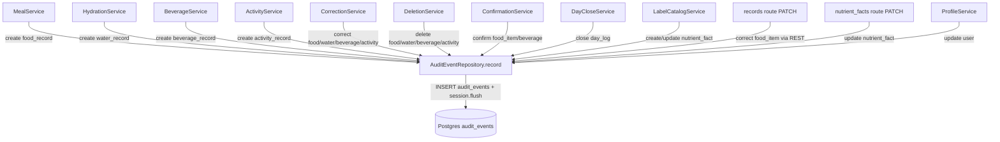
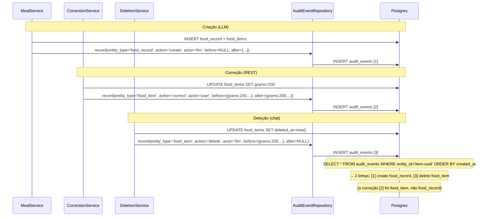

# Arquitetura — Trilha de auditoria

## Visão geral

Feature puramente cross-cutting: sem rota HTTP, sem service próprio. É um padrão de chamada: `AuditEventRepository(session).record(...)` executado ao final de cada operação de escrita, dentro da mesma transação da mutação. A atomicidade é garantida pelo SQLAlchemy session — `flush()` no `record()` inclui o INSERT no batch da transação; rollback desfaz ambos.

## Componentes

| Componente | Papel |
|---|---|
| `AuditEvent` (model) | Row em `audit_events` com JSONB `before`/`after` |
| `AuditEventRepository.record` | INSERT atômico em `audit_events` via `session.flush()` |
| Services callers (11+) | Instanciam e chamam o repository após mutar |
| `AUDIT_ACTIONS`, `AUDIT_ACTORS` | CHECK constraints no schema (enforçados pelo Postgres) |

## Diagrama de contexto — quem grava audit



## Diagrama de sequência — ciclo de vida de um food_item



## Decisões de design

1. **Repository no `repositories/food.py`** (não em arquivo próprio).
   - **Justificativa**: criado na Fase 4 junto com `FoodRecordRepository` e `FoodItemRepository`. Nome histórico; mudança de localização seria refactor de baixo valor.
   - **Consequência**: nome confuso — `repositories/food.py` contém audit. Dev novo pode não encontrar.

2. **`entity_id` sem FK constraint** (sem `ForeignKey("tabela.id")`).
   - **Justificativa**: cada `entity_type` aponta pra tabela diferente; FK genérica não existe em SQL relacional sem polimorfismo. Se entidade for hard-deletada, audit sobrevive.
   - **Alternativa**: tabelas separadas `food_audit`, `water_audit`, etc. Rejeitada — explosão de tabelas.

3. **JSONB para `before`/`after`** (não colunas tipadas).
   - **Justificativa**: shape varia por `entity_type`. JSONB JSONB permite evolução sem migration.
   - **Consequência**: sem validação de schema nos campos internos. Caller define shape ad hoc.

4. **`flush()` dentro do `record()`** (não `commit()`).
   - **Justificativa**: garantia de atomicidade com a transação do caller. `flush()` inclui no batch; `commit()` quebraria isso.
   - **Consequência**: se caller fizer rollback depois, audit desfaz junto — comportamento correto.

5. **Sem API de leitura no MVP**.
   - **Justificativa**: uso operacional apenas; não é feature de produto.
   - **Consequência**: acesso apenas via SQL direto ou futuro endpoint admin.

6. **`action='confirm'` pode não estar no CHECK** (`AUDIT_ACTIONS = ("create","update","delete","correct")`).
   - **`confirmation.py` usa `action="confirm"`** mas o model declara `AUDIT_ACTIONS` sem `confirm`.
   - **Risco**: INSERT pode falhar silenciosamente ou o CHECK pode não existir no schema real (migration pode ter omitido `confirm`). **Verificar migration 000X que cria `audit_events`.**

## Segurança e autenticação

- **`user_id` obrigatório**: toda linha tem dono.
- **`actor` enforçado**: só `user` ou `llm` — sem `system`, `admin`, etc.
- **Sem leitura pública**: `audit_events` é write-only para a API no MVP.

## Observabilidade

`audit_events` é a própria fonte de observabilidade de mutações. Queries úteis:

```sql
-- Timeline de um item
SELECT action, actor, before, after, created_at
FROM audit_events
WHERE entity_id = 'item-uuid'
ORDER BY created_at;

-- Tudo que a LLM fez hoje
SELECT entity_type, action, created_at
FROM audit_events
WHERE actor = 'llm'
AND created_at::date = current_date
ORDER BY created_at;

-- Fechamentos de dia
SELECT entity_id, after->>'closed_at', created_at
FROM audit_events
WHERE entity_type = 'day_log' AND action = 'close'
ORDER BY created_at;
```
