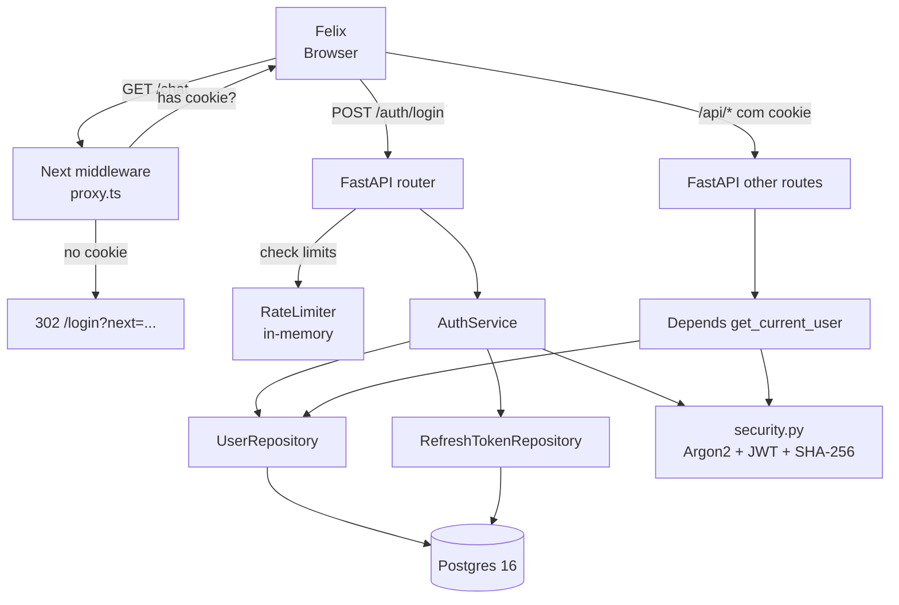
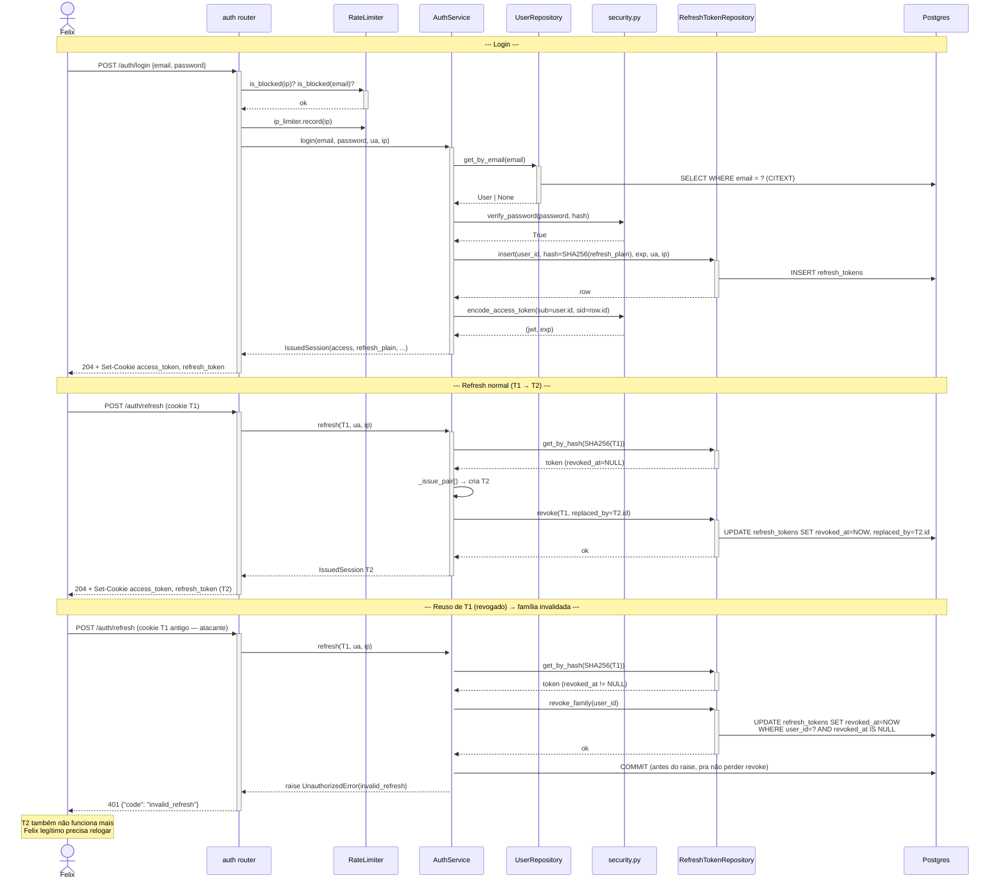

# Arquitetura — Autenticação e sessão

## Visão geral

Modelo de sessão híbrido: **access token stateless (JWT HS256, 15min)** + **refresh opaco persistido (14d, SHA-256 hasheado)**. Access é rápido de validar (sem DB); refresh é rotacionável e revogável. Rate limits em memória protegem `POST /auth/login`. Frontend usa middleware Next.js (`proxy.ts`) que só olha presença do cookie; validação real é backend. Nenhum endpoint HTTP cria ou reseta usuário — CLI é a única superfície administrativa (feature [`admin-bootstrap-cli`](../admin-bootstrap-cli/)).

## Componentes envolvidos

| Componente | Responsabilidade | Tecnologia |
|---|---|---|
| `POST /auth/login`, `/refresh`, `/logout`, `GET /auth/me` | Roteamento HTTP | FastAPI router |
| `AuthService` | Login, rotação de refresh, detecção de reuso, logout | Python service |
| `UserRepository`, `RefreshTokenRepository` | Acesso ao DB | SQLAlchemy 2 async |
| `hash_password` / `verify_password` / `needs_rehash` | Argon2id via `argon2-cffi` | `argon2` |
| `encode_access_token` / `decode_access_token` | JWT HS256 via `python-jose` | `jose` |
| `generate_refresh_token` / `hash_refresh_token` | `secrets.token_urlsafe` + SHA-256 | stdlib |
| `get_ip_limiter` / `get_email_fail_limiter` | Rate limit em memória | `SlidingWindowLimiter` (internal) |
| `get_current_user` | Dependency que valida cookie access e devolve `User` | FastAPI Depends |
| `proxy.ts` (Next middleware) | Redirect por presença de cookie | Next 16 |

## Diagrama de contexto

## Diagrama de sequência — Login + Refresh + Detecção de reuso

## Decisões de design

1. **Access stateless (JWT) + refresh opaco stateful**.
   - **Justificativa**: JWT rápido de validar (sem DB por request); refresh audita (`revoked_at`, `replaced_by`) permitindo detecção de reuso. Simetria entre security e performance.
   - **Alternativa considerada**: Session-only (cookie opaco lookupa DB por request). Rejeitada — DB call por request em app single-user via HTTP polling do chat é overhead desnecessário.

2. **Rotação obrigatória a cada refresh**.
   - **Justificativa**: Const. Art. V §17. Chain `T1 → T2 → T3 → ...` com `replaced_by` cria trilha auditável. Reuso de qualquer token intermediário é sinal seguro de sessão comprometida.
   - **Alternativa considerada**: Refresh long-lived reutilizável. Rejeitada — impossível detectar roubo.

3. **Família = todos os refresh ativos do user; reuso invalida toda ela (INV-6)**.
   - **Justificativa**: se um atacante roubou `T_n` e usou `T_n-1`, ambos podem estar sob risco. Cortar tudo é conservador; força novo login (custo baixo em UX, alto em segurança).
   - **Alternativa considerada**: Invalidar só o token específico. Rejeitada — atacante persistiria com `T_n`.

4. **Commit antes do raise em detecção de reuso** (`services/auth.py` linhas 79-82).
   - **Justificativa**: `get_session` dependency faz rollback em exception; sem commit explícito, a revogação da família seria perdida. **Bug crítico se removido**.
   - **Consequência**: exception continua propagando normalmente após commit.

5. **Rate limit em memória** (`SlidingWindowLimiter`).
   - **Justificativa**: MVP single-VPS, single-user. Zero deps externas (sem Redis).
   - **Alternativa considerada**: Redis / Postgres. Rejeitada — complexidade que não paga em single-instance.
   - **Consequência**: restart da API zera contadores. Aceito por design.

6. **`ip_limiter.record()` roda ANTES da autenticação; `email_limiter.record()` só em falha**.
   - **Justificativa**: mesmo login válido conta pro IP (limitar sequência automatizada de logins). Email só falhas (evita lockar user legítimo por 10 logins consecutivos bem-sucedidos).
   - **Alternativa considerada**: contar só falhas em ambos. Rejeitada — IP burst é sinal de bot mesmo com senha correta.

7. **`invalid_credentials` é o único código para qualquer falha de auth pré-token**.
   - **Justificativa**: user inexistente, inativo, senha errada → mesmo shape. Timing attacks são possíveis (Argon2 vs. no-op) mas MVP não trata (aceito).
   - **Alternativa considerada**: Diferenciar códigos em log interno (não em resposta). OK, futuro.

8. **Refresh persistido como `SHA-256(plain)`**.
   - **Justificativa**: se DB vazar, atacante não obtém refreshes válidos direto. Comparação O(1) (hash constante).
   - **Alternativa considerada**: bcrypt do refresh. Rejeitada — bcrypt é slow; refresh não é senha humana, SHA-256 é suficiente.

9. **JWT payload inclui `sid = refresh_id`**.
   - **Justificativa**: âncora para auditoria/futuras revogações granulares. Hoje é informativo; ninguém consulta.
   - **Consequência**: expansão futura ("revogue todos os accesses emitidos pela sessão X") é 1 query.

10. **Middleware Next apenas heurística**.
    - **Justificativa**: garante UX de redirect antes de bater no backend, mas não valida assinatura JWT (Next Edge Runtime não tem `jose`). Backend continua sendo a verdade.
    - **Consequência**: cookie forjado sem valor real pode passar do middleware, mas será rejeitado por `Depends(get_current_user)` no backend.

## Padrões utilizados

- **Layered**: routes → services → repositories.
- **DI via `Depends`**: `db_session`, `current_user`, cookies (`Cookie(default=None, alias=REFRESH_COOKIE)`).
- **Result object**: `IssuedSession` dataclass.
- **Repository per aggregate**: `UserRepository`, `RefreshTokenRepository`.
- **Constant-time comparisons**: `argon2.verify` e `secrets.compare_digest` (via `hash_refresh_token` + lookup por hash indexado).

## Segurança e autenticação

- **Cookies em produção**: `Secure` obrigatório (via `COOKIE_SECURE=true` + HTTPS). Nginx faz TLS termination (ver [`deploy-pipeline-ci-cd`](../deploy-pipeline-ci-cd/) e `infra/nginx/`).
- **CSRF**: `SameSite=Lax` mitiga a maioria (POSTs cross-origin não enviam cookies). Sem CSRF token adicional no MVP (aceito para app privado).
- **JWT secret**: `settings.jwt_secret` deve ter ≥ 32 bytes; produção lê de `.env.production` (nunca em git).
- **Session fixation**: refresh sempre novo a cada login/refresh; sem carregar token do request.
- **CORS**: como frontend e backend compartilham origem (via Nginx em prod), CORS é fechado (só `same-origin`). Em dev, `apps/api/app/main.py` libera `http://localhost:3000`.

## Observabilidade

- **`refresh_tokens.user_agent` + `ip`** persistidos para audit de sessões suspeitas.
- **Logs**: middleware injeta `X-Request-Id`; erros de auth são warns (`invalid_credentials`) ou infos (`rate_limited`), sem valor do password.
- **Métricas potenciais** (futuro): taxa de `revoke_family` disparado (sinal de ataque), latência de Argon2 (calibração de params).

## Ganchos com outras features

- **[`admin-bootstrap-cli`](../admin-bootstrap-cli/)**: cria o admin default via `python -m app.cli bootstrap`; reset de senha via `app.cli reset-password`. Nunca via HTTP.
- **Todas as features protegidas** dependem de `Depends(get_current_user)` — este é o ponto onde `user_id` entra em todos os services (Const. §21).
- **Frontend**: `apps/web/src/lib/api.ts` (interceptor axios) trata 401 para chamar `/auth/refresh` transparentemente.
