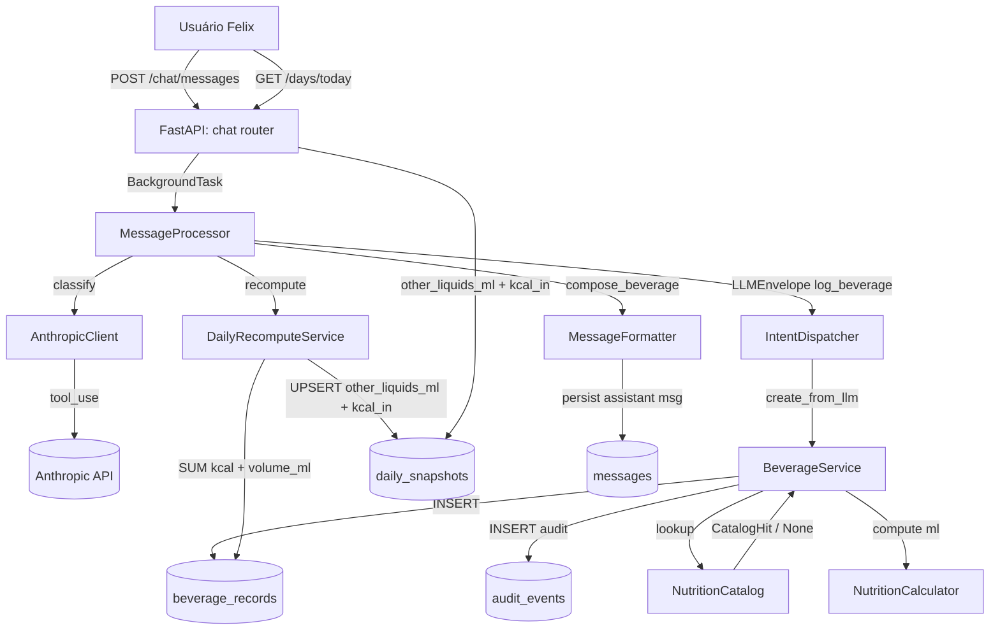
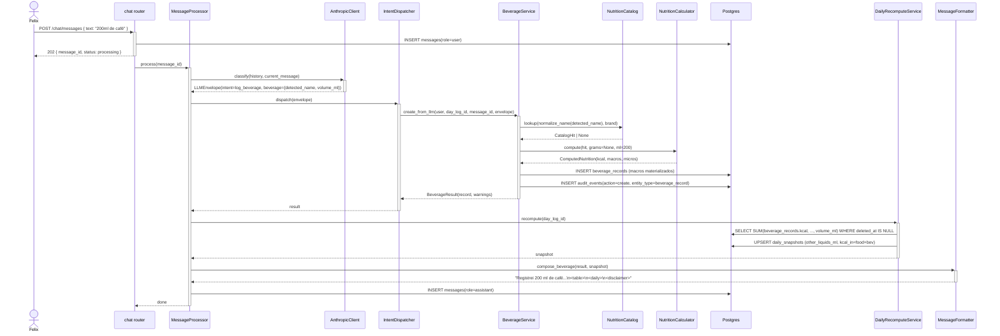

# Arquitetura — Registro de bebidas calóricas

## Visão geral

Feature irmã de `water-tracking`, mas com cálculo nutricional. A LLM classifica `log_beverage` e extrai `detected_name` + `volume_ml`; o backend faz lookup no `NutritionCatalog` (mesmo de alimentos), calcula macros via `NutritionCalculator` (basis `per_100ml`), materializa em `beverage_records` (tabela separada de `water_records` — INV-3), grava auditoria e dispara recompute. Sem endpoint próprio — tudo via `POST /chat/messages`.

## Componentes envolvidos

| Componente | Responsabilidade | Tecnologia |
|---|---|---|
| `chat.router` | Recebe `POST /chat/messages`, agenda `BackgroundTask` | FastAPI |
| `MessageProcessor` | Orquestra: LLM → dispatch → recompute → formatter → persist | Python service |
| `AnthropicClient` | Classifica intent via `tool_use` | `anthropic` SDK |
| `LLMEnvelope.beverage` (`BeverageIn`) | Sub-schema Pydantic v2 `extra="ignore"` | Pydantic v2 |
| `IntentDispatcher._handle_log_beverage` | Roteia `intent=log_beverage` para `BeverageService` | Python service |
| `BeverageService` | Lookup catálogo, cálculo macros, cria `beverage_records`, warnings, audit | Python service |
| `NutritionCatalog` | `lookup(name, brand)` → `CatalogHit \| None` | integrations |
| `NutritionCalculator` | `compute(hit, grams=None, ml=volume_ml)` → `ComputedNutrition` | static method |
| `BeverageRecordRepository` | INSERT em `beverage_records` | SQLAlchemy 2 async |
| `AuditEventRepository` | INSERT em `audit_events` | SQLAlchemy 2 async |
| `DailyRecomputeService._aggregate_beverage` | `SELECT SUM(kcal), ..., SUM(volume_ml)` → UPSERT | SQLAlchemy 2 + Postgres |
| `MessageFormatter.compose_beverage` | Monta assistant message (SP-118) | Python util |

## Diagrama de contexto

## Diagrama de sequência

## Decisões de design

1. **Tabela dedicada `beverage_records`** vs. unificada com `water_records`.
   - **Justificativa**: INV-3 (Const. Art. IV §13) — bebida nunca conta em `water_ml`. Tabelas separadas tornam impossível vazamento. Ver detalhe em `water-tracking/trade-offs.md` decisão 1 (mesma decisão, documentada lá).
   - **Consequência**: `DailyRecomputeService` tem `_aggregate_water` e `_aggregate_beverage` separados.

2. **Macros materializados em `beverage_records`** (não calculados sob demanda).
   - **Justificativa**: igual a `food_items` — `SUM` sem N+1 e histórico estável. Se catálogo TBCA mudar, registros antigos preservam kcal do momento da criação.
   - **Alternativa considerada**: calcular sob demanda via `catalog_ref_id` + `volume_ml`. Rejeitada — quebraria histórico.

3. **`BeverageIn(_LenientBase)` com `extra="ignore"`** vs. `WaterIn(_StrictBase)` com `extra="forbid"`.
   - **Justificativa**: LLM tende a inventar campos (`kcal`, `sugars_g`) em bebidas. `ignore` tolera o lixo; o backend só consome `detected_name`, `volume_ml`, `brand`, `confidence`. `WaterIn` é estrito porque água é simples (só `volume_ml`).
   - **Alternativa considerada**: `forbid` em beverage. Rejeitada — invocaria `validation_exhausted` com frequência.

4. **`needs_confirmation = confidence < 0.5 OR hit is None`** — duplo gatilho.
   - **Justificativa**: bebida sem catálogo é inerentemente incerta (macros zerados); confiança baixa também. Ambos merecem destaque na UI.

5. **`beverage_kind='other'` fixo** no schema.
   - **Justificativa**: MVP não discrimina alcoólico/lácteo/suco. `Literal["other"]` deixa a porta aberta para enum futuro sem quebrar envelope antigo.
   - **Dívida**: [Inferido do código] nenhum uso de `beverage_kind` hoje além do default. <!-- TODO: SP futuro pode querer subtipos -->

6. **Sem rejeição semântica como `_NON_WATER_HINTS`** em beverage.
   - **Justificativa**: beverage aceita qualquer `detected_name`. Se a LLM mandar "água" como `log_beverage`, persiste com `kcal=0` e soma em `other_liquids_ml` — tecnicamente incorreto, mas sem gate defensivo. O prompt `system_v2.md` orienta a LLM a usar `log_water` para água pura.

## Padrões utilizados

- **Layered architecture**: routes → services → repositories → models.
- **Result object**: `BeverageResult(record, warnings)` — dataclass com `slots=True`.
- **Repository pattern**: `BeverageRecordRepository.create` com `user_id` explícito (Const. §21).
- **Pure function**: `NutritionCalculator.compute` — `staticmethod`, sem estado (compartilhado com `food-logging`).
- **Error code translation**: `ValidationAppError(code="invalid_beverage_envelope")` → `MessageProcessor` mapa para `validation_exhausted`.

## Segurança e autenticação

- **Rota de entrada** (`POST /chat/messages`) exige JWT (cookie `access_token`).
- **`user_id`** propagado em toda query (Const. §21). `BeverageRecordRepository.create` recebe `user_id` obrigatório.
- **RLS não usado**; isolamento em application-layer.
- **`detected_name`** é texto livre — não é logado fora de audit/messages.

## Observabilidade

- **Logs estruturados** com `request_id`, `user_id`, `intent`.
- **Métricas** (futuro): taxa de `no_catalog_hit` em beverage — sinal de seed TBCA faltando bebidas comuns.
- **Audit trail**: `audit_events` é a fonte para "quando e quanto esta bebida foi registrada".

## Ganchos com outras features

- **`water-tracking`**: complementar. Tabelas separadas garantem INV-2/INV-3. `_NON_WATER_HINTS` em `HydrationService` rejeita bebida em `log_water`; o caminho correto é `log_beverage`.
- **`food-logging`**: compartilha `NutritionCatalog` + `NutritionCalculator` + `normalize_name`. Mesmo pipeline de cálculo, só muda `grams` vs. `ml`.
- **`chat-messaging`**: dono do `POST /chat/messages`. `BeverageService` é um handler.
- **`anthropic-integration`**: dono do `LLMEnvelope` + `BeverageIn`.
- **`daily-snapshot`**: dono do `DailyRecomputeService._aggregate_beverage`.
- **`record-correction`** / **`record-deletion`**: mutam `beverage_records` (TargetKind.BEVERAGE).
- **`day-close`**: usa `other_liquids_ml` + `kcal_in` do snapshot.
- **`weekly-report`**: soma `other_liquids_ml` + `kcal_in` entre dias fechados.
