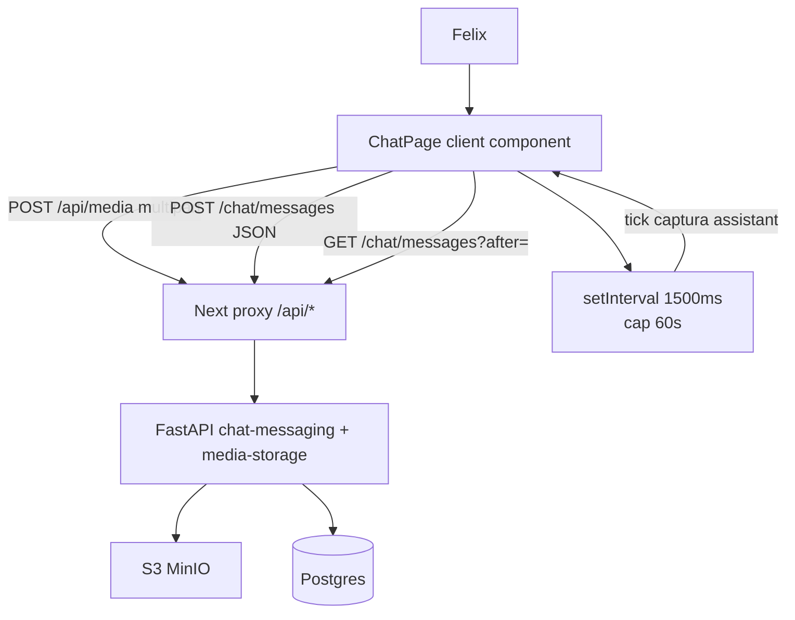
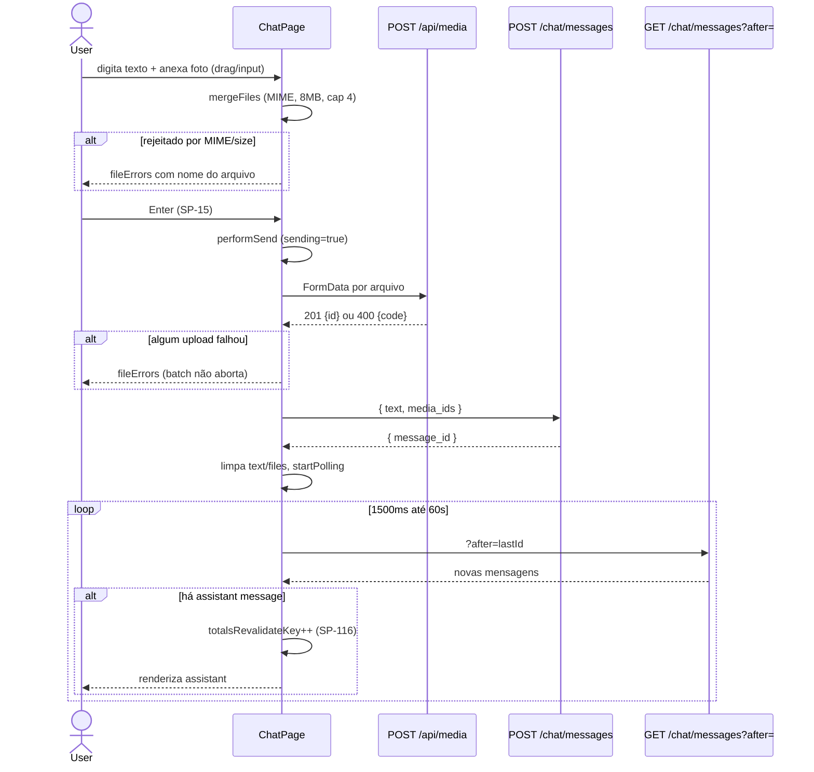

# Arquitetura — Composer do chat — UX (Bloco 1)

> **Rastreabilidade**: SP-15..SP-19 · Implementação: `apps/web/src/app/(app)/chat/page.tsx` (componente único `'use client'`).

## Visão geral

O composer é um único componente client (`ChatPage`) em Next.js 16 App Router responsável por todo o estado de UI do `/chat`: texto, arquivos anexados, envio, polling de resposta do assistente, erros por arquivo, drag-and-drop e disparo de modais (`CloseDayModal`, `PendingItemsModal`). Não tem backend próprio — consome `POST /chat/messages` e `POST /media` da feature `chat-messaging` via proxy Next.js (`/api/*` → API FastAPI). O backend revalida todas as regras (SP-11); a UI replica as mesmas validações para dar feedback imediato antes do round-trip.

## Componentes envolvidos

| Componente | Responsabilidade | Tecnologia |
|---|---|---|
| `ChatPage` (`page.tsx`) | Estado + handlers (envio, anexar, drag, polling, modais) | React 19 client component |
| `<textarea>` | Composição de texto com `onKeyDown` (SP-15) + placeholder pt-BR | HTML nativo |
| `<input type="file">` | Seletor de anexo com `capture="environment"` (SP-16) e `accept` filter | HTML nativo |
| `mergeFiles` | Normalização de anexos: MIME/size/cap/overflow → `files` + `fileErrors` (SP-17/18) | Função utilitária local |
| `uploadMedia` | `POST /api/media` FormData → `{ ok, id }` ou erro mapeado (SP-18) | `fetch` |
| `performSend` | Orquestra upload → `POST /chat/messages` → polling (SP-15) | Função local |
| `startPolling`/`stopPolling` | Polling 1500ms / cap 60s de `GET /chat/messages?after=` | `setInterval` |
| `AssistantContent` | Renderiza markdown da resposta do assistente (SP-115..118) — referência cruzada | `./AssistantContent.tsx` |
| `DayTotalsBar` | Barra de totais do dia revalidada por `totalsRevalidateKey` (SP-116) | `./DayTotalsBar.tsx` |
| `PendingItemsModal` | Confirmação inline de itens pendentes (SP-117) | `./PendingItemsModal.tsx` |
| `CloseDayModal` | Encerramento de dia (T-704) | `./CloseDayModal.tsx` |
| `api` (`lib/api-client.ts`) | Wrapper de `fetch` com tratamento de erros e cookie | TypeScript |
| Proxy Next.js (`proxy.ts`) | Roteia `/api/*` para o backend, protege por cookie | Next 16 middleware |

## Diagrama de contexto

## Diagrama de sequência — envio de mensagem com foto (SP-15/17/18)

## Decisões de design

1. **Componente único em vez de decomposição**: o `ChatPage` mantém todo o estado em um arquivo (568 linhas). Justificativa: estado altamente acoplado (envio depende de `text`+`files`+`sending`; polling depende de `lastIdRef`; modais dependem de `totalsRevalidateKey`). Decomposição exigiria.lift de estado pesado para pouco ganho no MVP. Dívida: arquivo grande.

2. **Replicar validações do backend client-side** (`MAX_FILE_BYTES`, `ACCEPT_MIME`, cap de 4): o backend (SP-11) já rejeita inválidos; a UI replica para feedback imediato (antes do round-trip) e porque arquivos gigantes podem falhar no proxy Next.js antes de o backend responder JSON de erro. Referência: RNF-001/RNF-002 em [`requirements.md`](./requirements.md).

3. **`replace` vs `append` em `mergeFiles`**: input file usa `replace` (semântica nativa: nova seleção substitui); drag-and-drop usa `append` (acumula). Espelha a intenção esperada do usuário em cada gesto.

4. **`dragCounterRef` para evitar flicker**: enter/leave disparam ao transitar entre filhos do form; o contador só zera quando realmente sai do container. Alternativa considerada: `relatedTarget` checks — mais frágil com elementos SVG.

5. **Poll imediato antes do `setInterval`**: resposta do assistente pode chegar antes do primeiro tick (1500ms); o poll imediato captura isso, depois agenda o interval.

6. **`capture="environment"` como dica**: dica para o SO; não garante câmera traseira. Aceito porque melhora a UX mobile sem custo em desktop (atributo é ignorado).

7. **Anti-duplo-envio via state `sending`**: Enter e click no botão verificam `sending`; `performSend` wrapped em `try/finally` garante reset mesmo em erro.

## Padrões utilizados

- **Design pattern**: Controlled components (React) com `useState`/`useRef`; refs para valores que não disparam re-render (`dragCounterRef`, `pollRef`, `lastIdRef`).
- **Convenções**: estado de UI declarativo; handlers nomeados (`onTextareaKeyDown`, `onDragEnter`); constantes em CAPS no topo; mensagens pt-BR centralizadas em `UPLOAD_REASONS`.
- **Acessibilidade**: `role="alert"` em listas de erro; `aria-live`/`aria-label` no `TypingIndicator`; `aria-label` nos botões de remover anexo.

## Segurança e autenticação

- **Cookie `access_token`**: todo `fetch('/api/*')` usa `credentials: 'include'` (`uploadMedia` e `api-client`). Validação real acontece no backend (`authentication-session`).
- **Upload**: `cache: 'no-store'` evita servir mídia de cache; backend impõe allowlist MIME e cap de 8 MB (SP-11) — UI replica mas backend é a fonte de verdade.
- **Validação dupla**: mesmo bypassando client-side via DevTools, o backend rejeita (`POST /media` e `POST /chat/messages` com `media_ids` inválidos).

## Observabilidade

- **Logs**: [Inferido do código] — não há telemetria/client analytics explícita no composer. Erros ficam em `state` (`error`, `fileErrors`) e só. <!-- TODO: avaliar adicionar Sentry/analytics -->
- **Métricas**: nenhuma client-side; backend registra `audit_events` e métricas das rotas.
- **Traces**: `X-Request-Id` injetado no backend (middleware global); o `fetch` do cliente propaga cookies mas não `X-Request-Id` explícito.