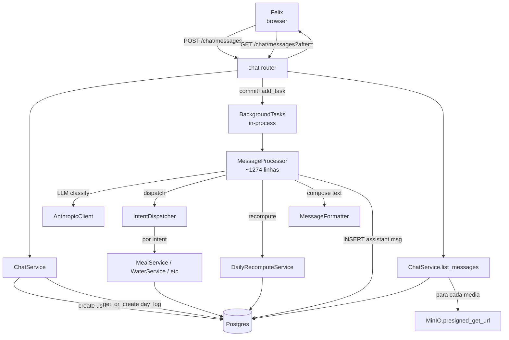
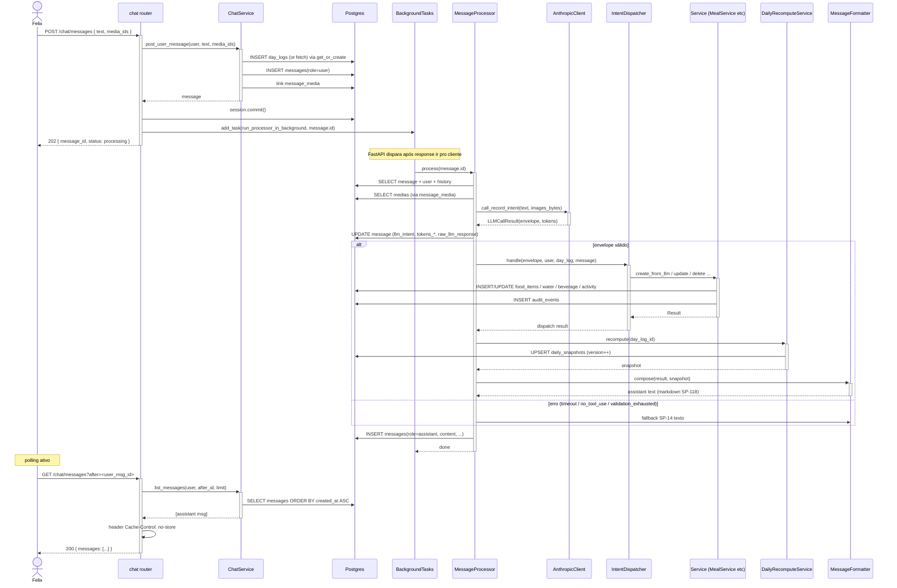

# Arquitetura — Chat e mensagens

## Visão geral

Padrão **command-query com processamento assíncrono**: POST persiste comando e retorna 202; worker in-process (FastAPI BackgroundTask) executa dispatch → LLM → services → recompute → formatter → assistant message; cliente lê via polling GET. Único ponto de entrada de mutação; imutabilidade de mensagens (correção/deleção mexem em records, nunca em `messages`).

## Componentes envolvidos

| Componente | Papel |
|---|---|
| `chat.router` | Roteador FastAPI: `POST /chat/messages`, `GET /chat/messages` |
| `ChatService` | Persist user message + validate media + get_or_create day_log |
| `MessageRepository`, `MediaRepository`, `DayLogRepository` | Camada de acesso |
| `local_today(tz)` | Wrapper `zoneinfo` para o dia local do user (SP-92) |
| `BackgroundTasks` (FastAPI) | Fire-and-forget do worker in-process |
| `MessageProcessor` | Orquestrador do pipeline pós-202 (~1274 linhas) |
| `IntentDispatcher` | Roteia envelope por intent para service específico |
| `MessageFormatter` | Compõe assistant text (markdown SP-118) |
| `AnthropicClient` | Classificação de intent (feature [`anthropic-integration`](../anthropic-integration/)) |
| `DailyRecomputeService` | Recompute pós-mutação (feature [`daily-snapshot`](../daily-snapshot/)) |
| MinIO storage | Baixa media para enviar à LLM; gera presigned URL na listagem |

## Diagrama de contexto

## Diagrama de sequência — request-to-assistant

## Decisões de design

1. **BackgroundTask do FastAPI (in-process) ao invés de Celery/RQ.**
   - **Justificativa**: MVP single-VPS single-user. Complexidade de Celery/RQ (broker Redis, worker container) não paga.
   - **Trade-off**: se processo morre entre POST 202 e processing, mensagem user persiste mas assistant nunca chega. Aceito — usuário reenvia.

2. **Retorno 202 + polling** (sem streaming/SSE).
   - **Justificativa**: SP-10 explicitamente cita polling. Nginx buffering complica SSE.
   - **Consequência**: latência percebida = fim-a-fim. Aceito no MVP.

3. **`session.commit()` explícito antes de `add_task`.**
   - **Justificativa**: FastAPI BackgroundTask roda depois do commit da dep `get_session`, mas queríamos garantir. Worker abre nova sessão via `session_factory`.
   - **Consequência**: request response tarda ~5-10ms extra; mas race window fechado.

4. **`Cache-Control: no-store` no GET**.
   - **Justificativa**: bug 2026-07-19 — polling da mesma URL era cacheado por Chrome/Safari por 5-30s, mascarando novas mensagens.
   - **Consequência**: sem cache, mas polling tolera.

5. **Sem cursor devolve mais recentes**.
   - **Justificativa**: UX. Usuário abre app → última msg no topo.
   - **Consequência**: teste de regressão explícito; se alguém "otimizar" pra sempre ordenar ASC do início, quebra.

6. **`raw_llm_response` como JSONB opaco**.
   - **Justificativa**: schema evolui; JSONB tolera. Contém envelope + dispatch metadata + erros.
   - **Trade-off**: sem constraint no shape. Auditoria informal.

7. **`nutrient_fact_id` exposto no MessageOut apenas para `log_nutrition_label`**.
   - **Justificativa**: SP-33 pede botão inline de confirmação. Só makes sense pra esse intent.
   - **Alternativa**: campo genérico `dispatch_metadata`. Rejeitada — só um caso hoje.

8. **`day_log_id` como FK SET NULL**.
   - **Justificativa**: se dia for deletado (migração), mensagem sobrevive como registro histórico.
   - **Consequência**: código que agrupa msg por dia precisa checar NULL.

9. **`role='system'` no enum, mas sem uso hoje.**
   - **Justificativa**: preparação para prompt engineering futuro (mensagem de sistema por conversa).

10. **Media validação por `list_by_ids(ids, user_id)`**.
    - **Justificativa**: single query resolve ownership + existência. `unknown_media` genérico não vaza info.

## Padrões utilizados

- **CQRS-like**: POST (comando) devolve 202; GET (query) devolve estado. Assíncronos.
- **Repository**: `MessageRepository`, `MediaRepository`, `DayLogRepository`.
- **Fire-and-forget worker**: BackgroundTask.
- **Cursor-based pagination**: `after`/`before` sobre UUIDs monotônicos por tempo (UUID v7 se implementado; v4 se não — assumindo ordem por `created_at`).
- **Result object nunca lança**: assistant fallback SP-14 é a resposta pra qualquer erro do pipeline.

## Segurança e autenticação

- **Auth**: `Depends(get_current_user)` em ambas rotas.
- **Ownership**:
  - `messages` filtrado por `user_id` na listagem.
  - `message_media` só linka se media pertence ao user (validado em `ChatService`).
  - Presigned URLs MinIO são short-lived (~1h) — mesmo se vazadas, expiram.
- **CSRF**: `SameSite=Lax` do cookie de auth mitiga.
- **Injeção**: Pydantic + SQLAlchemy 2 blindam SQL/XSS.
- **PII**: `content` texto livre; guardado em plaintext no DB. Sem redação.

## Observabilidade

- **`X-Request-Id`** injetado por middleware global.
- **`raw_llm_response`** é log de auditoria por mensagem (JSONB).
- **Métricas potenciais** (não implementadas): tempo entre POST e assistant persistir, rate de fallback SP-14, rate de clarify vs. registro válido.

## Ganchos com outras features

- **[`authentication-session`](../authentication-session/)**: `get_current_user` em ambas rotas.
- **[`media-storage`](../media-storage/)**: upload em `POST /media`; presigned URL na listagem.
- **[`anthropic-integration`](../anthropic-integration/)**: LLM chamada no processor.
- **[`daily-snapshot`](../daily-snapshot/)**: `get_or_create` day_log; recompute pós-dispatch.
- **[`food-logging`](../food-logging/), etc.**: dispatchers de intent.
- **[`chat-composer-ux`](../chat-composer-ux/)**: Bloco 1 melhora client-side (Enter, drag-drop, camera capture).
- **[`assistant-message-rendering`](../assistant-message-rendering/)**: Bloco 2 estrutura a `content` da assistant (cards, tabelas, DayTotalsBar).
- **[`nutrition-label-ocr`](../nutrition-label-ocr/)**: `nutrient_fact_id` exposto no MessageOut para SP-33.
