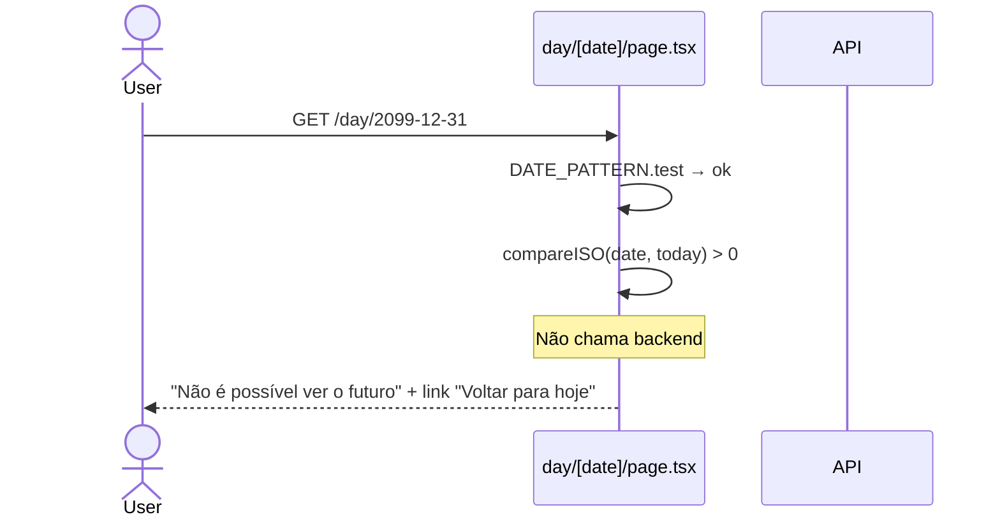

# Arquitetura — Visão detalhada do dia (Bloco 6)

> **Rastreabilidade**: SP-150..SP-155 · Implementação: `apps/web/src/app/(app)/day/` (11 arquivos) + `apps/web/src/app/(app)/day/[date]/page.tsx` + `apps/api/app/services/day_query.py`.

## Visão geral

Página Next 16 App Router server-rendered para visualização detalhada do dia. Dois entrypoints (`/day` hoje, `/day/[date]` passado) delegam ao `DayView` compartilhado. Estratégia:

1. **Server components por padrão** — tabelas, seções, `<details>` nativo sem JS.
2. **Client components isolados** só onde necessário: `DayNavigator` (navigation/state), `ConfirmItemButton` (POST + refresh), `CloseDayButton` (modal), `RefreshOnFocus` (staleness).
3. **Backend sem mudanças** — consome `GET /days/today`/`GET /days/{date}`; `_load_food` já retorna micros + metadata desde Fase 4.

Sem cache HTTP (`force-dynamic`) porque records mudam a cada mensagem no chat. `RefreshOnFocus` combate staleness do Router Cache do Next após mutações externas.

## Componentes envolvidos

| Componente | Responsabilidade | Tecnologia |
|---|---|---|
| `day/page.tsx` | Entrypoint hoje; fetch `GET /days/today` server-side | Next 16 server component |
| `day/[date]/page.tsx` | Entrypoint date; valida param; bloqueia futuro; fetch `GET /days/{date}` | Next 16 server component |
| `DayView` | Render compartilhado; `groupBySlot`, `EmptyState`, `TotalsCard`, `NarrativeCard`, `Disclaimer` | Server component |
| `MealSection` | Seção por slot pt-BR + kcal parcial + grid header | Server component |
| `FoodItemRow` | Linha expansível (`<details>`); badge "confirmar"/"sem catálogo"; micros | Server + `ConfirmItemButton` (client) |
| `ConfirmItemButton` | Inline `POST /confirm` + `router.refresh()` | React 19 client |
| `AuxiliarySections` (Hydration/Beverage/Activity) | Seções auxiliares SP-153 | Server components |
| `DayNavigator` | Botões prev/next/Hoje + date picker | React 19 client |
| `CloseDayButton` | Abre `CloseDayModal` reusado do chat | React 19 client |
| `RefreshOnFocus` | `router.refresh()` no mount + `visibilitychange` debounce | React 19 client |
| `format.ts` | Formatters pt-BR + aritmética de datas UTC | TypeScript |
| `types.ts` | `DaySnapshot` + dicionários pt-BR (`MEAL_SLOT_*`, `ACTIVITY_*`, `CALC_METHOD_*`, `SOURCE_*`) | TypeScript |
| `day_query.py::_load_food` | Backend: micros + metadata por FoodItem | Python |
| `proxy.ts` | Protege `/day` e `/day/:path*` por cookie | Next 16 middleware |
| `(app)/layout.tsx` | Link "Hoje" no header | Server |

## Diagrama de contexto

```mermaid
graph TD
    User[Felix] -->|cookie| Proxy[proxy.ts checa cookie]
    Proxy -->|/day| DayPage[day/page.tsx server]
    Proxy -->|/day/[date]| DatePage[day/[date]/page.tsx server]
    DayPage -->|INTERNAL_API_URL + cookie header| API[FastAPI GET /days/today]
    DatePage -->|valida param + futuro blocked| API2[FastAPI GET /days/{date}]
    API --> Query[day_query.py::_load_food]
    API2 --> Query
    Query --> DB[(Postgres)]
    DayPage --> DayView[DayView compartilhado]
    DatePage --> DayView
    DayView --> MealSec[MealSection per slot]
    DayView --> AuxSec[AuxiliarySections]
    DayView --> Totais
    DayView --> Navigator[DayNavigator client]
    DayView --> CloseBtn[CloseDayButton client]
    DayView --> Refresh[RefreshOnFocus client]
    Navigator -->|router.push| User
    CloseBtn --> CloseModal[CloseDayModal do chat]
    CloseModal -->|POST /days/close| API
    UIItem[ConfirmItemButton no FoodItemRow] -->|POST /confirm| API3[FastAPI records]
    API3 -->|recompute INV-4 + audit INV-10| DB
    Weekly[/weekly] -->|link Dia| User
```

## Diagrama de sequência — render `/day` + confirm inline

```mermaid
sequenceDiagram
    actor User
    participant Page as day/page.tsx server
    participant API as GET /days/today
    participant DayView
    participant Refresh as RefreshOnFocus
    participant Confirm as ConfirmItemButton
    User->>Page: GET /day
    Page->>API: fetch INTERNAL_API_URL + cookie
    API-->>Page: DaySnapshot JSON
    Page->>DayView: data, allowClose
    DayView->>Refresh: render
    Refresh->>Refresh: router.refresh() no mount
    User->>Confirm: click badge de needs_confirmation
    Confirm->>Confirm: preventDefault + stopPropagation (não toggle <details>)
    Confirm->>API: POST /records/food-items/{id}/confirm
    API-->>Confirm: 200 already_confirmed
    Confirm->>Confirm: state=done; router.refresh()
    Note over Confirm,DayView: server component re-fetches<br/>re-renderiza sem badge
    DayView-->>User: UI atualizada
```

## Diagrama de sequência — `/day/[date]` futuro bloqueado



## Decisões de design

1. **Server components por padrão + islands client**: tabelas/seções renderizam sem JS execto o `<details>` nativo. Client components só em 4 pontos que **precisam** de interação (navigator, confirm, close, refresh). Resultado: bundle leve, FCP rápido, SEO-friendly.

2. **`<details>` nativo em vez de lib de accordion**: SP-152 pede expansão por item. `<details>/<summary>` HTML5 faz sem JS, estilizável com Tailwind, acessível_default. Sem NPM dep.

3. **`RefreshOnFocus` explícito em vez de `revalidate`/ISR**: o Router Cache do Next pode servir snapshot pré-mutação quando o usuário volta pra aba/navega client-side. `force-dynamic` cobre fetch server, mas o cache do router é outra camada. Estratégia: refresh no mount + `visibilitychange` com debounce. Alternativa considerada: `revalidate={0}` no fetch — não cobre navegações client-side pós-mutação.

4. **Backend sem mudanças**: `_load_food` já retornava micros + metadata (Fase 4-4.b); a unica coisa nova foi a UI de `/day`. Justificativa: zero migração/spec nova; consome contrato existente.

5. **`DayView` compartilhado** entre `/day` e `/day/[date]`: diferenças só no fetch entrypoint + `allowClose` (§always true para `/[date]`). Justificativa: zero duplicação de render; 1 arquivo mantém layout.

6. **`CloseDayButton` reusado** do chat: mesmo `CloseDayModal` (feature `day-close`/Bloco `assistant-message-rendering`). Só muda o `onClosed` callback que faz `router.refresh()` em vez de incrementar `revalidateKey`. Justificativa: consistência; zero duplicação de modal.

7. **Aritmética de datas UTC interna**: `addDaysISO`/`partsToISO` usam `Date.UTC` para evitar DST drift em transições de horário de verão (Brasil abolished 2019 mas código defensivo). Input YYYY-MM-DD sem hora é dia-calendário; comparação lexicográfica funciona porque zero-padded.

8. **Read-only by design** (exceções `ConfirmItemButton`/`CloseDayButton`): SP-154 explicita que mutações de records continuam via chat. Confirm/close são ações um-click não-mutação de valor (só flags de estado) e reabertura não existe (INV-5).

9. **Futuro bloqueado client/server sem backend hit**: SP-155 exige não chamar backend em data futura. `compareISO` server-side antes do fetch. Economiza round-trip + protege contra 500s.

10. **`proxy.ts` protege `/day` e `/day/:path*`**: adicionado no PR Bloco 6 (T-B605). Garante que a página `/day` redirecione pra `/login` sem cookie.

## Padrões utilizados

- **Design pattern**: Server-first Next App Router + compositional components (`DayView` orquestra filhos).
- **State lifting pattern**: `RefreshOnFocus` no pai, callbacks (`onCloseDayClick`, `onPendingClick`) do Bloco 2 reaproveitados.
- **Typography/grid pattern**: grids 12-col consistentes entre MealSection header e FoodItemRow summary.
- **Acessibilidade**: `<nav aria-label>`, `<details>/<summary>` nativos, tooltips via `title`, `role=alert` implícito em n/a.
- **Color tokens**: amber para pendente, slate-200/700 para "sem catálogo", emerald para `closed`.

## Segurança e autenticação

- **Cookie server pass-through**: server components pegam `cookies()` (`next/headers`); enviam como `Cookie` header no `fetch` para o backend. `INTERNAL_API_URL` é DNS interno do compose (não expõe).
- **`proxy.ts`**: `/day` e `/day/:path*` em `PROTECTED_PREFIXES`; valida presença de cookie (auth real no backend).
- **Path traversal rejected**: `^\d{4}-\d{2}-\d{2}$` em `/day/[date]` antes do fetch.
- **INV-5 (dia fechado imutável)**: `ConfirmItemButton` e `CloseDayButton` respeitam `status==='open'`; backend rejeita mute em `closed`.
- **Isolamento por usuário** (Art. V §21): backend `GET /days/*` e `POST /confirm` filtram por `user_id`.
- **Audit (INV-10)**: `POST /confirm` registra `audit_events(action='confirm')`.

## Observabilidade

- **Logs**: backend `X-Request-Id` middleware; server components não propaguem explicitamente (potencial amélioração).
- **Métricas**: nenhuma client-side; backend instrumenta rotas.
- **Traces**: [Inferido do código] — sem Sentry/analytics front. `RefreshOnFocus` é client-side; refresh count potencialmente útil.
- **Erros**: page mostra ErrorPanel com mensagem pt-BR; `ConfirmItemButton` falha volta a `idle` sem toast (potencial UX gap).
<!-- TODO: adicionar analytics de page views + expand ratio de items -->