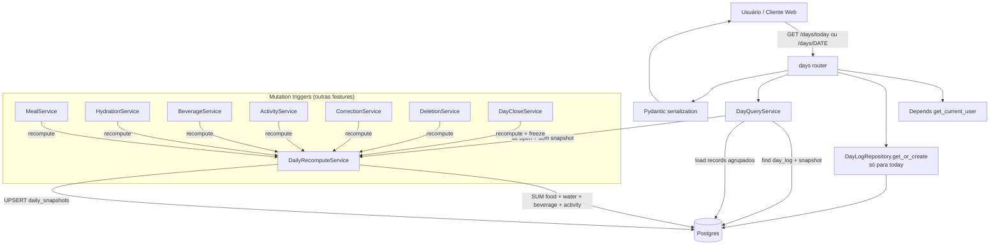
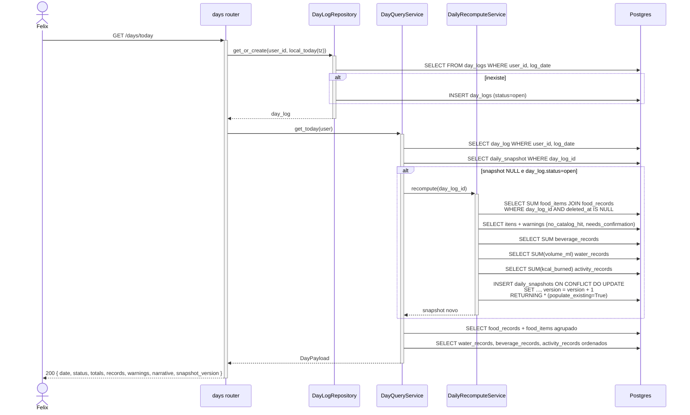

# Arquitetura — Snapshot diário

## Visão geral

Snapshot é cache materializado com semântica de recomputo obrigatório. Duas superfícies HTTP (`GET /days/today` e `GET /days/{date}`) leem do snapshot; um único serviço (`DailyRecomputeService`) reconstrói de zero via `SUM` sobre tabelas cruas. A regra "from-scratch" (INV-4) é enforcada arquiteturalmente — não existe caminho que faça delta.

## Componentes envolvidos

| Componente | Responsabilidade | Tecnologia |
|---|---|---|
| `days.router` | `GET /days/today`, `GET /days/{date}` (+ `POST /days/{date}/close`, dono de [`day-close`](../day-close/)) | FastAPI |
| `DayQueryService` | Orquestra: encontra day_log, decide se recomputa, carrega records, monta payload | Python service |
| `DailyRecomputeService` | Executa 4 agregações + upsert atômico | Python service |
| `DayLogRepository.get_or_create` | Idempotente para "today" | SQLAlchemy 2 async |
| `local_today(tz)` | `zoneinfo` — resolve dia local a partir do timezone do user | `zoneinfo` stdlib |
| Model `DailySnapshot` | Cache + JSONB warnings + version + narrative | SQLAlchemy + Postgres JSONB |
| Model `DayLog` | Ciclo de vida (`open` / `closed`) + `closed_at` | SQLAlchemy |
| Schema `DaySnapshotOut` | Wire format | Pydantic v2 |

## Diagrama de contexto



## Diagrama de sequência — Read do dia atual



## Diagrama de sequência — Recompute em mutação

```mermaid
sequenceDiagram
    actor U as Felix
    participant M as MessageProcessor (chat pipeline)
    participant D as IntentDispatcher
    participant S as MealService / etc
    participant DRS as DailyRecomputeService
    participant DB as Postgres

    U->>M: POST /chat/messages (log_food)
    M->>D: dispatch(envelope)
    D->>+S: create_from_llm(...)
    S->>DB: INSERT food_records + food_items + audit_events
    S-->>-D: MealResult
    D->>+DRS: recompute(day_log_id)
    DRS->>DB: SUM sobre tabelas cruas (from-scratch)
    DRS->>DB: UPSERT daily_snapshots
    DRS-->>-D: RecomputeResult (snapshot atualizado)
    Note over D,DB: Snapshot já refletindo mudança;<br/>próximo GET /days/today devolve valor novo
```

## Decisões de design

1. **Materializar snapshot** ao invés de calcular sob demanda em toda leitura.
   - **Justificativa**: `GET /days/today` roda em cada polling do chat (SP-116 revalidação) — reconstruir a cada leitura seria ~10ms × N leituras. Materializado devolve `SELECT * FROM daily_snapshots WHERE ...` em <5ms.
   - **Alternativa**: derivar em cada leitura. Rejeitada — custo × frequência.

2. **Recompute from-scratch (INV-4)**, nunca delta.
   - **Justificativa**: Const. Art. III §10. Elimina uma classe inteira de bugs (drift, race, undo de soft delete). Simplicidade > microperformance.
   - **Alternativa**: incremental (`snapshot.kcal_in += item.kcal`). Rejeitada — impossível auditar; impossível recuperar de estado inconsistente.

3. **Upsert atômico via `pg_insert ... ON CONFLICT`**.
   - **Justificativa**: `UNIQUE(day_log_id)` garante 1:1. Race entre dois recomputes simultâneos é resolvida pelo Postgres — o segundo faz UPDATE em cima do primeiro. Valor final é consistente (idempotente).
   - **Consequência**: `version` pode incrementar mais de uma vez por "operação de negócio" — aceito; cliente usa version como signal de "diferente do meu cache".

4. **`populate_existing=True` no `.returning()`**.
   - **Justificativa**: sem essa flag, SQLAlchemy pode devolver o `DailySnapshot` do identity map (cache do session) em vez do valor que acabou de escrever. Regressão vista na Fase 4.
   - **Consequência**: obriga re-load da linha; custo desprezível (mesma transação).

5. **Recompute on-read para dia aberto sem snapshot**.
   - **Justificativa**: se algum caminho de escrita esqueceu de recomputar (bug latente ou dado importado sem trigger), leitura de dia aberto se auto-corrige.
   - **Alternativa**: falhar (500) ou devolver zeros. Rejeitada — self-heal é melhor UX.

6. **Dia fechado nunca recomputa on-read (INV-5)**.
   - **Justificativa**: Const. Art. VIII §28. Imutabilidade é garantia de estabilidade histórica. Se algo mudar no catálogo, dia passado não é afetado.
   - **Consequência**: snapshot é "congelado" no fechamento — decisão do [`day-close`](../day-close/).

7. **`user_id` armazenado tanto em `day_logs` quanto em `daily_snapshots`**.
   - **Justificativa**: redundância proposital. Permite queries diretas em `daily_snapshots` filtradas por user (útil em `weekly_report`) sem JOIN. Custo: 16 bytes/linha.
   - **Alternativa**: sempre JOIN com `day_logs`. Rejeitada — semanal ficaria mais complexo.

8. **Warnings como JSONB array**.
   - **Justificativa**: shape variável (item_id vs. record_id, entity diferente). JSONB é indexável se precisar; flexível pra evolução.
   - **Alternativa**: tabela `snapshot_warnings`. Rejeitada — overkill.

9. **`local_today(user.timezone)`** — nunca `datetime.utcnow().date()`.
   - **Justificativa**: SP-92. Se o backend inferir dia por UTC, mensagem de 23:59 local vira dia seguinte no dia errado.
   - **Consequência**: obrigação de repassar `user.timezone` em toda decisão de "hoje".

10. **`_load_food` agrupa em memória por `food_records.id`**.
    - **Justificativa**: JOIN devolve produto cartesiano; agrupar client-side é mais simples que window function.
    - **Alternativa**: JSONB agregado no Postgres (`json_agg`). Rejeitada — legibilidade e portabilidade caem.

## Padrões utilizados

- **Cache-aside** com invalidação por trigger (recompute chamado explicitamente após mutação).
- **UPSERT atômico** via `INSERT ... ON CONFLICT DO UPDATE`.
- **Result object** (`RecomputeResult`, `DayPayload`).
- **Repository** apenas para `DayLog.get_or_create` — `DailyRecomputeService` acessa `session` direto para operações agregadas complexas.
- **Immutable operations**: soft delete + `SUM` filtrado por `deleted_at IS NULL` — sem UPDATE destrutivo.

## Segurança e autenticação

- **Auth** via `Depends(get_current_user)` em todas as rotas.
- **`user_id`** verificado implicitamente (SELECT `day_log WHERE user_id = ...`). Nenhuma query cross-user.
- **Sem info leak**: 404 de dia inexistente **não** revela se o dia existe para outro usuário (só devolve `day_not_found` genérico).

## Observabilidade

- **`snapshot.version`** — monotônico; pode ser usado como métrica de mutabilidade do dia.
- **`snapshot.computed_at`** — última recomputação; útil pra debug ("por que meu total tá desatualizado?").
- **`warnings`** — visível ao usuário; sinal para produto sobre qualidade do catálogo.

## Ganchos com outras features

- **Todas as features de mutação** ([`food-logging`](../food-logging/), [`water-tracking`](../water-tracking/), [`caloric-beverages`](../caloric-beverages/), [`activity-cardio-logging`](../activity-cardio-logging/), [`record-correction`](../record-correction/), [`record-deletion`](../record-deletion/)) chamam `recompute` como último passo.
- **[`day-close`](../day-close/)** — chama recompute uma última vez, salva `narrative`, seta `day_log.status='closed'` e `closed_at`.
- **[`weekly-report`](../weekly-report/)** — agrega `daily_snapshots` (só `status='closed'` — INV-8).
- **[`assistant-message-rendering`](../assistant-message-rendering/) (SP-116)** — barra de totais consulta `GET /days/today` em cada polling do chat.
- **[`daily-detail-view`](../daily-detail-view/)** — página `/day` renderiza este payload.
