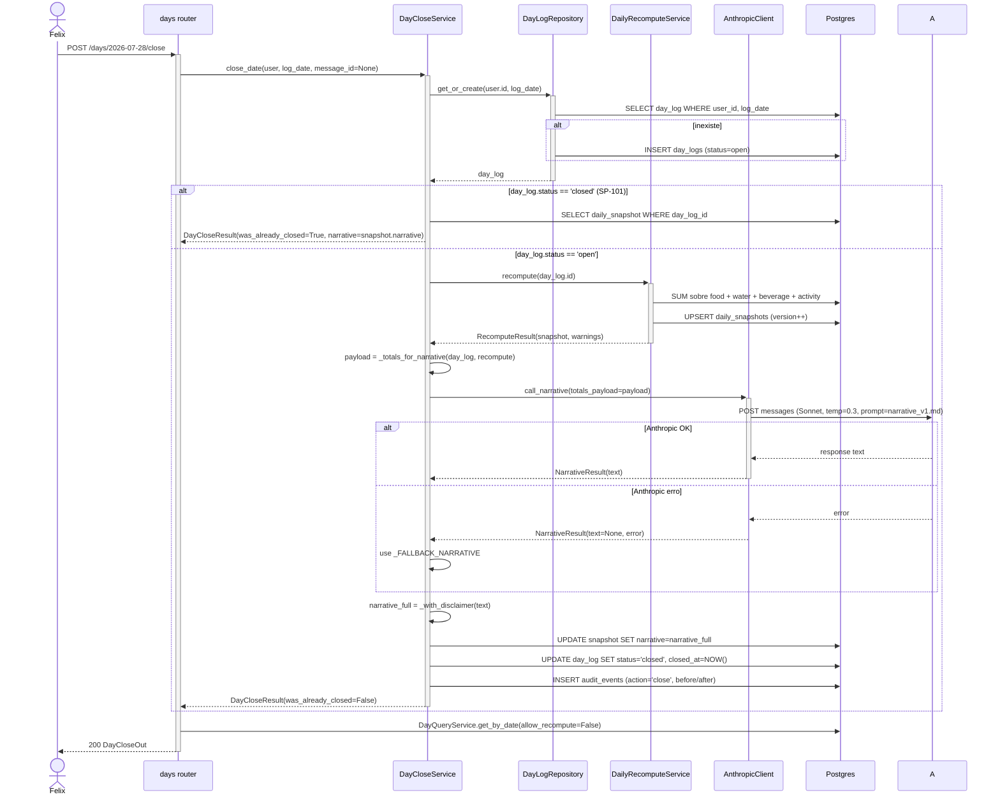

# Arquitetura — Encerramento de dia

## Visão geral

Único caminho de transição `day_log.status: open → closed`. Executa 3 mutações em ordem estrita: **(1) recompute forçado** (INV-4 → snapshot fresh) → **(2) narrativa via LLM** sobre totais → **(3) congela** (`status/closed_at + snapshot.narrative`) + audit. Idempotente por natureza — se dia já é `closed`, retorna estado atual sem executar (1) nem (2).

## Componentes envolvidos

| Componente | Papel |
|---|---|
| `days.router` | Endpoint `POST /days/{log_date}/close` |
| `DayCloseService` | Orquestrador: idempotência, recompute, narrative, congelamento, audit |
| `DayLogRepository.get_or_create` | Garantir day_log existe |
| `DailyRecomputeService.recompute` | Recompute obrigatório (INV-4) |
| `AnthropicClient.call_narrative` | Narrativa sobre totais calculados (SP-103) |
| `AuditEventRepository.record` | Log INV-10 |
| `DayQueryService.get_by_date(allow_recompute=False)` | Devolve payload final da rota |
| `MessageProcessor._handle_close_day` | Path via chat (intent `close_day`) |
| `_with_disclaimer` | Concatena disclaimer sem duplicar (SP-104) |

## Diagrama de contexto

```mermaid
graph TD
    UB[Felix] -->|POST /days/DATE/close| R[days router]
    UB -->|chat: "encerrar dia"| Chat[chat router]
    Chat --> MP[MessageProcessor]
    MP -->|intent=close_day| HC[_handle_close_day]
    HC --> DC[DayCloseService]
    R --> DC
    DC --> DLR[DayLogRepository.get_or_create]
    DLR --> DB[(Postgres)]
    DC -->|se open| DR[DailyRecomputeService]
    DR --> DB
    DC -->|totals| AN[AnthropicClient.call_narrative]
    AN --> A[(Anthropic API)]
    DC -->|congela| DB
    DC --> AUD[AuditEventRepository]
    AUD --> DB
    DC --> DQ[DayQueryService.get_by_date<br/>allow_recompute=False]
    DQ --> DB
    R --> UB
    HC -->|assistant message| DB
```

## Diagrama de sequência — Fechamento normal



## Decisões de design

1. **Recompute obrigatório antes do close (SP-102, INV-4).**
   - **Justificativa**: fechamento é "commit final". Se snapshot está stale por algum bug ou race anterior, agora é a última chance de corrigir.
   - **Alternativa**: confiar no snapshot atual. Rejeitada — quebra determinismo de "história fechada = fatos vivos ao fechar".

2. **Idempotência pura**: 2ª chamada não regrava nada.
   - **Justificativa**: Const. §29 literal. UX tolerante a duplo clique.
   - **Consequência**: `_generate_narrative` custa API Anthropic apenas uma vez por dia — não recomputa on-read se já closed.

3. **Narrativa sobre totais pré-calculados (SP-103, INV-1)**.
   - **Justificativa**: LLM não pode "achar" que kcal_in é diferente. Se a LLM produz texto que menciona valor errado, tolerância zero — mas o payload já vai com valores exatos.
   - **Consequência**: prompt (`narrative_v1.md`) instrui "use exatos"; se LLM alucinar, ainda usa nossos números na string.

4. **Fallback textual sempre**.
   - **Justificativa**: Anthropic pode falhar. Não deixar dia fechado com `narrative=None` — quebra UX e teste de compliance.
   - **Consequência**: `_FALLBACK_NARRATIVE` é curto e útil.

5. **`_with_disclaimer` evita duplicação**.
   - **Justificativa**: LLM às vezes inclui texto do disclaimer espontaneamente. Duplicar seria feio.
   - **Implementação**: `if _DISCLAIMER in stripped: return stripped` — check por substring exata.

6. **`get_or_create` do day_log**.
   - **Justificativa**: user pode querer fechar dia sem registros ("hoje foi domingo, não registrei nada"). Sem `get_or_create`, 404 preveniria.
   - **Consequência**: snapshot zerado é válido.

7. **`_require_snapshot` recompute forçado em anomalia**.
   - **Justificativa**: se `day_log.status='closed'` mas `daily_snapshots` não existe (bug de migration antigo?), recompute forçado devolve totals coerentes ao invés de 500.
   - **Trade-off**: essa recompute em dia fechado tecnicamente viola INV-5, mas só acontece em anomalia. Aceito.

8. **`warning_codes` na payload, não os warnings completos**.
   - **Justificativa**: LLM não precisa de IDs internos; só sinaliza que "há itens sem catálogo" no texto.
   - **Consequência**: privacidade + tokens menores.

9. **Fechar dia passado é permitido**.
   - **Justificativa**: SP-155 v1.11 explicita — user pode fechar dia que esqueceu. Backend não restringe a "hoje".
   - **Frontend**: `/day/[date]` mostra botão se `status='open'`.

10. **INV-5 enforce fora do escopo desta feature**.
    - **Justificativa**: `DayCloseService` só produz `status='closed'`. Quem bloqueia mutação subsequente é `CorrectionService`, `DeletionService`, `MealService.correct` etc.
    - **Separação de responsabilidades**: 1 service = 1 papel.

## Padrões utilizados

- **State machine** simples: `open → closed`. Sem `closed → open` (reabertura fora de escopo).
- **Result object**: `DayCloseResult(day_log, snapshot, narrative, was_already_closed)`.
- **Idempotência estrutural**: check antes de qualquer side effect.
- **Composição via DI**: `DayCloseService(session, anthropic=...)` recebe cliente.
- **Fallback com defaults declarativos** (`_FALLBACK_NARRATIVE`, `_DISCLAIMER` como consts no topo).

## Segurança e autenticação

- **Auth**: `Depends(get_current_user)`.
- **Ownership**: `DayLogRepository` filtra por `user_id`.
- **INV-5 downstream**: bloqueio de correção/deleção enforça imutabilidade após close.

## Observabilidade

- **`audit_events`**: fonte primária.
- **`snapshot.version`**: cliente sabe se snapshot cresceu durante close.
- **Logs LLM**: `call_narrative` gera `event=anthropic_usage` com tokens.

## Ganchos com outras features

- **[`daily-snapshot`](../daily-snapshot/)**: recompute obrigatório antes de fechar; leitura pós-close nunca recomputa (INV-5 leitura).
- **[`anthropic-integration`](../anthropic-integration/)**: `call_narrative` com prompt `narrative_v1.md`.
- **[`chat-messaging`](../chat-messaging/)**: intent `close_day` roteia para cá.
- **[`record-correction`](../record-correction/)** e **[`record-deletion`](../record-deletion/)**: bloqueiam mutação pós-close (INV-5 escrita).
- **[`weekly-report`](../weekly-report/)**: só considera `status='closed'` (INV-8).
- **[`daily-detail-view`](../daily-detail-view/)** SP-155 v1.11: botão de close em `/day/[date]` para retroativo.
- **[`assistant-message-rendering`](../assistant-message-rendering/)**: renderiza narrativa como assistant message.
