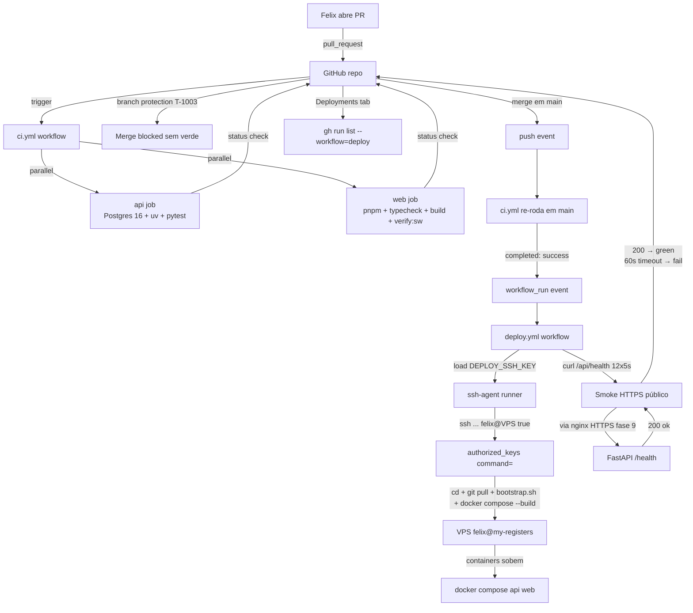
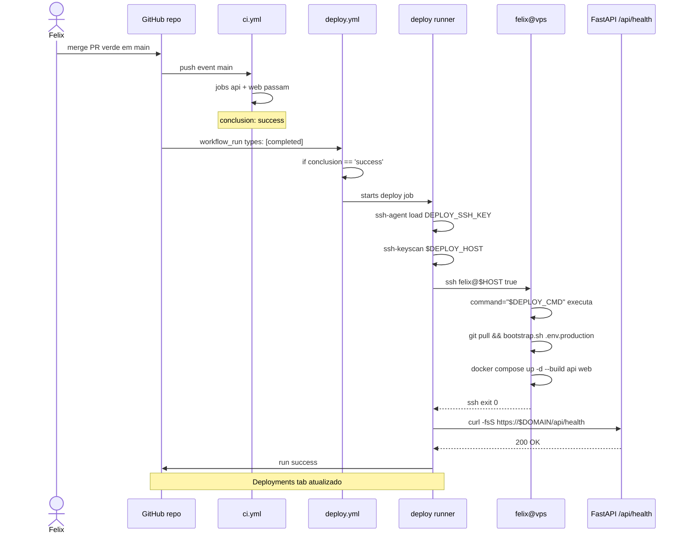

# Arquitetura — Pipeline CI/CD (Fase 10)

> **Rastreabilidade**: ADR-012 · Implementação: `.github/workflows/{ci,deploy}.yml`, `docs/deploy.md` §14, `scripts/bootstrap.sh`, `apps/api/app/api/routes/health.py`, `docker-compose.production.yml`.

## Visão geral

Pipeline CI/CD com GitHub Actions em dois workflows desacoplados:

1. **`ci.yml`** — validação pré-merge em PRs contra `dev`/`main`. Jobs paralelos `api` (Postgres 16 + ruff + pytest) e `web` (typecheck + build + `verify:sw`). Gate bloqueante (após T-1003 branch protection).
2. **`deploy.yml`** — deploy pós-CI verde em `main` via `workflow_run`. SSH na VPS com chave `deploy-only` restrita (executa `bootstrap.sh + docker compose --build`). Smoke em `/api/health` por HTTPS público (12×5s).

Estratégia **zero-secret de negócio**: `ANTHROPIC_API_KEY`, `POSTGRES_PASSWORD` etc. ficam em `.env.production` na VPS; GitHub só tem `DEPLOY_SSH_KEY`. Build roda local na VPS (`docker compose --build`), não em registry. ADR-012 descarta explicitamente Webhook/Watchtower/ArgoCD/Compose-pull/leave-as-is.

## Componentes envolvidos

| Componente | Responsabilidade | Tecnologia |
|---|---|---|
| `ci.yml` | Lint + test + build + `verify:sw` em PR | GitHub Actions |
| `deploy.yml` | SSH deploy + smoke pós-merge em `main` | GitHub Actions |
| Postgres 16-alpine service | DB efêmero para `pytest` em `ci.yml` job `api` | GitHub service container |
| `setup-uv@v5` | Instala uv + Python 3.12 + cache `~/.cache/uv` | Astral action |
| `pnpm/action-setup@v4` + `setup-node@v4` | Instala pnpm 10.12.1 + Node 20 + cache | Actions marketplaces |
| `verify-sw.mjs` | Sanity estático INV-11/SP-130/132/135 (5 checks) | Node ESM |
| `webfactory/ssh-agent@v0.9.0` | Carrega `DEPLOY_SSH_KEY` no runner | webfactory action |
| `authorized_keys` (VPS) | Linha `command="$DEPLOY_CMD",restrictions` que roda o deploy fixo | OpenSSH |
| `scripts/bootstrap.sh` | Idempotente: `alembic upgrade head` + setup admin/catalog | Bash |
| `docker-compose.production.yml` | Services `api`/`web` alvos do rebuild seletivo; nginx/certbot/postgres/minio intactos | Docker Compose |
| `health.py` route | `GET /health` sem auth para smoke | FastAPI + Pydantic |
| `nginx` (Fase 9) | Termina TLS em `https://$DEPLOY_DOMAIN/api/health` para smoke | Nginx + Certbot |
| Branch protection rule | T-1003: require status checks + linear history | GitHub repo settings |
| `gh` CLI | Debug de runs (`run list --workflow`, `run view --log`) | GitHub CLI |

## Diagrama de contexto

## Diagrama de sequência — merge em `main` → deploy

## Decisões de design

1. **`workflow_run` (não `push`) para deploy**: dispara só depois que `ci.yml` completa; `push: [main]` também roda `ci.yml` mas `workflow_run` garante que CI verde precede deploy. Alternativa considerada: `push: [main]` em `deploy.yml` com condição manual — perderia sequenciamento natural.

2. **Dois workflows separados (não um só com jobs dependentes)**: separa escopos — CI roda em PRs (rejeita insecure secret forwarding), deploy só roda em `main`. Significa: `ci.yml` em PR pode ter mocks/dummies; `deploy.yml` herda só sucesso de CI, não dependências de jobs.

3. **SSH restrito via `command="..."`** (não secrets injetados no runner): VPS executa comando fixo do `authorized_keys`; runner só envia "venia" com `true`. Alternativa considerada: runner montar `command` e passar — mas vazar `DEPLOY_SSH_KEY` permitiria shell. Com `command="..."`, mesmo vazada, atacante só força deploy do estado HEAD do `main`.

4. **Sem registry de imagem (build local na VPS, não registry → GHCR)**: Watchtower/ArgoCD descartados em ADR-012 por complexidade; build de 2 min aceitável. Trade-off: build ocupa CPU da VPS (não do runner) durante rebuild seletivo.

5. **Rebuild seletivo (`up -d --build api web`)**: postgres/minio/nginx/certbot não rebuildados — reduz downtime e custo. Database `up -d` sem `--build` só reinicia se compose mudou config. Alternativa considerada: rebuild all — maior janela de indisponibilidade.

6. **Smoke em HTTPS público (não em healthcheck interno do compose)**: evita falso positivo onde compose sinaliza healthy mas nginx/certbot quebraram. Trade-off: depende de TLS saudável (Fase 9).

7. **`bootstrap.sh` idempotente e compartilhado**: usado pelo Actions e em deploy manual; fallback GitHub outage não tem código divergente. Implementa Art. VI §24 (runtime da API não roda migrations; deploy chama `alembic upgrade head` explicitamente) e Art. I (bootstrap CLI idempotente).

8. **`ANTHROPIC_API_KEY` nunca no GitHub**: ADR-012 mandate. Segredo de LLM só vive na VPS; rotatividade é operação manual SSH. Implementação: deploy.yml nunca edita `.env.production`.

9. **`concurrency.group=deploy-production` com `cancel-in-progress: false`**: 1 deploy por vez, não cancela deploy em curso mesmo se novo merge chega. CI usa `cancel-in-progress: true` (runs redundantes em PR não agregam valor).

10. **Branch protection via UI (não código)**: T-1003 não pode ser commitado — exige acionar Settings → Branches. Aceito: gap operacional até config; documentado em `docs/deploy.md` §14.2.

11. **Sem workflow de rollback dedicado**: `git revert + push` reroda o pipeline com o hash anterior; ADR-012 descarta workflow de rollback. Migration destrutivahandled separadamente via `alembic downgrade -1` manual.

12. **Sem E2E (Playwright) no CI**: ADR-012 explicita — custo/manutenção não justificado em single-dev. Unit + integration cobrem invariantes; smoke pós-deploy cobre boot. Revisitar se aumentar equipe.

## Padrões utilizados

- **Pipeline > blue-green/canary**: `git revert` é rollback; zero infra de versões paralelas.
- **Pin de actions versions** (`actions/checkout@v4`, `setup-uv@v5`, `pnpm/action-setup@v4`, `setup-node@v4`, `ssh-agent@v0.9.0`) — supply-chain reprodutibilidade.
- **Pin de toolchain** (Python 3.12, Node 20, pnpm 10.12.1) — replica dev local e prod.
- **`--frozen`/`--frozen-lockfile`** travam lock drift em CI.
- **`enable-cache: true`/`cache: pnpm`** aceleram runs subsequentes.
- **`set -euo pipefail`** no smoke script — falha em qualquer parte do pipe.
- **Variables (não secrets) para host/domain**: aparecem em logs; tudo de negócio fica em secrets/excluded.
- **Runners em ubuntu-24.04** (LTS/latest estável alinhado com dev host macOS via toolchain managers).

## Segurança e autenticação

- **Chave SSH deploy-only**: `ed25519` sem passphrase, restrita via `command="$DEPLOY_CMD",no-port-forwarding,no-x11-forwarding,no-agent-forwarding,no-pty` em `authorized_keys`.
- **Secret único**: `DEPLOY_SSH_KEY` (private key). Variáveis `DEPLOY_HOST`/`DEPLOY_DOMAIN` são não-sensíveis.
- **Segredos de negócio na VPS**: `ANTHROPIC_API_KEY`, `POSTGRES_PASSWORD`, JWT secrets, MinIO creds — nunca passam pelo runner; deploy nunca edita `.env.production`.
- **Fase 9 (Nginx + Certbot)**: TLS para smoke HTTPS; `/api/health` exposto via `nginx` (não protegido por basic auth — health pública, sem dado sensível).
- **Runner não tem acesso ao DB**: API fala com Postgres na VPS via rede interna do compose; runner só conecta SSH.
- **Supply-chain**: actions pinados em major version (`@v4`, `@v5`) — aceitável mas não pin em SHA. Trade-off: revisão manual do release notes de cada. <!-- TODO: pin actions em SHA-256 -->
- **`pg_isready` healthcheck** em CI env: `registers_app` user com `dev_password` é segregado (não é credencial real de prod).

## Observabilidade

- **Logs**: `gh run list --workflow=deploy.yml --limit 10` + `gh run view --log`. Logs do step `bootstrap.sh` na VPS em `/var/log/...` ou `docker compose logs -f api web`.
- **Deployments tab**: `environment: production` + `url` faz GitHub exibir histórico.
- **Métricas**: ações número de runs/mês visíveis em Settings → Billing; `cancel-in-progress` ajuda grátis em repo privado.
- **Traces**: [Inferido do código] — sem tracing distribuído; `X-Request-Id` middleware no backend serve correlação request > logs API. Não propagado pro pipeline.
- **Erros**: smoke fail → run red; Felix vê em email/Slack (se habilitar); rollback via `git revert`.
- **Acesso à VPS por SSH fora do pipeline**: único dev SSH com sua chave pessoal (diferente da `deploy-only`); variável em `~/.ssh/known_hosts` do dev.