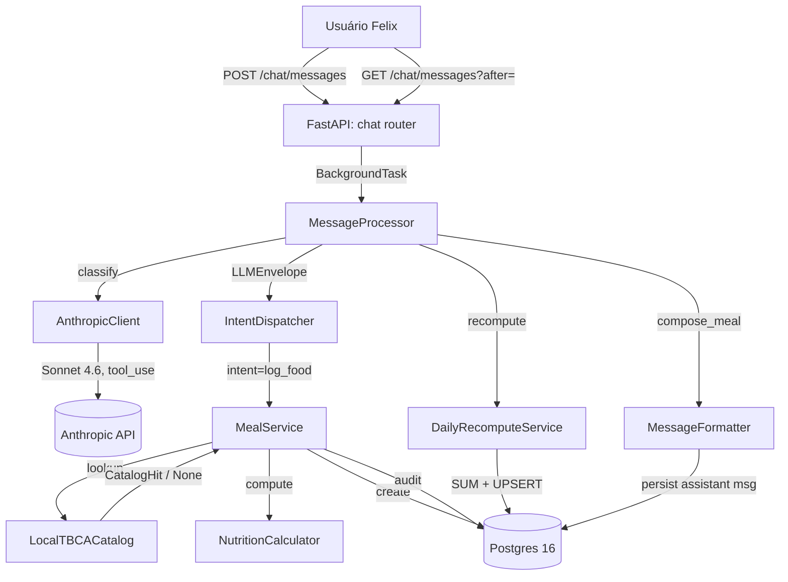
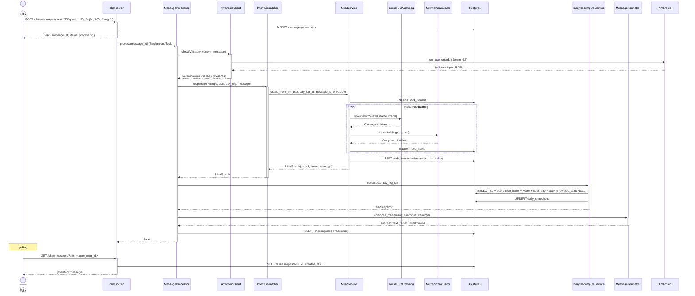

# Arquitetura — Registro de alimentos

## Visão geral

Feature composta por três camadas em `apps/api`: **interpretação** (LLM via Anthropic), **transformação** (`MealService` + `NutritionCalculator`), **persistência** (`food_records`, `food_items`, `audit_events`, `daily_snapshots`). O pilar é o Art. II da Constituição: LLM interpreta, backend calcula.

## Componentes envolvidos

| Componente | Responsabilidade | Tecnologia |
|---|---|---|
| `chat.router` | Recebe `POST /chat/messages`, agenda `BackgroundTask` | FastAPI |
| `MessageProcessor` | Orquestra: LLM → dispatch → recompute → formatter → persist | Python service |
| `AnthropicClient` | Chama Sonnet 4.6 com `tool_use` forçado, retry semântico, fallback Haiku 4.5 | `anthropic` SDK + wrapper |
| `LLMEnvelope` + submodelos | Contrato Pydantic v2 validado (`extra="forbid"` no root, `extra="ignore"` nos payloads) | Pydantic v2 |
| `IntentDispatcher` | Roteia `log_food` para `MealService.create_from_llm` | Python service |
| `MealService` | Cria `food_records`, itera itens, chama `NutritionCalculator`, coleta warnings, grava audit | Python service |
| `LocalTBCACatalog` | Lookup em memória (semeado no bootstrap), retorna `CatalogHit \| None` | Repositório + integrations |
| `NutritionCalculator` | Deterministic pure function: `(hit, grams, ml) → ComputedNutrition` | Static method Python |
| `FoodRecordRepository` / `FoodItemRepository` / `AuditEventRepository` | SQLAlchemy 2 async, todas com `user_id` obrigatório | SQLAlchemy 2 |
| `DailyRecomputeService` | UPSERT em `daily_snapshots` via agregação SQL sobre tabelas cruas | Python service + Postgres |
| `MessageFormatter.compose_meal` | Monta assistant message em formato SP-118 (tabelas markdown pt-BR) | Python util |

## Diagrama de contexto

## Diagrama de sequência

## Decisões de design

1. **Colunas materializadas em `food_items`** para macros/micros.
   - **Justificativa**: `DailyRecomputeService` faz `SELECT SUM(...)` sem N+1 e sem depender do estado atual do catálogo. Se o TBCA for atualizado, itens antigos preservam kcal calculado no momento da criação (histórico estável).
   - **Alternativa considerada**: calcular sob demanda a partir de `catalog_ref_id` + `grams`. Rejeitada — quebraria histórico ao mudar seed.

2. **Recompute from-scratch (INV-4)** ao invés de delta incremental.
   - **Justificativa**: Const. Art. III §10. Elimina categoria inteira de bugs (drift, race condition, edge case de deleção). Custo aceitável em single-user + volume baixo.
   - **Alternativa considerada**: atualização incremental. Rejeitada — complexidade vs. valor não compensa.

3. **`extra="ignore"` em `FoodItemIn`, `BeverageIn`, `ActivityIn`; `extra="forbid"` em `LLMEnvelope` raiz**.
   - **Justificativa**: LLM tende a inventar campos comuns em payloads (`pace`, `kcal`, `sugars_g`) que **não** consumimos. `forbid` no envelope raiz garante estrutura; `ignore` nos payloads permite tolerância a lixo.
   - **Alternativa considerada**: `forbid` em tudo. Rejeitada — invocaria `validation_exhausted` com frequência, quebrando UX ("Não consegui interpretar").

4. **`normalize_name` no ponto de lookup**, não no schema Pydantic.
   - **Justificativa**: `detected_name` é o que a LLM leu; `normalized_name` é derivado. Manter normalização no service centraliza a lógica e permite fallback (`entry.normalized_name or entry.detected_name`).

5. **`meal_slot='unspecified'` default via `server_default`**.
   - **Justificativa**: nem sempre a LLM classifica meal_slot; forçar dispatch a decidir aumenta chance de erro. `unspecified` é semanticamente correto.

6. **`raw_llm_response` gravado em `messages`, mas texto livre descartado**.
   - **Justificativa**: `raw_llm_response` fica para debugging (INV-9); apenas `tool_use.input` alimenta o `LLMEnvelope`. Se a LLM devolver "achei que era arroz mas..." em texto livre, é descartado.

7. **Auditoria em criação, mas `after` só com dados leves**.
   - **Justificativa**: `after={meal_slot, occurred_at, item_ids}` basta para reconstrução. Não duplica os itens (podem ser lidos por `entity_type='food_item'` em suas próprias entradas de auditoria futuras — correção/deleção).

## Padrões utilizados

- **Layered architecture**: routes → services → repositories → models. Nenhuma rota chama `session.execute` direto.
- **Dependency Injection** via FastAPI (`Depends`) para `db_session`, `current_user`, `settings`.
- **Result object** em vez de tupla: `MealResult(food_record, items, warnings)` retornado de `create_from_llm`.
- **Value object determinístico**: `ComputedNutrition` — dataclass frozen com `slots`, imutável dentro do request.
- **Repository pattern**: cada repositório encapsula suas queries; `user_id` é sempre argumento explícito, nunca inferido de contexto.
- **Pure function**: `NutritionCalculator.compute` é `staticmethod`, sem estado, sem side effects — trivial de testar.

## Segurança e autenticação

- **Rota de entrada** (`POST /chat/messages`) exige JWT válido; extraído do cookie `access_token` via middleware.
- **`user_id`** propagado em toda operação (Const. §21). Nunca há uma query em `FoodItemRepository` sem `user_id` no filtro.
- **RLS não é usado**; isolamento é enforced em application-layer (decisão de simplicidade em single-user MVP).
- **Fotos**: enviadas base64 para Anthropic (Const. §26). Nunca URL pública. Após upload em MinIO, o thumbnail retornado ao browser é o único caminho de leitura para o próprio usuário.
- **Injeção**: SQLAlchemy 2 usa `bindparams`; sem string concatenation em queries.
- **PII**: `detected_name`, `notes` são texto livre; não são logados fora de audit/messages.

## Observabilidade

- **Logs estruturados** (`structlog`?) com `request_id` (middleware `X-Request-Id`), `user_id`, `intent`. Erros levantam `AppError` que é serializado pelo handler global em `main.py`.
- **Métricas** (futuro): latência por intent, taxa de `no_catalog_hit`, `low_confidence_item` — sinal de melhoria de prompt/seed.
- **Traces**: Anthropic call durations não são exportados hoje; potencial melhoria (OpenTelemetry) em outro release.
- **Health**: `GET /health` (não coberto por esta feature; ver `docs/deploy.md`).
- **Audit trail**: `audit_events` é a fonte primária para "por que este item apareceu com esses valores?".

## Ganchos com outras features

- **`chat-messaging`**: dono do `POST /chat/messages` e do polling `GET /chat/messages?after=`. Sem alterar o contrato dele.
- **`anthropic-integration`**: dono do wrapping do SDK + retry semântico + fixtures. `MealService` não sabe qual modelo respondeu.
- **`daily-snapshot`**: dono do `DailyRecomputeService`. `MealService` só chama.
- **`assistant-message-rendering`**: dono do parsing da tabela markdown no frontend (SP-115..118). Backend só emite string.
- **`nutrition-label-ocr`**: intercepta antes com `intent=log_nutrition_label`; se rótulo + também consumido, roda ambos os fluxos.
- **`record-correction`** / **`record-deletion`**: mutam `food_items` posteriormente; recompute é o mesmo `DailyRecomputeService`.
- **`manual-catalog-recovery`**: sequência natural quando SP-23 dispara — usuário clica no prompt (SP-140) e cadastra manualmente (SP-141) com promoção opcional do item legado (SP-142).
