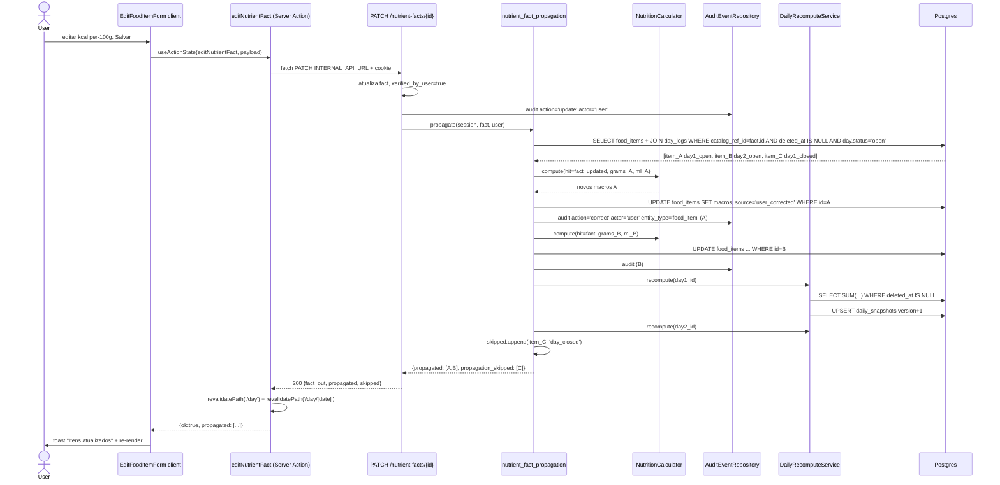

# Arquitetura — Edição inline de registros na página `/day`

> **Rastreabilidade**: SP-160..SP-169, INV-14 · ADRs em [`specs/002-edicao-inline-day/research.md`](../../002-edicao-inline-day/research.md): ADR-013 (propagação), ADR-014 (Server Action + lazy mount), ADR-015 (`correction_ops` compartilhado).
> Estende [`daily-detail-view/architecture.md`](../daily-detail-view/architecture.md) (Bloco 6).

## Visão geral

Extensão da página `/day` (Bloco 6 — server-rendered, read-only v1) com superfícies de mutação inline. Mantém o shell server component do `FoodItemRow`/`AuxiliarySections`; injeta client components (`EditFoodItemForm`/`EditWaterForm`/`EditBeverageForm`/`EditActivityForm`) apenas quando o `<details>` está aberto (lazy mount — ADR-014). Mutações vão ao backend via **Server Actions** (`actions.ts`) usando `INTERNAL_API_URL` + cookie pass-through, e chamam `revalidatePath` ao fim.

Backend: extrai funções puras de correção para `services/correction_ops.py` (consumidas pelo chat existente e pelos novos handlers REST — ADR-015); adiciona `services/nutrient_fact_propagation.py` (ADR-013 — Inv-14); 3 novos handlers PATCH em `routes/records.py` (water/beverage/activity); extensão do PATCH em `routes/nutrient_facts.py` para chamar `propagate`.

## Componentes envolvidos

| Componente | Responsabilidade | Tecnologia | Status |
|---|---|---|---|
| `EditFoodItemForm.tsx` (novo, client) | Form inline dentro de `FoodItemRow`; inputs grams/ml + per-100g opcional; chama `editFoodItem`/`editNutrientFact` | React 19 client | novo |
| `EditWaterForm.tsx` (novo, client) | Form inline em `HydrationSection`; input volume_ml | React 19 client | novo |
| `EditBeverageForm.tsx` (novo, client) | Form inline em `BeverageSection`; input volume_ml | React 19 client | novo |
| `EditActivityForm.tsx` (novo, client) | Form inline em `ActivitySection`; inputs duration/intensity/kcal_burned | React 19 client | novo |
| `FoodItemRow.tsx` (extensão) | Shell server mantém; `<details onToggle>` injeta `EditFoodItemForm` lazy | Next 16 server + client island | estendido |
| `AuxiliarySections.tsx` (extensão) | Seções auxiliares com `<details>` + forms client inline | Next 16 server + client island | estendido |
| `day/actions.ts` (novo) | Server Actions: `editFoodItem`/`editNutrientFact`/`editWater`/`editBeverage`/`editActivity`; fetch PATCH via `INTERNAL_API_URL`; `revalidatePath` | Next 16 server actions | novo |
| `routes/records.py` (extensão) | 3 novos handlers PATCH (water/beverage/activity) | FastAPI | estendido |
| `routes/nutrient_facts.py` (extensão) | PATCH chama `propagate` ao fim; response estendido | FastAPI | estendido |
| `services/correction_ops.py` (novo) | Funções puras `apply_water_change`/`apply_beverage_change`/`apply_activity_change` (extraídas de `correction.py`) | Python | novo |
| `services/correction.py` (refactor) | Consome `correction_ops` em vez de duplicar lógica | Python | refactor |
| `services/nutrient_fact_propagation.py` (novo) | `propagate(session, fact, user) -> {propagated, skipped}`; recalcula registros vivos | Python | novo |
| `services/daily_recompute.py` (reuso) | `recompute(day_log_id)` após cada PATCH com mudança | Python | reuso |
| `services/nutrition_calculator.py` (reuso) | `compute(hit, grams, ml)` determinístico | Python | reuso |
| `services/activity_calculator.py` (reuso) | `compute(activity_type, intensity, duration, weight_kg)` determinístico | Python | reuso |
| `repositories/food.py::AuditEventRepository` (reuso) | `record(action, actor, before, after)` | Python | reuso |

## Diagrama de contexto

```mermaid
graph TD
    User[Felix] -->|cookie| Proxy[proxy.ts]
    Proxy -->|/day| DayPage[day/page.tsx server]
    DayPage -->|INTERNAL_API_URL + cookie| API_Get[GET /days/today]
    API_Get --> DayView[DayView compartilhado]
    DayView --> MealSec[MealSection per slot]
    MealSec --> FoodRow[FoodItemRow shell server]
    FoodRow -->|details onToggle| EditFoodForm[EditFoodItemForm client]
    EditFoodForm -->|useActionState| Action1[actions.ts editFoodItem/editNutrientFact]
    Action1 -->|fetch PATCH INTERNAL_API_URL| APIPatch1[PATCH /records/food-items OR /nutrient-facts]
    APIPatch1 --> CorrOps[correction_ops.py]
    APIPatch1 --> Prop[nutrient_fact_propagation.py]
    Prop --> Recompute[DailyRecomputeService]
    APIPatch1 --> Audit[AuditEventRepository]
    CorrOps --> Calc[NutritionCalculator]
    Recompute --> DB[(Postgres)]
    Audit --> DB
    Action1 -->|revalidatePath| DayView
    DayView --> AuxSec[AuxiliarySections water/beverage/activity]
    AuxSec -->|details onToggle| EditAuxForms[EditWater/Beverage/ActivityForm]
    EditAuxForms -->|useActionState| Action2[actions.ts edit*]
    Action2 -->|fetch PATCH| APIPatch2[PATCH /records/water|beverage|activity]
    APIPatch2 --> CorrOps
    APIPatch2 --> Audit
    APIPatch2 --> Recompute
    Note[Chat fixo - sem mudança]
    Chat[CorrectionService chat] --> CorrOps
```

## Diagrama de sequência — editar per-100g do rótulo + propagação (SP-162 + SP-163)



## Diagrama de sequência — editar quantidade de food_item (SP-160)

```mermaid
sequenceDiagram
    actor User
    participant Form as EditFoodItemForm
    participant Action as editFoodItem
    participant API as PATCH /records/food-items/{id}
    participant Ops as correction_ops.apply_food_change
    participant Calc as NutritionCalculator
    participant Audit
    participant Recompute
    User->>Form: alterar grams de 150 para 220, Salvar
    Form->>Action: editFoodItem(id, {grams:220})
    Action->>API: PATCH INTERNAL_API_URL + cookie
    API->>API: SELECT FoodItem WHERE id AND user_id (Art. V §21)
    API->>API: validar day.status='open' (INV-5)
    API->>Ops: apply_food_change(item, grams=220)
    Ops->>Calc: compute(hit, grams=220, ml)
    Calc-->>Ops: novos macros
    Ops-->>API: {changed: {grams, kcal, ...}, warnings: []}
    API->>Audit: audit action='correct' actor='user' before/after
    API->>Recompute: recompute(day_log_id)
    API-->>Action: 200 {id, kcal, grams}
    Action->>Action: revalidatePath('/day')
    Action-->>Form: {ok:true}
    Form->>User: details recolhe; totais atualizam
```

## Decisões de design

1. **Shell server + client island lazy mount** (ADR-014): `FoodItemRow` permanece server; o `<details onToggle>` injeta `{open && <EditFoodItemForm/>}`. Preserva o benefício zero-JS do SP-152 quando item está recolhido; paga custo de hidratação só no item expandido.

2. **Server Actions via `INTERNAL_API_URL`** (ADR-014): mutações não expõem `NEXT_PUBLIC_API_URL` para o browser; Server Action faz fetch no servidor repassando cookie. Padrão do repo, coerente com `proxy.ts` e Server Components existentes.

3. **`correction_ops.py` compartilhado chat + REST** (ADR-015): extrai `apply_*_change` puras de `correction.py`. Chat converte `LLMEnvelope.correction.changes` → kwargs; REST passa payload Pydantic direto. Evita divergência no cálculo (Const. Art. II §5 indiretamente).

4. **Propagação síncrona na mesma transação** (ADR-013 / INV-14): após SP-162 commitar fact, `propagate` roda na mesma transação, assicronamente deixa a UI ver consistência imediatamente. Trade-off: PATCH nutrient-facts cresce com nº de itens referenciando o fact (~ dezenas no MVP — ≤ 300ms RNF-001).

5. **Response default `[]`**: `NutrientFactOut.propagated` e `.propagation_skipped` default `[]` — não quebra clientes antigos (RFC 2119 SHOULD).

6. **Dia closed validado no início do handler**: antes de qualquer mutação, para evitar audit "órfão" (mutação detectada mesmo com erro 409). Mismo padrão do `correction.py::_ensure_day_open`.

7. **`detected_name` não editável via REST** (SP-166): continue via chat — o matching via `normalized_name` + `meal_slot` (SP-72) é complexo; expor inline causaria desalinhamento.

8. **Edição de per-100g da bebida fora do escopo v1**: UI só edita `volume_ml` para beverage; fact da bebida segue editável via SP-162 quando referenciado por food_item, mas não há shortcut direto da seção Bebidas (deixar para follow-up).

9. **A11y desde o design**: `<label htmlFor>`, foco no 1º input ao abrir, `aria-live` para erros, `disabled` em dia fechado. Componente `<form>` nativo com `useActionState`.

10. **Aviso legal mantido** (Const. Art. VII §26): `<Disclaimer/>` no rodapé do `DayView` não é removido na re-renderização pós-edição; revalidate só afeta dados, não layout.

## Padrões utilizados

- **Design pattern**: Server-First App Router + Client Islands (mesmo do Bloco 6).
- **Shared service extraction**: `correction_ops` como núcleo reutilizável (chat + REST).
- **Propagação em transação**: para consistência INV-14; sem fila assíncrona (ver ADR-013 alternativas).
- **Server Actions pattern**: padrão Next 16 com `revalidatePath` declarativo.
- **Pydantic tipado + Literal**: `intensity: Literal[...]` valida enum canônico; `gt=0` para quantidades.
- **Acessibilidade**: `<label>`, `aria-live`, `disabled` em estado imutável; `<form>` nativo permite submit por Enter.

## Segurança e autenticação

- **Cookie server pass-through**: Server Actions pegam `cookies()` (`next/headers`) e repassam no fetch interno. `INTERNAL_API_URL` é DNS interno do compose; não exposto ao browser.
- **`proxy.ts`**: `/day` e `/day/:path*` já em `PROTECTED_PREFIXES` (Bloco 6) — sem mudança.
- **Isolamento por usuário** (Const. Art. V §21): filtro `user_id == current_user.id` em todo SELECT de PATCH. Cross-user retorna 404 `not_found` (não revela existência).
- **INV-5 valido no início do handler**: diante de qualquer mutação, `day_log.status === 'open'`; se não, 409 sem efeito colateral.
- **Audit (INV-10)**: `AuditEventRepository.record` chamado antes do commit em cada PATCH e por item propagado.
- **Path traversal**: aplicado no `/day/[date]` (Bloco 6) — sem mudança nesta feature.

## Observabilidade

- **Logs**: middleware `X-Request-Id` no backend continuam; Server Actions propagam `X-Request-Id` no fetch (potencial melhoria).
- **Métricas**: latência do PATCH (alvo RNF-001 ≤ 300ms P95) — instrumentar `time.perf_counter()` no handler ou via middleware.
- **Traces**: sem Sentry/analytics front — alvo futuro.
- **Erros**: server action retorna `{ok:false, error:'<code>'}` mapeado para pt-BR no client (`conflict_closed_day` → "Dia encerrado é imutável"; `not_found` → "Item não encontrado"; `not_editable` → "Catálogo canônico — não editável"; `unauthorized` → "Sessão expirada, recarregue").
<!-- TODO: adicionar métrica de latência específica para PATCH nutrient-facts com propagação (pico cresce com N itens) -->