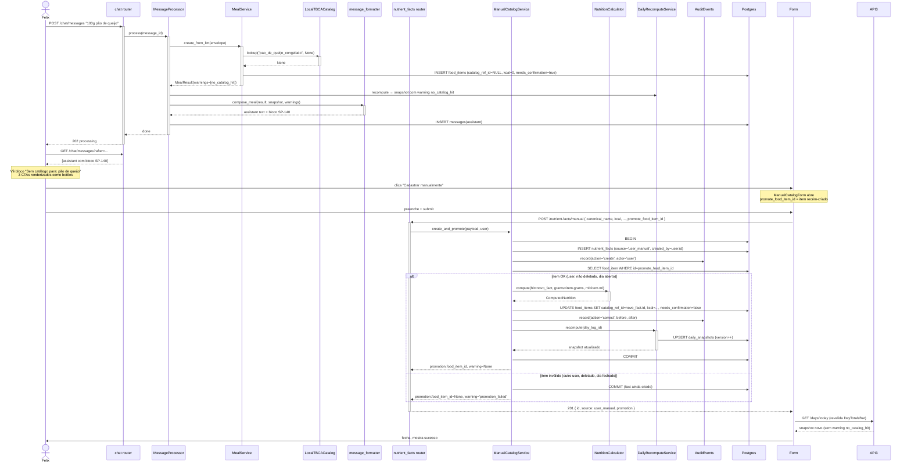

# Arquitetura — Recuperação manual de itens sem catálogo

## Visão geral

Bloco 5 é feature majoritariamente aditiva: nova rota + migration + form frontend + bloco extra no assistant message formatter. Reusa infra pesada existente (`NutritionCalculator`, `DailyRecomputeService`, `AuditEventRepository`, `LabelCatalogService` como referência de shape). O que muda semanticamente é o loop de feedback pro usuário: item sem catálogo antes era "morto no diário"; agora é "morto até virar clique".

## Componentes envolvidos

| Componente | Papel | Estado nesta árvore |
|---|---|---|
| `message_formatter.compose_meal` | Anexa bloco de recovery quando warnings contêm `no_catalog_hit` | Existe (sem a extensão) |
| `POST /nutrient-facts/manual` (nova rota) | Recebe payload, valida, cria fact + opcional promoção + audit + recompute | **Ausente** aqui; presente em `feat/bloco-5-catalog-recovery` |
| `ManualNutrientFactIn` (novo schema) | Pydantic v2 com validações estritas | **Ausente** aqui |
| Serviço novo (`ManualCatalogService`?) ou extensão de `LabelCatalogService` | Encapsula upsert de fact user_manual | **Ausente** aqui |
| Migration `0008_nutrient_facts_source_user_manual` | Adiciona valor `user_manual` ao CHECK constraint | **Ausente** aqui |
| `LocalTBCACatalog.lookup` | Precedência de source com `user_manual` | Precisa validar em code (spec §141) |
| `NutritionCalculator.compute` | Reusado no recálculo pós-promoção | Existe |
| `DailyRecomputeService.recompute` | Recompute pós-promoção bem-sucedida | Existe |
| `AuditEventRepository.record` | Duas gravações (create + correct) | Existe |
| `ManualCatalogForm.tsx` | Formulário curto client-side | **Ausente** aqui |
| `AssistantContent.tsx` (extensão) | Detecta bloco de recovery e renderiza botões | **Ausente** (componente existe; extensão não) |

## Diagrama de contexto

```mermaid
graph TD
    U[Felix<br/>browser] -->|POST /chat/messages<br/>"comi pão de queijo"| API1[chat routes]
    API1 --> MP[MessageProcessor]
    MP --> DIS[IntentDispatcher]
    DIS --> MS[MealService]
    MS -->|item sem hit| CAT[LocalTBCACatalog]
    MS --> DB[(Postgres)]
    MS -->|MealResult com warning no_catalog_hit| DIS
    DIS --> DR[DailyRecomputeService]
    DR --> DB
    DIS --> MF[message_formatter.compose_meal]
    MF -->|detecta no_catalog_hit| Bloco[anexa bloco SP-140<br/>com 3 CTAs em markdown]
    MP --> DB
    MP -->|assistant message persiste| DB

    U2[Felix<br/>vê bloco no chat] -->|clica Cadastrar manualmente| Form[ManualCatalogForm.tsx]
    Form -->|POST /nutrient-facts/manual<br/>+ promote_food_item_id| API2[nutrient_facts routes]
    API2 --> NEW[ManualCatalogService<br/>novo]
    NEW --> DB
    NEW -->|promotion válida| NC[NutritionCalculator]
    NEW --> DR2[DailyRecomputeService]
    NEW --> AUD[AuditEventRepository]
    NEW -->|201 promotion.food_item_id| Form
    Form -->|revalida| Bar[DayTotalsBar]
    Bar --> API3[GET /days/today]
```

## Diagrama de sequência — Fluxo completo (SP-140 → SP-141 + SP-142)



## Decisões de design

1. **Transação única para create fact + promote**.
   - **Justificativa**: se o UPDATE do item falhar por race (item deletado no meio), rollback do fact é semanticamente esquisito — user pediu para criar. Preferimos: **fact sempre criado; promoção é opcional** (warning se falhar).
   - **Alternativa**: 2 endpoints (create-fact e promote-item). Rejeitada — mais requests, UX pior.

2. **Promoção falha silenciosa (warning, sem rollback)**.
   - **Justificativa**: user não deve perder trabalho de cadastro. Promoção falhando é sinal, não erro fatal.
   - **Alternativa**: rollback e 409. Rejeitada — obriga user a re-preencher form.

3. **`source='user_manual'` distinto de `manual`**.
   - **Justificativa**: `manual` legado no CHECK vem de uso original ambíguo; `user_manual` deixa claro "criado pelo user via form" vs. seed manual.
   - **Consequência**: migration T-B502 adiciona valor ao enum. Se rollback do release, `source=user_manual` continua no DB — CHECK falharia em `INSERT`, mas linhas existentes ficam OK.
   - **Ambiguidade**: spec pediu `user_manual`; alguém pode ter interpretado como reuso de `manual`. Alinhar antes de merge.

4. **`aliases` como array**.
   - **Justificativa**: `pão_de_queijo_congelado` pode ser buscado por "pão de queijo" também. `LocalTBCACatalog` faz match em `canonical_name` OU em qualquer alias.
   - **Alternativa**: tabela `nutrient_fact_aliases`. Rejeitada — ARRAY do Postgres é indexável (GIN) e evita join.

5. **`created_by` denormalizado**.
   - **Justificativa**: `LocalTBCACatalog.lookup` filtra por user; se `created_by IS NULL` (facts globais TBCA_2023) ou `created_by = current_user.id` (facts do próprio user).
   - **Consequência**: precisa migration para adicionar coluna. T-B502 ou T-B503 — spec omite ordem exata.

6. **Sem endpoint DELETE de fact manual**.
   - **Justificativa**: adiar; auditoria preserva; MVP não precisa.
   - **Alternativa**: soft delete. Rejeitada — sem caso de uso concreto.

7. **Sem ADR ainda sobre 200 vs 201 em merge**.
   - Spec §141 menciona "ou 200 se merge com fact existente do usuário — decisão via ADR".
   - Provável decisão: 201 sempre (idempotência simples) ou 200 se `canonical_name + created_by` já existe. Confirmar antes de merge.

8. **UI markdown detection é frágil**.
   - `AssistantContent.tsx` detecta bloco por regex do padrão `**Sem catálogo para:**`. Se message_formatter mudar formato, botões somem.
   - Alternativa: estruturado (JSON no fim da message). Rejeitada — quebra outros consumidores da assistant text.
   - **Mitigação**: teste E2E que valida presença dos botões após mensagem gerada.

## Padrões utilizados

- **Layered**: novo route → service novo (ou reuso de LabelCatalogService) → repositórios → DB.
- **Transaction pattern** com "partial success" via warning.
- **Reuse via composition**: `NutritionCalculator.compute(hit=novo_fact, grams, ml)` reaproveita cálculo determinístico existente.
- **Idempotência opcional**: ADR pendente sobre merge (200) vs. sempre create (201).
- **UX contract via markdown pattern**: acoplamento leve entre formatter e AssistantContent parser.

## Segurança e autenticação

- **Auth obrigatório** via `Depends(get_current_user)`.
- **`user_id` propagado** para `created_by` do fact e para verificação de ownership do item promovido.
- **Isolamento**: `LocalTBCACatalog.lookup` respeita `created_by` do fact — user A nunca vê fact de user B.
- **Injeção**: SQLAlchemy 2 + Pydantic parsing eliminam.
- **PII**: `canonical_name`, `aliases`, `brand` são texto livre; nada de PII.

## Observabilidade

- **Métrica útil (não implementada)**: taxa de `no_catalog_hit` que vira `POST /nutrient-facts/manual`. Sinal de qualidade do catálogo TBCA seed.
- **Audit trail completa**: cada create + cada promoção deixa rastro em `audit_events`.
- **Warnings continuam no `daily_snapshots.warnings`**: até promover, item aparece no contador do `DayTotalsBar`.

## Ganchos com outras features

- **[`food-logging`](../food-logging/)**: gera os warnings `no_catalog_hit` que disparam este fluxo. Sem mudança no `MealService`.
- **[`daily-snapshot`](../daily-snapshot/)**: `DailyRecomputeService` chamado após promoção. Warnings removidos naturalmente no próximo recompute (item agora tem `catalog_ref_id != NULL`).
- **[`nutrition-label-ocr`](../nutrition-label-ocr/)**: fluxo "irmão" por foto — usuário pode escolher entre form manual (SP-141) ou foto (SP-30..35).
- **[`record-deletion`](../record-deletion/)**: CTA "Descartar" injeta comando `apaga X` no composer que dispara `intent=delete_record`.
- **[`assistant-message-rendering`](../assistant-message-rendering/)**: `AssistantContent.tsx` estendido para detectar bloco e renderizar botões (T-B507).
- **[`record-correction`](../record-correction/)**: audit `action='correct'` reutiliza semântica.
- **[`authentication-session`](../authentication-session/)**: `Depends(get_current_user)` na rota.
