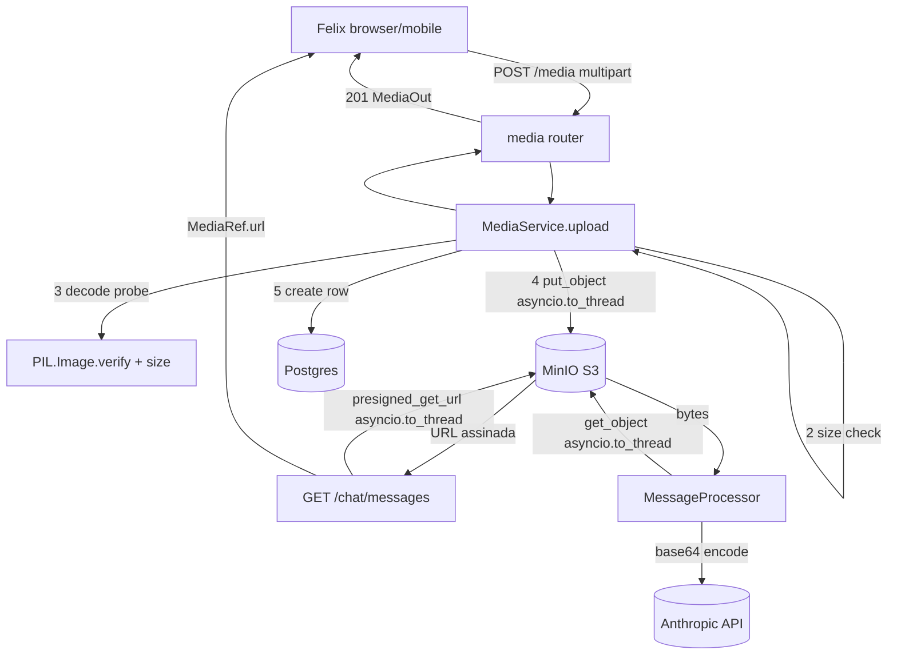
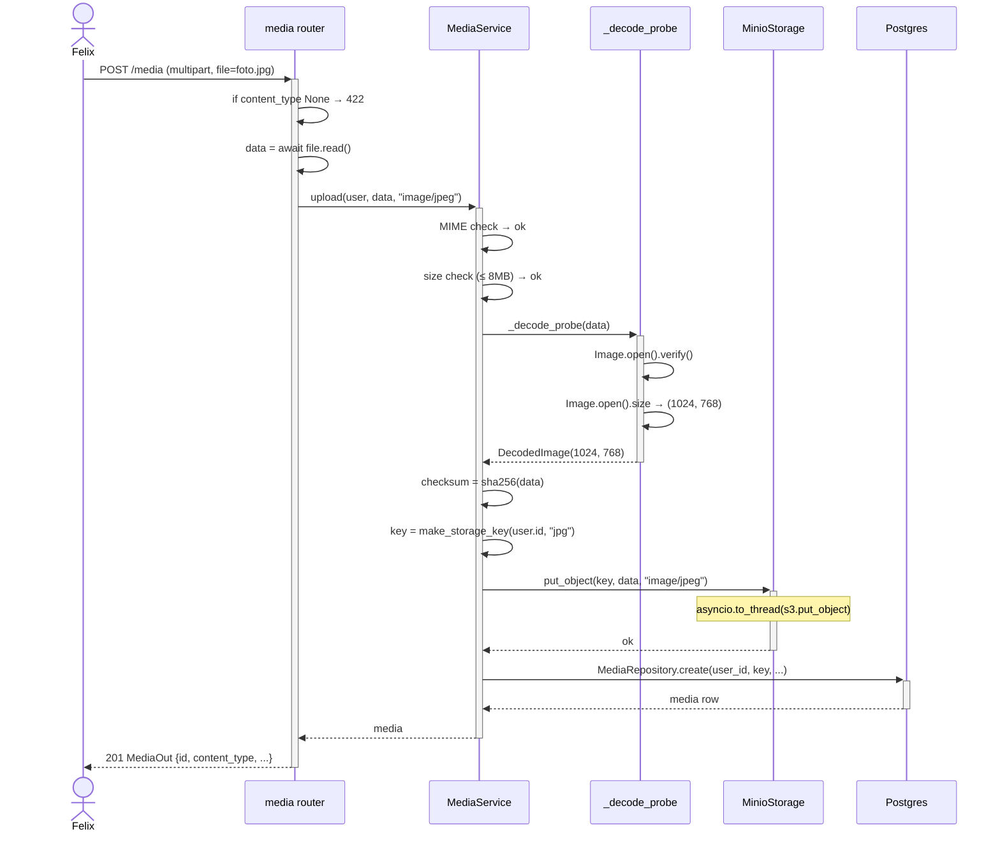

# Arquitetura — Storage de mídia

## Visão geral

Pipeline de upload em 5 etapas sequenciais, todas síncronas dentro do request (exceto `put_object`): validação de MIME → validação de tamanho → decode probe (Pillow) → upload para MinIO → persistência de metadados. O objeto nunca é exposto via URL direta na API — clientes recebem presigned URLs geradas por demanda em `GET /chat/messages`. Bytes para Anthropic são baixados server-side via `get_object` e enviados em base64.

## Componentes envolvidos

| Componente | Papel |
|---|---|
| `media.router` | `POST /media` — recebe multipart, delega |
| `MediaService` | Orquestra validação, probe, upload, persistência |
| `_decode_probe` | `PIL.Image.verify()` + `size` — garantia de imagem real |
| `make_storage_key` | Gera path canônico `users/{uid}/media/{yyyy}/{mm}/{uuid}.{ext}` |
| `MIME_TO_EXT` | Allowlist `{jpeg, png, webp}` |
| `MinioStorage` | Wrapper async sobre boto3 S3 |
| `MediaRepository` | Persiste row em `media` |
| `presigned_get_url` | URL assinada pra leitura (usada em `GET /chat/messages`) |
| `get_object` | Download bytes para envio à Anthropic |

## Diagrama de contexto

## Diagrama de sequência — Upload

## Decisões de design

1. **Decode probe obrigatório (Const. §22)** antes do upload.
   - **Justificativa**: sem probe, um arquivo malicioso poderia chegar à Anthropic como "imagem". Const. §22 codifica.
   - **Dois `Image.open` separados**: `verify()` consome o BytesIO internamente; segundo open relê para capturar `size`. É o comportamento documentado do Pillow.
   - **Alternativa**: `filetype` library (magic bytes). Rejeitada — Pillow já é dep e o `verify()` é mais completo.

2. **boto3 em `asyncio.to_thread`** (RF-008, RNF-002).
   - **Justificativa**: boto3 é I/O-bound e totalmente síncrono. Rodar direto no loop do FastAPI bloquearia outros requests.
   - **Alternativa**: `aiobotocore` (async native). Rejeitada — dep extra; maturidade menor; boto3 via thread é padrão para este caso.

3. **`storage_key` gerado pelo backend** (Const. §22).
   - **Justificativa**: sem isso, cliente poderia tentar path traversal ou sobrescrever objeto de outro user. Path inclui `user_id` como namespace.
   - **Formato**: `users/{uid}/media/{yyyy}/{mm}/{uuid4().hex}.{ext}` — hierárquico, auditável, data-particionado.

4. **Presigned URL gerada por demanda** (não armazenada).
   - **Justificativa**: URL expira em 1h; armazenar seria stale depois. Gerar por request é O(1) e custo negligível.
   - **Consequência**: cliente não pode cachear a URL além de ~1h. Aceitável.

5. **Reescrita de host para `S3_PUBLIC_BASE_URL`**.
   - **Justificativa**: em produção, MinIO fica em Docker network interna (`minio:9000`); cliente precisa de URL pública (Nginx). Trocar scheme+netloc e preservar path+query mantém a assinatura S3 válida (a assinatura inclui path+query, não host).
   - **Alternativa**: configurar MinIO com `MINIO_DOMAIN` público. Mais elegante mas requer config de DNS/TLS no MinIO.

6. **`get_object` → base64 → Anthropic** (Const. §26).
   - **Justificativa**: fotos do usuário nunca ficam com URL acessível publicamente no payload da Anthropic. Server baixa e codifica.
   - **Alternativa**: passar URL assinada para a Anthropic. Rejeitada — vaza URL; Anthropic poderia acessar diretamente.

7. **MIME allowlist restrita** (`{jpeg, png, webp}`).
   - **Justificativa**: Anthropic suporta esses formatos. WEBP é crescente em mobile (iOS 16+, Android).
   - **Alternativa**: aceitar qualquer image/* e converter. Rejeitada — complexidade sem valor MVP.

8. **`status='uploaded'` como default** (RF-013).
   - **Justificativa**: campo preparado para tracking de falhas. `status='failed'` reservado para casos onde o upload para MinIO falhou mas a row foi criada (hoje isso não acontece — em caso de falha, a transação desfaz tudo).

9. **SHA-256 calculado antes do `put_object`** (RF-007).
   - **Justificativa**: permite deduplicação futura e verificação de integridade. Custo: O(tamanho) uma vez.

10. **Compressão de imagem na camada Anthropic, não aqui** (separação de responsabilidades).
    - **Justificativa**: `MediaService` não sabe que a imagem vai para Anthropic — pode ser usada para rótulo OCR ou histórico. Compressão é preocupação de "envio ao LLM", não de "armazenamento".

## Padrões utilizados

- **Pipeline sequencial** com early exit em cada validação.
- **Wrapper async** sobre biblioteca síncrona (`asyncio.to_thread`).
- **Singleton** via `@lru_cache get_storage()`.
- **Pure function** `_decode_probe` — sem side effects.
- **Separation of concerns**: armazenamento (MinIO) desacoplado de metadados (Postgres).

## Segurança e autenticação

- **Auth**: `Depends(get_current_user)`.
- **Ownership**: `media.user_id = current_user.id`; path inclui `user_id`.
- **Cross-user**: `ChatService.post_user_message` rejeita `media_id` de outro user via `list_by_ids(ids, user_id=user.id)`.
- **Sem URL pública persistente**: apenas presigned URLs efêmeras.
- **MIME server-side**: nunca confiar no `Content-Type` do cliente.
- **Decode probe**: `PIL.verify()` antes de qualquer armazenamento.

## Observabilidade

- **`media.checksum_sha256`**: permite verificar integridade a posteriori.
- **`media.size_bytes`, `width`, `height`**: métricas de uso.
- **`storage_key` com data**: arquivos particionados por `{yyyy}/{mm}` — fácil de listar por período.
- **Logs**: erros de boto3 devem loggar `storage_key` e código S3 para debug.

## Ganchos com outras features

- **[`chat-messaging`](../chat-messaging/)**: `ChatService` valida ownership + linka via `message_media`; `GET /chat/messages` gera presigned URL.
- **[`anthropic-integration`](../anthropic-integration/)**: `MessageProcessor` usa `get_object` → base64.
- **[`nutrition-label-ocr`](../nutrition-label-ocr/)**: foto de rótulo usa mesmo fluxo de upload; `media.id` fica em `nutrient_facts.label_media_id`.
- **[`chat-composer-ux`](../chat-composer-ux/)**: SP-18 (erros amigáveis) mapeia `file_too_large`, `invalid_image`, `unsupported_media_type` para textos pt-BR.
