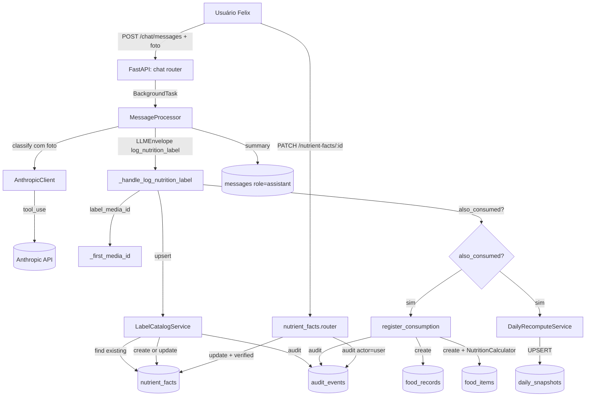
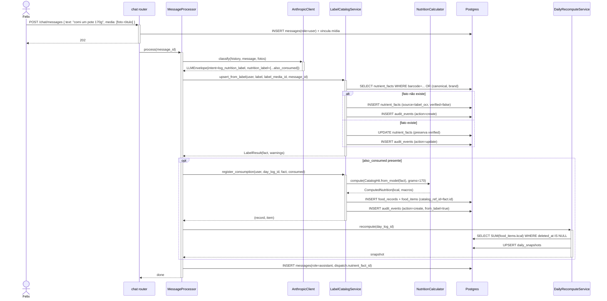

# Arquitetura — Leitura de rótulo nutricional (Fase 4.b)

## Visão geral

Feature que estende o catálogo nutricional (`nutrient_facts`) com entrada por foto de rótulo via chat. Dois fluxos: **cadastro** (`LabelCatalogService.upsert_from_label` → `nutrient_facts` com `source='label_ocr'`) e **confirmação** (`PATCH /nutrient-facts/{id}` → `verified_by_user=true`). Opcionalmente, cadastro + consumo na mesma mensagem (`also_consumed` → `food_records`/`food_items`). A LLM lê o rótulo via `tool_use`; o backend normaliza `per_serving` para `per_100g|per_100ml` e garante idempotência por `barcode` ou `(canonical_name, brand)`.

## Componentes envolvidos

| Componente | Responsabilidade | Tecnologia |
|---|---|---|
| `chat.router` | Recebe `POST /chat/messages` com foto | FastAPI |
| `MessageProcessor._handle_log_nutrition_label` | Orquestra upsert + consumo + recompute + summary | Python service |
| `AnthropicClient` | LLM lê rótulo da foto via `tool_use` | `anthropic` SDK |
| `NutritionLabelIn` / `NutritionLabelAlsoConsumed` | Schemas Pydantic v2 `extra="forbid"` com validator SP-32 | Pydantic v2 |
| `LabelCatalogService` | Upsert idempotente, normalização, consumo opcional, warnings | Python service |
| `NutrientFact` (model) | Tabela de catálogo compartilhada | SQLAlchemy 2 |
| `FoodRecordRepository` / `FoodItemRepository` | Cria registros de consumo (SP-31) | SQLAlchemy 2 async |
| `NutritionCalculator` | Calcula macros do item consumido (INV-1) | static method |
| `AuditEventRepository` | Audit em upsert e PATCH | SQLAlchemy 2 async |
| `DailyRecomputeService` | Recomputa snapshot se `also_consumed` | Python service |
| `nutrient_facts.router` | `PATCH /nutrient-facts/{id}` (SP-33) | FastAPI |
| `LocalTBCACatalog` | Lookup com precedência SP-35 (feature `food-logging`) | integrations |

## Diagrama de contexto

## Diagrama de sequência — cadastro + consumo (SP-30 + SP-31)

## Decisões de design

1. **Catálogo compartilhado (`nutrient_facts` sem `user_id`)**.
   - **Justificativa**: MVP é single-user; produto cadastrado por rótulo fica visível no lookup. Simplifica `LocalTBCACatalog` — não filtra por usuário.
   - **Alternativa considerada**: `owner_user_id` nullable em `nutrient_facts`. Rejeitada — complexidade desnecessária no MVP. <!-- TODO: multi-tenant precisaria revisar -->
   - **Dívida**: em multi-tenant, produtos de um usuário vazariam para outro. Marcado como risco.

2. **`per_serving` normalizado antes de persistir**.
   - **Justificativa**: catálogo só armazena `per_100g|per_100ml` (CheckConstraint). `NutritionCalculator` só sabe escalar por grams/ml, não por porção. Normalizar no upsert centraliza a lógica.
   - **Alternativa considerada**: persistir `per_serving` e escalar no lookup. Rejeitada — `NutritionCalculator` ficaria mais complexo.

3. **Idempotência por `barcode` (chave forte) com fallback `(canonical_name, brand)`**.
   - **Justificativa**: barcode é único por produto; sem barcode, par canônico+marca é proxy razoável. Evita duplicação no reupload.
   - **Alternativa considerada**: só `(canonical_name, brand)`. Rejeitada — dois produtos diferentes podem ter mesmo nome canônico.

4. **`verified_by_user` nunca rebaixado**.
   - **Justificativa**: se Felix confirmou valores (PATCH), um reupload com OCR impreciso não deve voltar para `false`. `verified=true` é sinal de confiança para SP-35.
   - **Implementação**: `upsert_from_label` não toca em `verified_by_user` se fato existente.

5. **`NutritionLabelIn(_StrictBase)` com `extra="forbid"`**.
   - **Justificativa**: rótulo tem campos bem definidos; LLM inventando campos é sinal de erro. Diferente de `FoodItemIn`/`BeverageIn` (`_LenientBase`) que toleram lixo.
   - **Alternativa considerada**: `ignore`. Rejeitada — rótulo é estruturado, não livre.

6. **`PATCH` só edita `label_ocr` e `manual`**.
   - **Justificativa**: facts `TBCA_2023`/`USDA_FDC` são canônicos (fonte externa confiável). Permitir edição quebraria a precedência (SP-35).
   - **Alternativa considerada**: permitir editar tudo. Rejeitada — corrói a noção de catálogo canônico.

7. **`also_consumed` no mesmo envelope, não em mensagem separada**.
   - **Justificativa**: "foto do rótulo + comi 170g" é uma interação natural. Separar em duas mensagens seria fricção.
   - **Implementação**: `NutritionLabelIn.also_consumed: NutritionLabelAlsoConsumed | None`.

8. **`register_consumption` usa `confidence=0.95`**.
   - **Justificativa**: valores vieram do rótulo (não estimativa); alta confiança. Não dispara `needs_confirmation`.

## Padrões utilizados

- **Layered architecture**: routes → services → repositories → models.
- **Result object**: `LabelResult(fact, warnings, consumed_item, consumed_record)`.
- **Idempotência por chave de negócio**: `barcode` ou `(canonical_name, brand)`.
- **Model validator** (Pydantic v2): `_serving_needs_size` em `mode="after"`.
- **Pure function**: `_resolve_basis_and_scale`, `_scale_or_none`, `_resolve_consumed_amount` — sem estado, determinísticas.

## Segurança e autenticação

- **`POST /chat/messages`** exige JWT (cookie `access_token`).
- **`PATCH /nutrient-facts/{id}`** exige JWT via `Depends(get_current_user)`.
- **Foto base64 para Anthropic** (Const. §26) — nunca URL pública.
- **`nutrient_facts` sem `user_id`**: catálogo compartilhado. `PATCH` não filtra por dono — qualquer usuário autenticado pode editar facts `label_ocr`/`manual`. Em MVP single-user é aceitável; em multi-tenant é risco. <!-- TODO: multi-tenant -->

## Observabilidade

- **Logs estruturados** com `request_id`, `user_id`, `intent=log_nutrition_label`.
- **Métricas** (futuro): taxa de `micros_missing_for_product` — esperado alta (RDC 429/2020); taxa de `per_serving` vs `per_100g` — sinal de tipo de rótulo.
- **Audit trail**: `audit_events` em upsert (`actor='llm'`) e PATCH (`actor='user'`) — reconstrói histórico do catálogo.

## Ganchos com outras features

- **`food-logging`**: dono do `LocalTBCACatalog` que aplica SP-35. `NutritionCalculator` compartilhado. `food_items.catalog_ref_id` aponta para `nutrient_facts`.
- **`chat-messaging`**: dono do `POST /chat/messages`. `_handle_log_nutrition_label` é um handler.
- **`anthropic-integration`**: dono do `LLMEnvelope` + `NutritionLabelIn`. Fotos enviadas base64.
- **`media-storage`**: foto do rótulo em MinIO; `label_media_id` referencia.
- **`daily-snapshot`**: `DailyRecomputeService` só roda se `also_consumed`.
- **`manual-catalog-recovery`**: fluxo relacionado — quando SP-23 (alimento sem catálogo) dispara, usuário pode fotografar rótulo (esta feature) ou cadastrar manual.
