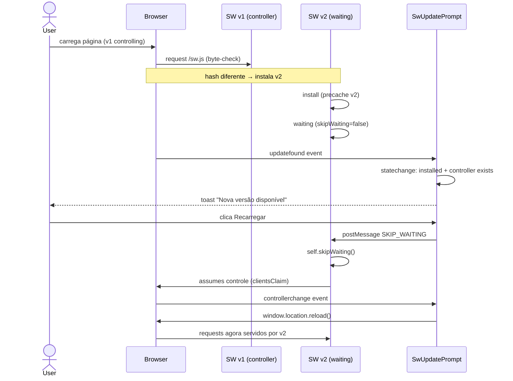
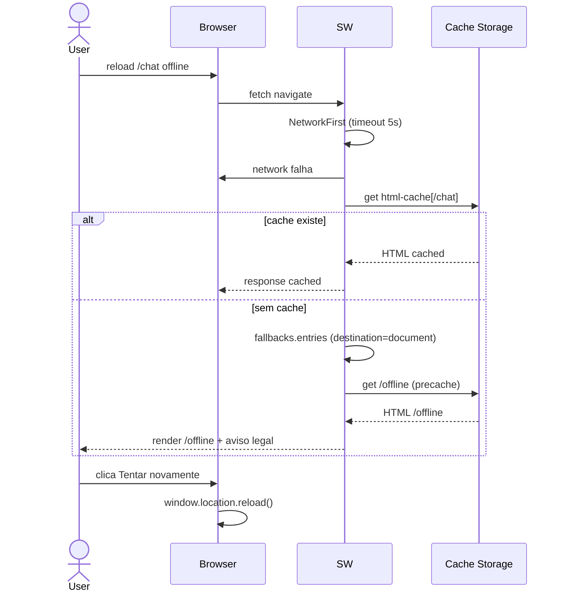

# Arquitetura — PWA — instalabilidade + shell offline (Bloco 4)

> **Rastreabilidade**: SP-128..SP-135 + INV-11 · Implementação: `apps/web/{src/app/{manifest.ts, layout.tsx, sw.ts, sw-update-prompt.tsx, offline/, (app)/InstallButton.tsx}, public/icons/, scripts/verify-sw.mjs, next.config.mjs}`.

## Visão geral

O Bloco 4 é puramente client-side: nenhum endpoint backend é tocado. Três eixos arquiteturais:

1. **Instalabilidade** — Manifest (Next Metadata API) + meta tags iOS (`appleWebApp`, `apple-touch-icon`) + ícones em 4 tamanhos. Browser vê tudo necessário para oferecer "Instalar".
2. **Shell offline** — Service worker Serwist com `runtimeCaching` por rota: `NetworkOnly` para `/api/*` (INV-11), `NetworkFirst` 5s para navegações HTML, `StaleWhileRevalidate` para `/_next/static/*`, cache-first default para ícones/manifest/fonts. `fallbacks.entries` serve `/offline` para documentos offline.
3. **Lifecycle** — `SwUpdatePrompt` (toast com `SKIP_WAITING` manual) + `InstallButton` (`beforeinstallprompt`/`appinstalled`).

Sanity estático via `verify-sw.mjs` roda no CI pós-build (job `web`), travando INV-11 e SP-130/132/135.

## Componentes envolvidos

| Componente | Responsabilidade | Tecnologia |
|---|---|---|
| `manifest.ts` | Gerar `manifest.webmanifest` com campos SP-128 | Next 16 `MetadataRoute.Manifest` |
| `layout.tsx` (`metadata`/`viewport`) | Meta tags iOS + theme-color + `<SwUpdatePrompt>` host | Next 16 `Metadata` + `Viewport` |
| `sw.ts` | Service worker runtime — runtimeCaching/fallbacks + listener SKIP_WAITING | Serwist ^9.5.12 |
| `sw-update-prompt.tsx` | Toast de update; registra SW em prod; reload em controllerchange | React 19 client |
| `InstallButton.tsx` | Botão "Instalar" baseado em `beforeinstallprompt` | React 19 client |
| `offline/page.tsx` + `OfflineRetryButton.tsx` | Página offline + botão retry | Next 16 server + React 19 client |
| `public/icons/*` | Ícones 192/512/maskable/apple-touch | PNG (gerados via `sharp`) |
| `next.config.mjs` | `withSerwistInit` (swSrc/swDest/disable dev) + rewrites `/api/*` | `@serwist/next` |
| `scripts/verify-sw.mjs` | Sanity pós-build INV-11/SP-130/132/135 | Node ESM |
| `proxy.ts` | Protege `/chat`/`/weekly`/`/day` por cookie; `/offline` público | Next 16 middleware |
| Cache Storage (não é componente) | `html-cache`, `next-static-cache`, precache default | Cache API |
| Fase 9 (nginx+certbot) | HTTPS — pré-requisito do PWA | Infra (referência cruzada) |

## Diagrama de contexto

```mermaid
graph TD
    User[Felix] -->|HTTPS| Nginx[Fase 9 Nginx + Certbot]
    Nginx --> Web[Next 16 apps/web]
    Web -->|manifest + meta tags| User
    Web -->|/sw.js| SW[Service Worker]
    SW -->|NetworkOnly INV-11| API[FastAPI /api/*]
    SW -->|NetworkFirst 5s| HTML[Rotas HTML]
    SW -->|SWR| Static[/_next/static/*]
    SW -->|cache-first default| Assets[icons/manifest/fonts]
    SW -. offline fallback .-> OfflinePage[/offline]
    OfflinePage -->|retry| User
    User -->|beforeinstallprompt| InstallBtn[InstallButton]
    User -->|updatefound + SKIP_WAITING| SW
```

## Diagrama de sequência — update do SW (SP-132)



## Diagrama de sequência — navegação offline (SP-135)



## Decisões de design

1. **Serwist em vez de Workbox**: `@serwist/next` é a evolução comunitária do `next-pwa` (mantido mesmo agora que o `next-pwa` está archived); integração first-class com Next 16 + produção-madura. Justificativa: setup declarativo em `next.config.mjs`, `runtimeCaching` API idêntica ao Workbox, suporte ativo.

2. **`skipWaiting: false` (opt-in)**: preferiu-se um toast explicito em vez de update silencioso. Justificativa: uma sala pode estar a meio de uma edição em um modal (ex.: `PendingItemsModal`); reload surpresa pode quebrar fluxo. UX > automatismo.

3. **Dev sem SW** (`disable: process.env.NODE_ENV === 'development'`): o SW em dev cachearia HMR e quebraria o workflow. Justificativa: zero custo de produção; só ativa lá.

4. **`NetworkFirst` com timeout 5s para navegações HTML**: cumpre SP-130 (network-first + fallback cache); o timeout impede que um usuário online fique esperando demais se_network lento.

5. **`NetworkOnly` para `/api/*` (INV-11)**: snapshots vêm sempre do DB (Art. III §10); cachear `/api/*` serviria totais obsoletos. Justificativa: integridade dos dados de negócio é não-negociável.

6. **`/offline` fora de `PROTECTED_PREFIXES`**: a página offline não pode exigir cookie — o usuário pode estar offline justamente porque ainda não autenticou. Justificativa: garantia de acesso ao feedback mínimo.

7. **`verify:sw.mjs` em vez de vitest**: T-B409 explicitamente **não** adicionou Vitest só por 1 assertion (custo de framework vs benefício). Justificativa: checagens são estáticas em texto (regex em `sw.ts` + bundle); CI já tem `typecheck`/`build`. Quando houver 3+ unit tests justifiquem Vitest, revisitar.

8. **Ícones placeholder via `sharp`**: agora são PNGs gerados a partir de `icon.svg` ('mr' em fundo `#0f172a`). Justificativa: aceitar que PWA funciona com placeholder; subsituir por design real sem bloquear release.

9. **Build `--webpack` (não Turbopack)**: Serwist ainda não suporta Turbopack (issue serwist/serwist#54). Justificativa: bloqueador técnico — `dev`/`build` no `package.json` usam `--webpack` explicitamente.

## Padrões utilizados

- **Design pattern**: estratégia de cache **Strategy** (uma rota → uma estratégia); Singleton implícito no Serwist.
- **Conventional file routing**: Next 16 resolve `manifest.ts` → `/manifest.webmanifest`; `offline/page.tsx` → `/offline`.
- **Lifecycle hand-off**: SW → `updatefound` → `statechange` → (`installed` + `controller`) → toast → `SKIP_WAITING` → `controllerchange` → reload.
- **Event-driven**: `InstallButton`/`SwUpdatePrompt` subscrevem browser events (`beforeinstallprompt`, `appinstalled`, `updatefound`, `statechange`, `controllerchange`).

## Segurança e autenticação

- **HTTPS mandatório**: PWA só instala sob TLS; produção tem Nginx + Certbot (Fase 9) com HSTS 1 ano.
- **Cookie `access_token`**: rotas protegidas (`/chat`, `/weekly`, `/day`) estão em `PROTECTED_PREFIXES` no `proxy.ts`; validação real no backend. `/offline` é **público** (acessível sem cookie).
- **INV-11**: SW nunca cacheia `/api/*` — autenticação de sessão/CSRF não precisa lidar com cache de respostas autenticadas.
- **Cache isolation**: Cache Storage é por-origin; sem risco cross-origin.

## Observabilidade

- **Logs**: SW erros vão para `console` no SW thread; `sw-update-prompt.tsx` catch silencioso (`console` vazio — "falha de SW não deve quebrar a app").
- **Métricas**: nenhuma client-side; Lighthouse PWA score é o gate operacional (manual).
- **Traces**: [Inferido do código] — sem Sentry/analytics front; `registration.updatefound` count potencialmente útil. <!-- TODO: adicionar analytics de SW install/update -->
- **Erros**: toast trata estado failedworker via `controllerchange`; UX explicita e não vazar exceção.