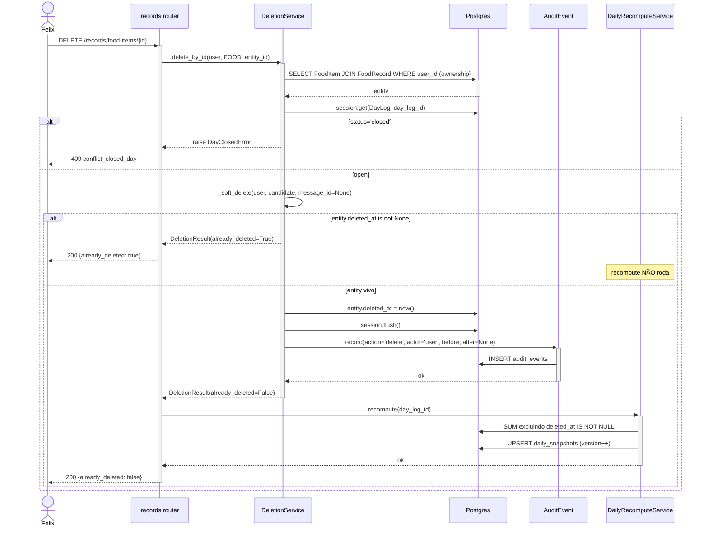

# Arquitetura — Remoção de registros

## Visão geral

Feature deliberadamente delgada: `DeletionService` importa `TargetMatcher`, `DayClosedError`, `_ensure_day_open` e `_snapshot` diretamente de `correction.py`/`correction_matcher.py`. Lógica própria é mínima — (1) verificar `already_deleted`, (2) setar `deleted_at`, (3) audit com `after=None`. O path REST (4 endpoints) converge em `_delete_generic`, que cuida do mapeamento `path → TargetKind` e do recompute condicional.

## Componentes envolvidos

| Componente | Papel |
|---|---|
| `records.router` | 4 DELETEs + `_delete_generic` + `_kind_from_path` |
| `DeletionService` | `apply_from_llm` (chat) + `delete_by_id` (REST) + `_soft_delete` (shared) |
| `_load_by_id` | Carrega entidade por kind com ownership check |
| `_resolve_day_log_id` | Resolve `day_log_id` para FOOD via FoodRecord |
| `TargetMatcher` (correction_matcher.py) | Reutilizado — mesmo scoring |
| `DayClosedError`, `_ensure_day_open` (correction.py) | Reutilizados — mesma verificação |
| `_snapshot` (correction.py) | Reutilizado — antes do audit |
| `AuditEventRepository` | `action='delete', after=None` |
| `DailyRecomputeService` | Somente se `not already_deleted` |

## Diagrama de contexto

```mermaid
graph TD
    U[Felix] -->|chat: "remova refrigerante"| Chat[chat router]
    U -->|DELETE /records/food-items/ID| REST[records router]

    Chat --> MP[MessageProcessor]
    MP -->|intent=delete_record| HD[_handle_delete_record]
    HD --> DS[DeletionService.apply_from_llm]
    DS --> TM[TargetMatcher]
    TM -->|score + ownership| DB[(Postgres)]
    DS --> SD[_soft_delete]
    SD --> DB
    SD --> AUD[AuditEventRepository]
    AUD --> DB

    REST --> DG[_delete_generic]
    DG --> DS2[DeletionService.delete_by_id]
    DS2 --> LBI[_load_by_id]
    LBI -->|ownership JOIN| DB
    DS2 --> SD

    HD -->|if not already_deleted| DR[DailyRecomputeService]
    DG -->|if not already_deleted| DR
    DR --> DB
```

## Diagrama de sequência — REST DELETE (happy path + idempotência)



## Decisões de design

1. **Reutilização total de `correction.py`**: `DayClosedError`, `_ensure_day_open`, `_snapshot`, `TargetMatcher`.
   - **Justificativa**: evitar duplicação. Os dois services têm exatamente o mesmo pré-requisito (dia aberto, mesmo matching).
   - **Consequência**: acoplamento entre `deletion.py` e `correction.py`. Aceitável; são features irmãs; qualquer refactor afeta ambas.

2. **`actor='llm'` inferido de `message_id`** (não por argumento).
   - **Justificativa**: elegante — `delete_by_id` no REST passa `message_id=None` por default.
   - **Alternativa**: argumento `actor: str`. Rejeitada — redundante.

3. **`after=None` no audit**.
   - **Justificativa**: entidade "deixou de existir". `before` preserva o estado para possível investigação.
   - **Alternativa**: `after={"deleted_at": timestamp}`. Rejeitada — campos de tombstone não fazem parte do shape observável do registro.

4. **Recompute condicional** (`if not already_deleted`).
   - **Justificativa**: `already_deleted=True` significa que o snapshot já exclui o item (do delete anterior). Recompute seria no-op, mas adiciona latência.

5. **4 endpoints separados (`food-items`, `water`, `beverage`, `activity`)** convergindo em `_delete_generic`.
   - **Justificativa**: REST explícito por recurso. `_delete_generic` seca o código; `_kind_from_path` é o único ponto de variação.
   - **Alternativa**: `/records/{type}/{id}` com `{type}` como path param. Rejeitada — menos legível em OpenAPI.

6. **Sem `DELETE /records/food-records/{id}`** (só food_items).
   - **Justificativa**: semântica de remoção é por item individual. Um `food_record` pode ter vários items; remover o agrupador seria difícil de comunicar.
   - **Consequência**: `food_records` "vazio" (todos items deletados) permanece. Inócuo — snapshot ignora itens deletados.

7. **`_load_by_id` resolve ownership diferentemente por kind**.
   - **Justificativa**: FOOD não tem `user_id` direto — necessário JOIN. Outros kinds têm `user_id` no próprio model.
   - **Efeito colateral**: para FOOD, pré-popula `entity.day_log_id` para economizar query em `_resolve_day_log_id`.

## Padrões utilizados

- **Composição por importação**: `deletion.py` importa de `correction.py` para funções compartilhadas.
- **Strategy implícita**: `_delete_generic` + `_kind_from_path` mapeiam path para kind.
- **Idempotência explícita**: check de `deleted_at is not None` antes de qualquer side effect.
- **Result object**: `DeletionResult(kind, entity_id, day_log_id, already_deleted)`.

## Segurança e autenticação

- **Auth**: `Depends(get_current_user)` em todos os endpoints.
- **Ownership**:
  - FOOD: JOIN `food_records.user_id = user_id`.
  - WATER/BEVERAGE/ACTIVITY: `model.user_id = user_id` direto.
- **Sem vazar existência**: 404 genérico `not_found` para item de outro user ou inexistente.
- **INV-5**: `_ensure_day_open` antes de qualquer mutação.

## Observabilidade

- **`audit_events`**: `before` preserva último estado antes do soft delete.
- **`deleted_at`**: timestamp auditável do momento da remoção.
- **Snapshot**: `DailyRecomputeService` incrementa `version` a cada delete efetivo.

## Ganchos com outras features

- **[`record-correction`](../record-correction/)**: compartilha `TargetMatcher`, `DayClosedError`, `_ensure_day_open`, `_snapshot`. Qualquer mudança nessa infra afeta ambas.
- **[`chat-messaging`](../chat-messaging/)**: intent `delete_record`.
- **[`daily-snapshot`](../daily-snapshot/)**: recompute pós-delete; `deleted_at IS NULL` é o filtro universal.
- **[`day-close`](../day-close/)**: `status='closed'` bloqueia.
- **[`audit-trail`](../audit-trail/)**: `AuditEventRepository`.
- **[`assistant-message-rendering`](../assistant-message-rendering/)**: botão "Descartar" em SP-117.
- **[`manual-catalog-recovery`](../manual-catalog-recovery/)**: CTA "Descartar item" do prompt SP-140 injeta `apaga {nome}` no composer → intend `delete_record`.
