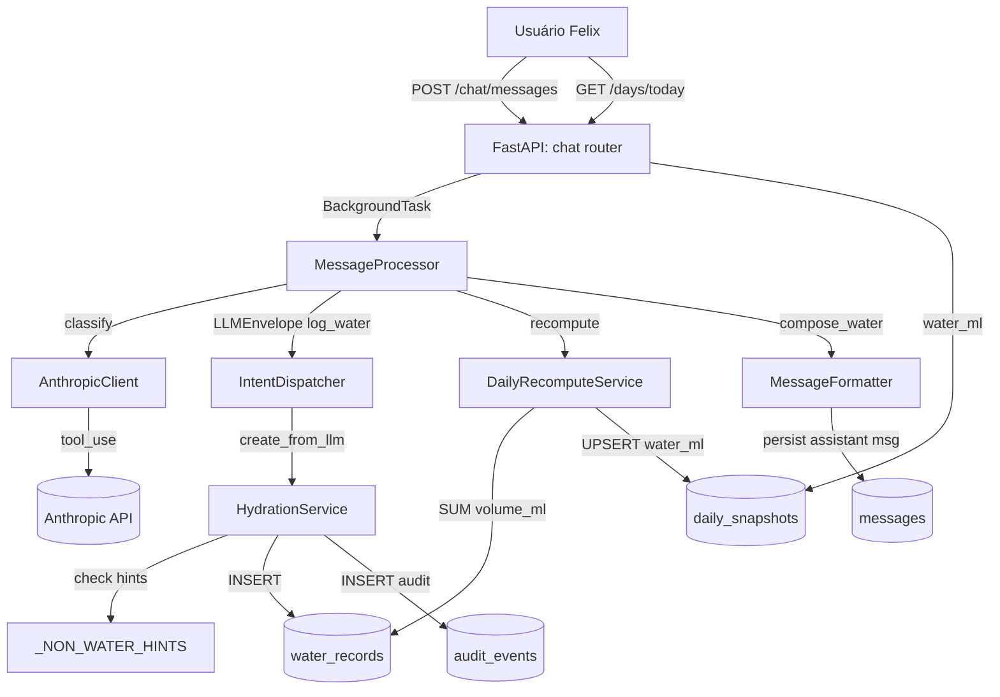
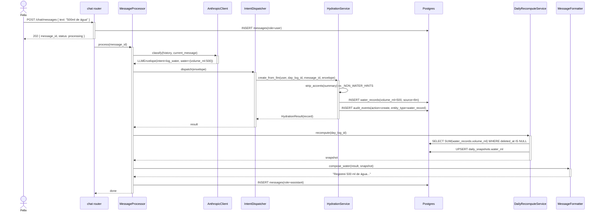

# Arquitetura — Registro de água pura

## Visão geral

Feature simples de persistência dentro do pipeline de chat. A LLM classifica a intenção (`log_water`) e extrai `volume_ml`; o backend valida defensivamente contra bebidas calóricas, persiste em `water_records` (tabela sem colunas de kcal — INV-2 estrutural), grava auditoria e dispara recompute do snapshot. Sem endpoint próprio — tudo passa por `POST /chat/messages`.

## Componentes envolvidos

| Componente | Responsabilidade | Tecnologia |
|---|---|---|
| `chat.router` | Recebe `POST /chat/messages`, agenda `BackgroundTask` | FastAPI |
| `MessageProcessor` | Orquestra: LLM → dispatch → recompute → formatter → persist | Python service |
| `AnthropicClient` | Classifica intent via `tool_use` forçado | `anthropic` SDK |
| `LLMEnvelope.water` (`WaterIn`) | Sub-schema Pydantic v2 `extra="forbid"` com `volume_ml`, `confidence` | Pydantic v2 |
| `IntentDispatcher._handle_log_water` | Roteia `intent=log_water` para `HydrationService` | Python service |
| `HydrationService` | Valida hints, cria `water_records`, grava audit | Python service |
| `WaterRecordRepository` | INSERT em `water_records` | SQLAlchemy 2 async |
| `AuditEventRepository` | INSERT em `audit_events` | SQLAlchemy 2 async |
| `DailyRecomputeService._aggregate_water` | `SELECT SUM(volume_ml)` → UPSERT `daily_snapshots.water_ml` | SQLAlchemy 2 + Postgres |
| `MessageFormatter.compose_water` | Monta assistant message (SP-118) | Python util |

## Diagrama de contexto

## Diagrama de sequência

## Decisões de design

1. **Schema sem colunas de kcal (INV-2 estrutural)** em vez de validação runtime.
   - **Justificativa**: Const. Art. IV §12. A ausência física da coluna torna impossível registrar caloria em água por engano — seja por bug, LLM desinformada ou migração descuidada. Validação runtime seria redundante.
   - **Alternativa considerada**: tabela única `liquid_records` com `kind` discriminando água/bebida. Rejeitada — aumentaria risco de dupla contagem e violaria INV-2/INV-3.

2. **Validação semântica defensiva** (`_NON_WATER_HINTS`) mesmo com schema seguro.
   - **Justificativa**: se a LLM classificar "café" como `log_water`, o volume (50ml) vaziaria para `water_ml` inflando hidratação. O schema impede kcal, mas não impede volume errado. A checagem do `user_text_summary` é o último gate.
   - **Alternativa considerada**: confiar só no prompt. Rejeitada — LLM é não-determinística.

3. **`_strip_accents` (NFKD)** antes do casamento de hints.
   - **Justificativa**: LLM pode devolver "café" ou "cafe"; normalizar para "cafe" casa com ambos. Robustez barata.

4. **`is_estimate` hardcoded `False`** no service, não lido do envelope.
   - **Justificativa**: [Inferido do código] `HydrationService` não recebe `is_estimate` do `WaterIn` (schema só tem `volume_ml` + `confidence`). A estimativa de "um copo → 250ml" é feita pela LLM no `volume_ml` final; o flag `is_estimate=true` não é propagado hoje. <!-- TODO: confirmar se SP-42 quer is_estimate persistido — hoje parece não estar chegando ao banco -->

5. **Sem endpoint HTTP próprio** para criar água.
   - **Justificativa**: todo registro de negócio entra pelo chat (Const. Art. II — LLM interpreta). Endpoint REST só para correção/deleção (`record-correction`, `record-deletion`).

6. **`occurred_at` opcional via hint** em vez de sempre `now()`.
   - **Justificativa**: usuário pode registrar água consumida mais cedo. `envelope.occurred_at_hint` permite isso sem endpoint separado.

## Padrões utilizados

- **Layered architecture**: routes → services → repositories → models. `HydrationService` não faz `session.execute` direto — usa `WaterRecordRepository`.
- **Result object**: `HydrationResult(record)` — dataclass com `slots=True`.
- **Repository pattern**: `WaterRecordRepository.create` encapsula INSERT; `user_id` sempre argumento explícito (Const. §21).
- **Error code translation**: `ValidationAppError(code="water_intent_rejected")` → `MessageProcessor` mapa para fluxo `clarify`. Service não sabe nada de HTTP.

## Segurança e autenticação

- **Rota de entrada** (`POST /chat/messages`) exige JWT válido (cookie `access_token`).
- **`user_id`** propagado em toda query (Const. §21). `WaterRecordRepository.create` recebe `user_id` obrigatório.
- **RLS não usado**; isolamento enforced em application-layer (decisão de simplicidade em single-user MVP).
- **Sem PII sensível** em `water_records` — apenas `volume_ml`, timestamps, FKs. Texto livre da mensagem fica em `messages`, não em `water_records`.

## Observabilidade

- **Logs estruturados** com `request_id` (middleware `X-Request-Id`), `user_id`, `intent`. `ValidationAppError` serializada pelo handler global.
- **Métricas** (futuro): contagem de `water_intent_rejected` — sinal de prompt impreciso ou LLM confusa.
- **Audit trail**: `audit_events` é a fonte primária para "quando e quanto este registro foi criado". `before=null`, `after={volume_ml, occurred_at}`.

## Ganchos com outras features

- **`chat-messaging`**: dono do `POST /chat/messages` e do polling. `HydrationService` é só um handler dentro do `IntentDispatcher`.
- **`anthropic-integration`**: dono do `LLMEnvelope` + `WaterIn`. `HydrationService` não sabe qual modelo respondeu.
- **`daily-snapshot`**: dono do `DailyRecomputeService`. `HydrationService` só chama via `MessageProcessor`.
- **`caloric-beverages`**: complementar — o que falha em `_NON_WATER_HINTS` deveria ir para `BeverageService` (se a LLM classificar como `log_beverage`).
- **`record-correction`** / **`record-deletion`**: mutam `water_records` posteriormente; recompute é o mesmo.
- **`day-close`**: usa `water_ml` do snapshot ao encerrar dia.
- **`weekly-report`**: soma `water_ml` entre dias fechados.
