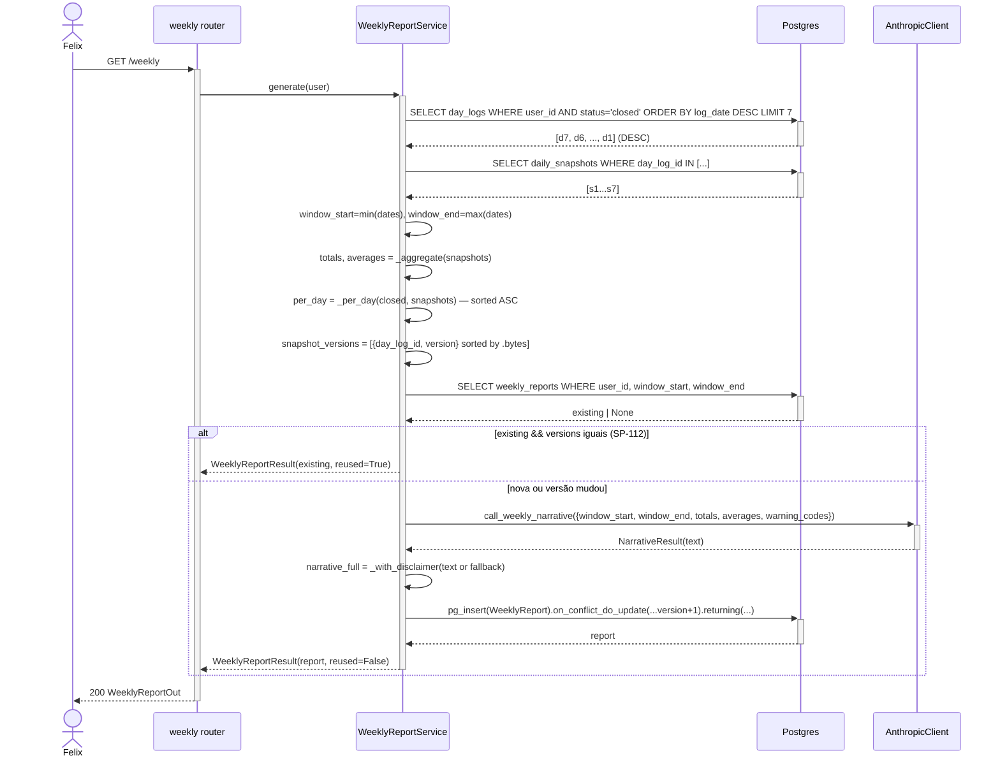

# Arquitetura — Relatório semanal

## Visão geral

Feature de leitura pura + geração condicional. `WeeklyReportService.generate` executa pipeline em 5 fases: **(1) fetch** dos últimos 7 dias fechados; **(2) aggregate** — soma e média via `Decimal` sobre `daily_snapshots`; **(3) idempotência** — fingerprint por `snapshot_versions` comparado contra relatório existente; **(4) narrativa** via `call_weekly_narrative` se necessário; **(5) upsert** atômico por `UNIQUE(user_id, window_start, window_end)`. Zero dias → resposta transiente (sem persistência).

## Componentes envolvidos

| Componente | Papel |
|---|---|
| `weekly.router` | `GET /weekly` |
| `WeeklyReportService` | Orquestrador das 5 fases |
| `_fetch_last_closed_days` | SELECT 7 DayLogs com `status='closed'` |
| `_fetch_snapshots` | SELECT DailySnapshots IN (day_log_ids) |
| `_aggregate` | SUM + AVG em Decimal por campo; retorna `totals`, `averages` |
| `_per_day` | Monta lista de dicts ASC por `log_date` |
| `_window_bounds` | min/max das datas |
| `snapshot_versions` | Fingerprint de idempotência |
| `_find_existing` | SELECT WeeklyReport por `(user_id, window_start, window_end)` |
| `AnthropicClient.call_weekly_narrative` | Narrativa condicional |
| `_with_disclaimer` | Concatena disclaimer sem duplicar |
| `pg_insert ... ON CONFLICT DO UPDATE` | Upsert atômico com `version+1` |
| `WeeklyReport` (model) | JSONB-heavy: totals, averages, per_day, snapshot_versions, warnings |
| `MessageProcessor._handle_weekly_summary` | Chat path |

## Diagrama de contexto

```mermaid
graph TD
    U[Felix] -->|GET /weekly| R[weekly router]
    U -->|chat: "resumo semanal"| Chat[chat router]
    Chat --> MP[MessageProcessor]
    MP -->|intent=weekly_summary| HW[_handle_weekly_summary]
    HW --> WRS[WeeklyReportService.generate]
    R --> WRS

    WRS --> FD[_fetch_last_closed_days]
    FD -->|status=closed ORDER BY log_date DESC LIMIT 7| DB[(Postgres)]
    WRS --> FS[_fetch_snapshots]
    FS -->|day_log_id IN [...]| DB
    WRS --> AGG[_aggregate]
    WRS --> PD[_per_day — sort ASC]
    WRS --> FE[_find_existing]
    FE --> DB
    WRS -->|se snapshot_versions mudou| AN[call_weekly_narrative]
    AN --> A[(Anthropic API)]
    WRS -->|pg_insert ON CONFLICT| DB
```

## Diagrama de sequência — `generate` com regeneração



## Decisões de design

1. **Idempotência por `snapshot_versions` (fingerprint)** ao invés de TTL ou `generated_at`.
   - **Justificativa**: única coisa que pode mudar o relatório é um snapshot novo ou alterado. Comparar versões é O(N) em memória, determinístico.
   - **Consequência**: se Postgres mudar order de dicts em JSONB, comparação pode falhar. Mitigado pela ordenação por `day_log_id.bytes`.

2. **`populate_existing=True` no RETURNING** (mesmo padrão do `DailyRecomputeService`).
   - **Justificativa**: evita instância cacheada no identity map do SQLAlchemy.

3. **Relatório transiente para zero dias** (não persistir).
   - **Justificativa**: `UNIQUE(user_id, NULL, NULL)` não funciona — Postgres trata NULL != NULL em constraints. Persistir causaria INSERT toda chamada.

4. **JSONB para `totals`, `averages`, `per_day`, `snapshot_versions`, `warnings`**.
   - **Justificativa**: schema evolui; campos novos em snapshots adicionados sem migration em `weekly_reports`. Custo: sem type enforcement.

5. **`_aggregate` usa `Decimal`** para soma exata; converte pra `float`/`int` só no output.
   - **Justificativa**: INV-1 — precisão. `float` acumula erro de representação; `Decimal(1000) + Decimal(1500)` é exato.
   - **`water_ml` e `other_liquids_ml` → `int`**: volume em ml não tem fração.

6. **Payload da narrativa sem `per_day` bruto**.
   - **Justificativa**: reduz tokens — LLM não precisa de detalhe dia-a-dia para gerar parágrafo de tendência. `totals` e `averages` são suficientes.

7. **`window` = `{min, max}` das datas, não `{start_of_week, end_of_week}`**.
   - **Justificativa**: SP-110 pede "últimos 7 dias fechados", não semana calendário. Um usuário que fecha irregularmente tem janela assimétrica.

8. **`latest()` como método separado** (não regenera).
   - **Justificativa**: `GET /weekly` da frontend pode querer o último sem custo de regeneração. `latest()` é `SELECT ORDER BY generated_at DESC LIMIT 1`.

9. **`version+1` no ON CONFLICT**.
   - **Justificativa**: cliente pode detectar se relatório mudou comparando `version`. Análogo ao `DailySnapshot.version`.

10. **Mesmo `_with_disclaimer` de `day_close.py`** (código duplicado mas não importado).
    - **Justificativa**: os dois módulos têm a mesma função standalone; importar de `day_close` criaria acoplamento entre dois services não relacionados.
    - **Dívida**: se disclaimer mudar, atualizar em 2 lugares. Aceito.

## Padrões utilizados

- **Pipeline sequencial** (5 fases explícitas em `generate`).
- **Idempotência por fingerprint** (`snapshot_versions`).
- **Upsert atômico** via `pg_insert ... ON CONFLICT DO UPDATE`.
- **Result object** `WeeklyReportResult(report, reused)`.
- **Pure functions** `_aggregate`, `_per_day`, `_window_bounds`, `_with_disclaimer`.

## Segurança e autenticação

- **Auth**: `Depends(get_current_user)`.
- **Ownership**: `user_id` em `_fetch_last_closed_days`, `_fetch_snapshots` (indiretamente via `day_log_id IN`), `_find_existing`, `pg_insert`.

## Observabilidade

- **`report.version`**: signal de "foi regenerado N vezes".
- **`generated_at`**: timestamp da última geração.
- **`reused` em `WeeklyReportResult`**: se logar, sabe se LLM foi chamada.
- **`warnings`**: `insufficient_history` é sinal de usuário novo ou que fechou poucos dias.

## Ganchos com outras features

- **[`day-close`](../day-close/)**: produz `status='closed'`; sem fechamento, weekly é sempre `insufficient_history`.
- **[`daily-snapshot`](../daily-snapshot/)**: fonte de todos os campos numéricos; `snapshot.version` é peça do fingerprint.
- **[`anthropic-integration`](../anthropic-integration/)**: `call_weekly_narrative` com `weekly_narrative_v1.md`.
- **[`chat-messaging`](../chat-messaging/)**: `intent=weekly_summary`.
- **[`daily-detail-view`](../daily-detail-view/)**: SP-155 — coluna "Dia" em `/weekly` linka para `/day/[date]`.
