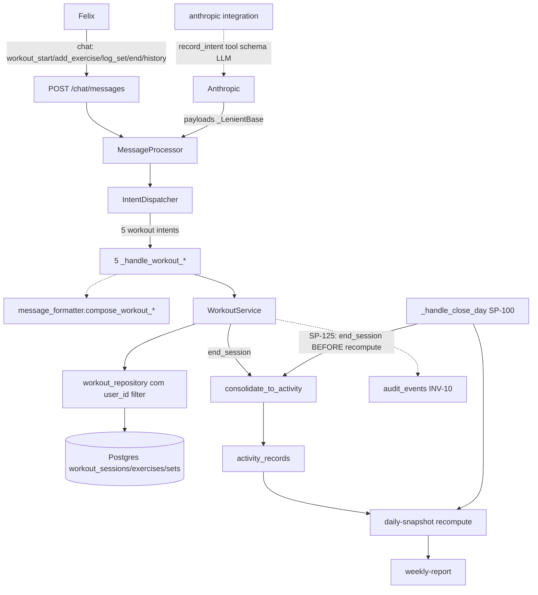
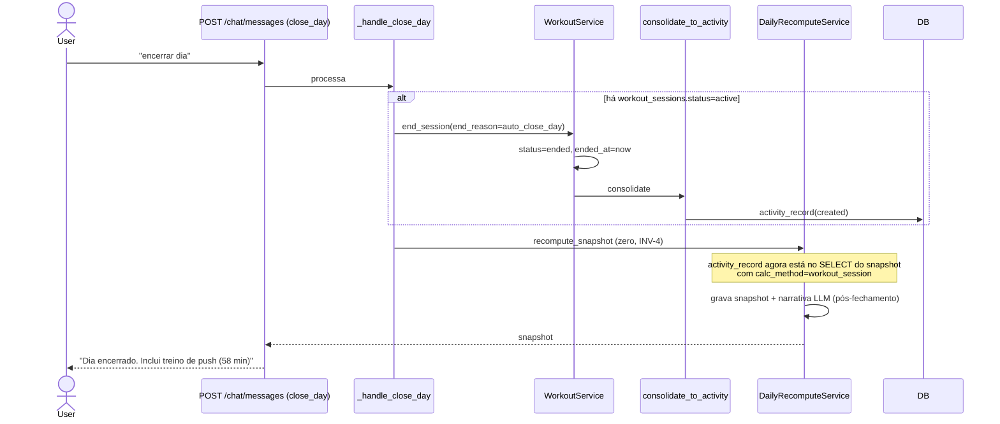

# Arquitetura — Treino estruturado (Bloco 3)

> **Rastreabilidade**: SP-120..SP-127, INV-11/12/13, ADR-011 (`research.md`) · Implementação: **`documented-only`** — nenhum dos arquivos abaixo existe. Status: spec aceita, implementação pendente.

## Visão geral

Módulo hierárquico "`workout_sessions` → `workout_exercises` → `workout_sets`" que coexiste com `log_activity` (cardio flat) via **consolidação em `activity_record`** no encerramento (SP-126 mantém snapshot/semanal agnósticos — ADR-011). Estado conversacional 100% em DB (sessão ativa + último exercício); LLM consulta a cada mensagem (INV-1 — sem memória). Cinco novos intents no chat; backend determinístico nos cálculos de kcal (MET fixo por `workout_type`).

## Componentes previstos (planejamento)

| Componente | Responsabilidade | Tecnologia | Arquivo planejado |
|---|---|---|---|
| Migration `0008_workout_tracking.py` | Cria 3 tabelas + types + FK opcional em `activity_records.workout_session_id` | Alembic | `apps/api/alembic/versions/` |
| `WorkoutSession`/`WorkoutExercise`/`WorkoutSet` models | ORM | SQLAlchemy 2 | `apps/api/app/models/workout.py` |
| `WorkoutService` | Lógica de domínio (start/add/log/end/console/history) | Python async | `apps/api/app/services/workout.py` |
| `Intent` enum ext + 5 novos payloads | Pydantic `_LenientBase` | Python | `apps/api/app/schemas/llm.py` |
| `MessageProcessor` handlers | 5 novos `_handle_workout_*` | Python | `apps/api/app/services/message_processor.py` |
| `IntentDispatcher` routing | Roteia 5 intents fora de `_STRUCTURED_INTENTS` | Python | `apps/api/app/services/intent_dispatcher.py` |
| `message_formatter.compose_workout_*` | Markdown pt-BR (SP-118 consistency) | Python | `apps/api/app/services/message_formatter.py` |
| Prompt `system_v2.md` regra 19 | LLM grande explicação dos intents | Markdown | `apps/api/app/integrations/anthropic/prompts/system_v2.md` |
| `_handle_close_day` hook (SP-125) | Chama `end_session` BEFORE recompute | Python | `apps/api/app/services/day_close.py` |
| `workout_repository` (provável) | Queries com `user_id` (Art. V §21) | SQLAlchemy 2 | `apps/api/app/repositories/workout.py` |
| Frontend `compose_workout_*` render | `AssistantContent` (Bloco 2) já renderiza markdown; T-B308 adiciona destaque visual (opcional) | React 19 | `apps/web/src/app/(app)/chat/AssistantContent.tsx` (ext) + `WorkoutHistoryCard` |
| Antecipação existente | `CALC_METHOD_LABEL_PT['workout_session'] = 'sessão de treino'` em `apps/web/src/app/(app)/day/types.ts:137` | TS | Já em produção |
| `apps/api/tests/test_workout.py` | Testes T-B307 | pytest | (a criar) |

## Diagrama de contexto



## Diagrama de sequência — sessão completa (SP-120..SP-126)

```mermaid
sequenceDiagram
    actor User
    participant API as POST /chat/messages
    participant MP as MessageProcessor
    participant WS as WorkoutService
    participant DB as Postgres workout_*
    participant Fmt as message_formatter
    participant Conso as consolidate_to_activity

    User->>API: "iniciando treino de push"
    API->>MP: processa
    MP->>WS: start_session(push, day_log)
    alt há sessão ativa
        WS->>WS: end_session(end_reason=auto_new_session)
        WS->>Conso: consolidate
        Conso->>DB: cria activity_record anterior
    end
    WS->>DB: cria workout_sessions.status=active
    MP->>Fmt: compose_workout_start(session)
    Fmt-->>API: markdown "Iniciei treino de push"
    API-->>User: assistant message

    User->>API: "supino reto com barra"
    API->>MP: processa
    MP->>WS: add_exercise(session_id, "supino reto com barra")
    WS->>DB: cria workout_exercises; lookup histórico
    WS-->>MP: exercise + HistoryContext
    MP->>Fmt: compose_workout_add_exercise(ex, historico)
    API-->>User: "Adicionei... Última 28/07: 4x10@60. PR 70x10 15/07"

    User->>API: "3x8 60 kg"
    MP->>WS: log_set(weight=60, reps=8, multiplier=3)
    WS->>DB: cria 3 workout_sets no último exercise
    MP->>Fmt: compose_workout_log_set
    API-->>User: "Série 3 registrada: 60 kg × 8"

    User->>API: "finalizar treino"
    MP->>WS: end_session(end_reason=user)
    WS->>WS: status=ended, ended_at=now
    WS->>Conso: consolidate (MET=5.0 × weight × duration)
    Conso->>DB: cria activity_record(calc_method=workout_session)
    MP->>Fmt: compose_workout_end(session, totals)
    API-->>User: "Treino encerrado (58 min) ~380 kcal"
```

## Diagrama de sequência — Close day com sessão ativa (SP-125)



## Decisões de design

1. **Coexistência com `log_activity`** (ADR-011): cardio genérico continua usando `log_activity` (SP-60..64); treino de força usa módulo novo. No encerramento,.agrega em 1 `activity_record`. Justificativa: snapshot/semanal mantêm-se agnósticos; menos rework nos formatters; dados de força são mais granulares e só importam para histórico (SP-121/127).

2. **Estado conversacional 100% em DB**: lookup `WHERE user_id=? AND status='active'` resolve "sessão atual"; `MAX(sequence_index)` resolve "último exercício". Justificativa: EVT (yo-yo case do multi-device); LLM não precisa de memória entre mensagens; backend idempotente.

3. **Consolida em encerramento (não a cada série)** (ADR-011): consolidar a cada série disparava `recompute` caro com só parcial info. Encerramento é o momento natural. Justificativa: menos churn no snapshot; dado só faz sentido quando completo.

4. **MET fixo por `workout_type`** (`push`/`pull`/`upper`=5.0; `legs`/`lower`=6.0; `full_body`=5.5): aproximação aceita no MVP. Justificativa: musculação varia (carga/descanso); refinamento "volume × densidade" fora do scope;_declared in ADR-011.

5. **`weight_kg` do perfil necessário pra kcal**: sem ele, `kcal_burned=NULL` + warning. Justificativa: perfil já tem `weight_kg`/`height_cm`/`birthdate`/`sex` (`User` model feature `set_profile`); oportunismo não obrigar preencher.

6. **INV-13 unlink bidirectional**: delete `activity_record` não afeta `workout_*`; vice-versa. Justificativa: recompute manual resolve (fora do MVP-de-treino); ADR-011 explicita que se for incomodar no futuro, abrir feature nova.

7. **`normalized_name` fuzzy match** em lookup histórico: slug-like + sinônimos catalogados ("supino reto" == "supino reto barra" == "supino reto halteres"). Justificativa: entrada natural do usuário não precisa ser canonical; histórico enxerga variações.

8. **Parser pt-BR pela LLM** (backend só valida): ex.: "20 kg da barra + 20 kg de cada lado" → 60. Justificativa: LLM faz NLP; backend não re-implementa parser regex; INV-1 (backend determinístico — receber valor calculado). Se ambíguo → `clarify`, sem set.

9. **5 intents fora de `_STRUCTURED_INTENTS`** no dispatcher: handlers dedicated; não entram no pipeline genérico de meal/water/beverage/activity. Justificativa: cada um tem fluxo próprio (lookup histórico, fuzzy, N sets); dispatcher simples.

10. **T-B308 frontend optional**: backend em markdown já é legível. Destaque visual (peso PR em amber, série atual em verde) é melhoria. Justificativa: escopo incremental; shipar backend primeiro.

11. **Antecipação `CALC_METHOD_LABEL_PT['workout_session']`** em `apps/web/src/app/(app)/day/types.ts:137`: já inserido quando `AuxiliarySections.tsx::ActivitySection` (Bloco 6) foi feito — preview sem backend. Justificativa: SP-153 (`/day` mostrando atividade) já renderiza labels de todos os `calc_method`s; `workout_session` já aparece sem implementação.

12. **Sessões órfãs aceitas**: se usuário nunca encerra, sessão fica `active` indefinidamente. Justificativa: MVP single-user, baixo impacto; SP-125 cobre caso mais comum (fechamento do dia). Futuro: cron que fecha sessões >24h.

## Padrões previstos

- **Service pattern** (alinhado a outros services): métodos async autônomos; sem depender de `MessageProcessor` (T-B303).
- **Repository pattern**: queries com `user_id` filter (Art. V §21).
- **Audit pattern** (INV-10): `audit_events` em toda mutação.
- **Migration**: enum types `CREATE TYPE` + tables com FK cascade + index parcial em `active`.
- **LLM tool pattern**: `record_intent` único schema estendido (não 5 tools); payloads `_LenientBase` (consistência com Bloco 5).
- **Compose pattern**: `message_formatter.compose_workout_*` em markdown pt-BR (2 cols, consistência SP-118).
- **Order-critical em close_day**: `end_session` BEFORE `recompute_snapshot` (T-B306).

## Segurança e autenticação

- **`user_id` em toda query** (Art. V §21): `WorkoutService` methods always filter by `user_id`. Index parcial garante performance.
- **Auth**: cookie `access_token` verify via `app/api/deps.py::get_current_user`; inválido → 401.
- **INV-5 (dia fechado imutável)**: mutações em `workout_*` em dia `closed` bloqueadas no backend; SP-125 é exceção que roda ANTES do close efetivo.
- **INV-10 audit**: `audit_events` gravados com `actor=user_id`, `before`/`after`, `message_id` correlato. Sessões/exercícios/sets mutam → audit.
- **LLM determinístico** (INV-1 / Art. II): backend calcula `kcal_burned`, `duration_minutes`, não LLM. LLM só classea `workout_type` e extrai `weight_kg`/`reps`/`exercise_name`.
- **LLM sem memória**: consultas ao DB substituem contexto; sem cache de conversa.

## Observabilidade (prevista)

- **Logs**: eventos `workout_session_started`/`ended`, `workout_set_logged`, `workout_consolidated` (com `user_id`, `session_id`); capturados por log middleware.
- **Métricas**: `kcal_out` total por sessão (visível via `activity_record`); duração média por `workout_type` (derivable de `activity_records`).
- **Audit**: `audit_events.action='create'/'update'/'delete'` em `workout_sessions/exercises/sets` (INV-10). Query `WHERE entity_type LIKE 'workout_%'` para listar.
- **Traces**: `X-Request-Id` middleware global; handlers `_handle_workout_*` propagam. Futuro: tracing distribuído Anthropic call → backend.
- **Erros**: `clarify` (ambiguidade parser), `NotFoundError` (sessão não existe), `LastExerciseOnlyError` (INV-12 violado), `DayLockError` (INV-5); cada um vira mensagem pt-BR assistant msg + audit (quando aplicável).