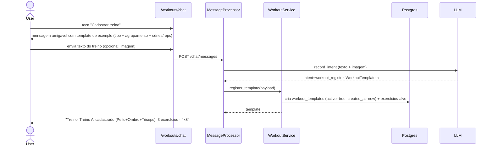
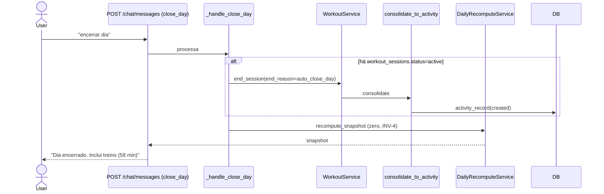

# Arquitetura — Módulo de Treino (Workout Module)

> **Rastreabilidade**: SP-120..SP-127, INV-15/16/17 (núcleo) · SP-170..179 (proposto) · ADR-011 (`research.md`) · Implementação: **`documented-only`** — nenhum dos arquivos abaixo existe. Status: spec aceita + expansão do cliente, implementação pendente.

## Visão geral

Módulo de treino completo: núcleo hierárquico (`workout_sessions` → `workout_exercises` → `workout_sets`) que coexiste com `log_activity` via **consolidação em `activity_record`** (SP-126, ADR-011), mais **`workout_templates`** (treinos reutilizáveis com status ativo) e uma face de **produto nova**: chat de treino dedicado no padrão do chat de alimentação, tela `/workouts` com abas Ativos/Inativos/Histórico, fluxo guiado de execução com cronômetro e seção de treinos no `/day`. Estado conversacional 100% em DB (sessão ativa + último exercício/última série); LLM consulta a cada mensagem e **nunca calcula** (INV-1) — kcal reportada pelo usuário/texto/imagem é persistida como `kcal_burned_reported` (INV-21), senão estimativa MET pelo backend.

## Componentes (planejamento)

| Componente | Responsabilidade | Tecnologia | Arquivo planejado |
|---|---|---|---|
| Migration núcleo `0008_workout_tracking.py` | 3 tabelas + types + FK `activity_records.workout_session_id` + `kcal_burned_reported` + `template_id` | Alembic | `apps/api/alembic/versions/` |
| Migration módulo `0011_workout_templates.py` | `workout_templates` + `workout_template_exercises` | Alembic | `apps/api/alembic/versions/` |
| `WorkoutTemplate`/`WorkoutTemplateExercise`/`WorkoutSession`/`WorkoutExercise`/`WorkoutSet` models | ORM | SQLAlchemy 2 | `apps/api/app/models/workout.py` + `workout_templates.py` |
| `WorkoutService` | Lógica de domínio (start/add/log/end/consolidate/history + template/guided/history_paginated/correct/reported_kcal) | Python async | `apps/api/app/services/workout.py` |
| `Intent` enum + payloads | Pydantic `_LenientBase` (núcleo + `WorkoutTemplateIn`/`WorkoutImageIn`/`WorkoutCorrectSetIn`) | Python | `apps/api/app/schemas/llm.py` |
| `MessageProcessor` handlers | handlers de treino (núcleo) + módulo (`workout_register`, `workout_correct`, `workout_next_exercise`, imagem); seleção de prompt por `messages.via` | Python | `apps/api/app/services/message_processor.py` |
| `IntentDispatcher` routing | Roteia intents de treino fora de `_STRUCTURED_INTENTS` | Python | `apps/api/app/services/intent_dispatcher.py` |
| `message_formatter.compose_workout_*` | Markdown pt-BR (SP-118) + mensagens de template/exemplo | Python | `apps/api/app/services/message_formatter.py` |
| Routes módulo `/workouts/*` | Templates (listagem/toggle), histórico paginado | Python | `apps/api/app/api/routes/workouts.py` |
| PATCH de sets/sessões | Edição peso/séries/kcal (RF-023) | Python | `apps/api/app/api/routes/records.py` |
| Prompt `system_v2.md` | Regra 19 + regras de template/imagem/chat de treino | Markdown | `apps/api/app/integrations/anthropic/prompts/system_v2.md` |
| `_handle_close_day` hook (SP-125) | `end_session` BEFORE recompute | Python | `apps/api/app/services/day_close.py` |
| `workout_repository` | Queries `user_id`-scoped (INV-18) | SQLAlchemy 2 | `apps/api/app/repositories/workout.py` |
| `/workouts` page | 3 abas: Ativos/Inativos/Histórico | React 19 | `apps/web/src/app/(app)/workouts/page.tsx` |
| `/workouts/chat` | Chat de treino no padrão do chat de alimentação | React 19 | `apps/web/src/app/(app)/workouts/chat/page.tsx` |
| `WorkoutTotalsHeader` | Header com atividades do dia + kcal gastas (variante `DayTotalsBar`) | React 19 | `apps/web/src/app/(app)/workouts/WorkoutTotalsHeader.tsx` |
| `Stopwatch` | Cronômetro iniciado/parado com a sessão (RF-021) | React 19 | `apps/web/src/app/(app)/workouts/Stopwatch.tsx` |
| `WorkoutTemplateList`/`ExercisePicker` | Botões de seleção do fluxo guiado | React 19 | `apps/web/src/app/(app)/workouts/` |
| `WorkoutSection` | Seção de treinos no `/day` | React 19 | `apps/web/src/app/(app)/day/AuxiliarySections.tsx` |
| `EditWorkoutSetForm`/`EditWorkoutSessionForm` | Edição inline (peso/séries/kcal) | React 19 | `apps/web/src/app/(app)/day/edit-forms.tsx` |
| `proxy.ts` | `/workouts`,`/workouts/chat` em `PROTECTED_PREFIXES` | TS | `apps/web/src/proxy.ts` |
| `apps/api/tests/test_workout.py` | Testes T-B307 + módulo | pytest | (a criar) |
| E2E Playwright | Fluxos de treino | Playwright | `apps/web/e2e/workout.spec.ts` |
| Antecipação existente | `CALC_METHOD_LABEL_PT['workout_session']='sessão de treino'` | TS | Já em produção (`day/types.ts:142`) |

## Diagrama de contexto

```mermaid
graph TD
    User[Felix] -->|chat de treino / chat alimentação| ChatMsg[POST /chat/messages]
    User -->|tela /workouts| WPage[/workouts - abas/lista]
    WPage --> WFmt[WorkoutTotalsHeader]
    WPage --> Stop[Stopwatch]
    WPage --> Tpl[WorkoutTemplateList / ExercisePicker]
    ChatMsg --> MP[MessageProcessor]
    MP --> Disp[IntentDispatcher]
    Disp -->|intents de treino| Handlers[_handle_workout_* / módulo]
    Handlers -.-> MF[message_formatter.compose_workout_*]
    Handlers --> WS[WorkoutService]
    WS --> Repo[workout_repository com user_id filter]
    Repo --> DB[(Postgres workout_templates/sessions/exercises/sets)]
    WS -->|end| Conso[consolidate_to_activity]
    Conso --> AR[activity_records]
    AR --> Snp[daily-snapshot recompute]
    DayClose[_handle_close_day] -->|SP-125 end BEFORE recompute| Conso
    DayClose --> Snp
    Day -->|/day| WSec[WorkoutSection - treinos do dia]
    WSec --> AR
    Tpl --> WS
    WS -->|register_template| DB
    AnthropicClient[anthropic integration] -.->|record_intent tool schema LLM| LLM[Anthropic]
    LLM -->|payloads _LenientBase + imagem| MP
    WS -.-> Audit[audit_events INV-10]
    Media[POST /media] -->|imagem de treino| PvImg[MinIO/S3]
```

## Diagrama de sequência — fluxo guiado (RF-020 + cronômetro RF-021)

```mermaid
sequenceDiagram
    actor User
    participant Chat as /workouts/chat
    participant API as POST /chat/messages
    participant WS as WorkoutService
    participant DB as Postgres
    participant Conso as consolidate_to_activity

    User->>Chat: toca "Iniciar treino"
    Chat->>API: GET /workouts/templates?active=true
    API-->>Chat: lista templates (botões)
    User->>Chat: seleciona template
    Chat->>API: workout_start {template_id}
    API->>WS: start_session(template_id)
    WS->>DB: cria session active + template_id
    API-->>Chat: lista exercícios do template (botões)
    User->>Chat: seleciona exercício
    API->>WS: add_exercise(exercise_name)
    WS->>DB: cria workout_exercises; lookup histórico
    WS-->>API: exercise + HistoryContext (últimas séries/cargas)
    API-->>Chat: "Última vez 28/07: 4x10@60. PR 70x10 15/07"
    User->>Chat: "60 kg x 8"
    API->>WS: log_set(60, 8)
    WS->>DB: cria workout_sets
    API-->>Chat: confirma + recapitula último treino + botão "Próximo exercício"
    loop cada exercício do template
        User->>Chat: "Ir para o próximo exercício"
        Chat->>API: workout_next_exercise
        API-->>Chat: lista exercícios de novo
        User->>Chat: seleciona próximo exercício
    end
    User->>Chat: "Finalizar treino" (ou botão)
    Chat->>API: workout_end
    API->>WS: end_session(user) + Stopwatch para
    WS->>DB: status=ended, ended_at=now, duration
    WS->>Conso: consolidate (kcal reportada ou MET)
    Conso->>DB: activity_record(calc_method=workout_session)
    API-->>Chat: "Treino concluído 58 min · 380 kcal"
```

## Diagrama de sequência — cadastro de template (RF-015)



## Diagrama de sequência — close day com sessão ativa (SP-125)



## Decisões de design

1. **Coexistência com `log_activity`** (ADR-011): cardio genérico continua `log_activity`; força usa módulo novo; consolida em 1 `activity_record` no encerramento. Snapshot/semanal agnósticos.

2. **Estado conversacional 100% em DB**: lookup `WHERE user_id=? AND status='active'` resolve "sessão atual"; `MAX(sequence_index)` resolve "último exercício". EVT multi-device.

3. **Consolida no encerramento (não a cada série)** (ADR-011): encerramento é o momento natural; menos churn no snapshot.

4. **kcal reportada como fonte (INV-21)**: usuário que informa kcal (texto/imagem/edição) tem valor persistido (`kcal_burned_reported`) e usado na consolidação; senão MET fixo por `workout_type` × `weight_kg` × horas. LLM nunca calcula (Art. II).

5. **`workout_templates` como entidade própria**: treinos reutilizáveis (RF-015) com `active` (RF-016). Justificativa: diferenciar "catálogo" de "execução"; histórico preservado por `workout_sessions.template_id` (INV-20).

6. **Chat de treino dedicado espelha chat de alimentação** (RF-018): mesmo composer/upload/polling/`AssistantContent`. Justificativa: consistência de UX; header específico (`WorkoutTotalsHeader`) mostra atividades do dia + kcal gastas; botões `Cadastrar treino`/`Iniciar treino`/`Finalizar treino` substituem "Encerrar dia" **naquele espaço** (encerrar dia continua no chat de alimentação/`/day`).

7. **Fluxo guiado via mensagens estruturadas + botões**: seleção de template/exercício é um `intent` (ou mensagem preenchida pelo frontend) — estado (exercício atual) mora no DB; botões são conveniência de UX sobre o mesmo protocolo. Justificativa: EVT; sem estado em memória.

8. **Cronômetro (RF-021)**: UI-only (fronte); fonte de tempo continua `ended_at - started_at` no backend. Justificativa: tempo exibido é derivado; o registrado é determinístico.

9. **Imagem de treino (RF-022)**: reutiliza `POST /media` + `media_ids` do chat de alimentação; LLM Sonnet (modelo com imagem) extrai `WorkoutImageIn`. Justificativa: zero infra nova.

10. **Paginação de histórico (RF-017)**: offset/limit com ordenação estável (`started_at DESC, id DESC`). Justificativa: determinístico; single-user.

11. **`_STRUCTURED_INTENTS` fora**: intents de treino com handlers dedicados (padrão já desenhado em Bloco 3). Justificativa: fluxos próprios (lookup histórico, fuzzy, N sets, guiado).

12. **INV-20 — reconsolidação em edição**: editar set/kcal de sessão encerrada re-roda `consolidate_to_activity`. Justificativa: manter `/day` consistente sem infringir INV-17 (só o `activity_record` da própria sessão muda).

13. **Antecipação `CALC_METHOD_LABEL_PT['workout_session']`** já em produção (`day/types.ts:142`) — sem regressão visual.

14. **Sessões órfãs aceitas**: usuário nunca encerra nem fecha dia → `active` indefinidamente; SP-125 cobre o comum. Futuro: cron de 24h.

## Padrões previstos

- **Service pattern**: métodos async autônomos; sem depender de `MessageProcessor` (T-B303).
- **Repository pattern**: queries com `user_id` filter (INV-18, Art. V §21).
- **Audit pattern** (INV-10): `audit_events` em toda mutação de `workout_*` + `workout_templates`.
- **Migration**: enum types + tables + index parcial `active`; módulo numa migration separada.
- **LLM tool pattern**: `record_intent` único schema estendido; payloads `_LenientBase`; imagem via mesmo pipeline.
- **Compose pattern**: `message_formatter.compose_workout_*` em markdown pt-BR 2-cols.
- **Order-critical em close_day**: `end_session` BEFORE `recompute_snapshot` (T-B306).
- **UI pattern chat**: `(app)/workouts/chat/page.tsx` espelha `(app)/chat/page.tsx` (composer, `AssistantContent`, polling, `CloseDayModal`).

## Segurança e autenticação

- **`user_id` em toda query** (Art. V §21): `WorkoutService` methods sempre filtram por `user_id` (`start_session`, `register_template`, `history_paginated`, etc.).
- **Auth**: cookie `access_token` via `api/deps.py::get_current_user`; `/workouts` e `/workouts/chat` em `PROTECTED_PREFIXES` do `proxy.ts`.
- **INV-5 (dia fechado imutável)**: mutações em `workout_*` em dia `closed` → 409; SP-125 é exceção que roda ANTES do close.
- **INV-10 audit**: `audit_events` com `actor=user_id`, `before/after`, `message_id`.
- **LLM determinístico** (INV-1): backend calcula kcal/duration; LLM só classifica/extrai. Imagem extrai campos, nunca soma.
- **LLM sem memória**: DB substitui contexto; sem cache de conversa.

## Observabilidade (prevista)

- **Logs**: `workout_session_started/ended`, `workout_set_logged`, `workout_template_created`, `workout_consolidated` (user_id, session_id/template_id).
- **Métricas**: `kcal_out` por sessão (via `activity_record`); duração média por `workout_type`; quantidade de treinos executados por semana (histórico paginado).
- **Audit**: `audit_events.action='create'/'update'/'delete'` em `workout_templates/sessions/exercises/sets`. Query `WHERE entity_type LIKE 'workout_%'`.
- **Traces**: `X-Request-Id` middleware; handlers de treino propagam.
- **Erros**: `clarify` (ambiguidade parser), `NotFoundError` (sessão/template não existe), `LastExerciseOnlyError` (INV-16), `DayLockError` (INV-5), `InactiveTemplateError` (INV-19) — cada um vira mensagem pt-BR assistant (ou 4xx) + audit.